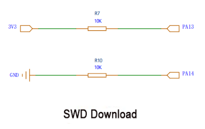

# 1. Controller Hardware Course

## 1.1 ROS Robot Controller Hardware Introduction

### 1.1.1 Development Board Diagram

| NO.  |                     Function Description                     |
| :--: | :----------------------------------------------------------: |
|  1   | Motor control switch: When turned on, the motor can move; when turned off, the motor is not controlled |
|  2   | 5V 5A external power supply: Specially designed to power Raspberry Pi, Jetson Nano development boards, etc. |
|  3   | Battery voltage powered PWM servo interface x2: For high current and high torque servo control |
|  4   | USB serial port 2: Designed for serial communication interface to communicate with Raspberry Pi and Jetson Nano. |
|  5   | I2C expansion interface: Can be used for module communication of the I2C interface. |
|  6   |   0.96-inch LCD display interface: For LCD display module.   |
|  7   | USB serial port 1/burning download: Can be used for program serial port burning and serial port communication. |
|  8   | MPU6050 IMU attitude sensor: Provides the current attitude of the development board. |
|  9   | GPIO expansion and SWD debugging: Used for other expansion external modules and debugging. |
|  10  | User indicator light: Allows users to customize LED light functions. |
|  11  | Power indicator light on the board: Indicates whether the voltage of each part is normal. |
|  12  |        Reset button: Main control chip reset button.         |
|  13  | USB HOST interface: Can connect USB slave devices such as USB handle receivers. |
|  14  | STM32F407VET6 main control chip: Main frequency 168MHz, ARM Cortex-M4 core, Flash 512KB, RAM 192KB, 82 general IO ports. |
|  15  | Four-lane encoded motor interface x4: Can drive four motors simultaneously. Refer to the corresponding course documents for connection methods based on different models. |
|  16  | Bluetooth module interface: Can receive control instructions from mobile apps, other Bluetooth modules, etc. |
|  17  | User button x2: Allows users to customize key functions and combined key functions. |
|  18  | Bus servo interface x2: Can control the movement of the bus servo mechanical arm. |
|  19  |      Buzzer: Used for user prompts and alarm functions.      |
|  20  |  Power switch: Main power switch of the development board.   |
|  21  | Power interface: DC 5V ~ 12.6V power input, can be powered by a power supply or battery. |
|  22  | SBUS remote control receiver interface: Used to connect model aircraft remote control receiver. |
|  23  | 5V power supply PWM servo interface x2: Can be used for 5V servo control. |

### 1.1.2 FAQ for Controller

1. How to control the control board with Raspberry Pi and Jetson Nano? How to communicate with the control board?

   Answer: Raspberry Pi, Jetson Nano, and similar devices can communicate with the control board via the serial port. It is recommended to use serial port 2 for communication to keep serial port 1 available for downloading programs. This reduces the need for frequent plugging and unplugging, speeding up the debugging process.

2. Which functions on the development board are managed by the microcontroller?

   Answer: The microcontroller on the development board manages several components, including the buzzer, robotic arm, servo gimbal, button, Bluetooth module interface, encoder motor interface, USB HOST interface, LED, MPU6050 attitude sensor, USB serial port, display interface, I2C interface, SBUS interface, GPIO expansion port, and more.

3. How to learn to use the development board? How to update the development board firmware?

   Answer: The development board comes with comprehensive tutorials, such as the FREERTOS system LED control tutorial, encoder motor control tutorial, and motor PID control tutorial. Interfaces are pre-implemented to facilitate rapid development. To update the firmware, you can use the USB serial port for downloads and JLink for debug updates. All interfaces are externally connected to make learning and debugging easier.

4. Why are two pins of the main control chip STM32F407VET6 on the development board connected?

   Answer: First, check if the version silk screen on the back of the board is V1.0. If it is version V1.0, it is normal for the two pins to be connected as shown in the figure below. In the V1.0 version, one pin is VDD and the other is related to the chip's built-in voltage measurement standard. These pins need to be connected to correctly read the battery voltage value. In version 1.1, this chip does not require pin soldering.

 (Left: V1.0; Right: V1.1)

## 1.2 ROS Robot Controller Schematic Explanation

### 1.2.1 Main Chip Description

**Main chip:** STM32F407VET6

This STM32F407VET6 has 100 pins. As you can see, many of these pins are already in use, while others are left available for customers to use in their own development. Below, we will detail which pins are in use, their functions, and which pins are available.

### 1.2.2 Shut Capacity

These 100nf capacitors are connected to the 3.3V supply on the STM32F407VET6. The functions of these bypass capacitors are voltage stabilization and filtering.

### 1.2.3 Peripheral Circuitry of the VET6

In the peripheral circuit of the device, the connections between AGND (analog ground) and GND (digital ground) and between 3V3 and VDDA play important roles. Analog and digital signals often need to coexist on the same circuit board, and the switching processes of digital circuits can introduce noise. Typically, two separate systems are used: one for the analog circuit (AGND) and one for the digital circuit (GND), to minimize interference between the ground currents of the analog and digital parts while ensuring consistent potential throughout the system to minimize noise impact.

3V3 is the supply voltage, and VDDA is the analog supply voltage. The circuit design may include power supply decoupling devices. An LC filter is formed by connecting an inductor (L) and two 100nF capacitors (C) in parallel. This filter reduces high-frequency noise in the supply voltage, thereby providing a more stable analog supply voltage (VDDA). This is crucial for power supply decoupling of peripheral circuits.

VREF+ and VREF- are connected in parallel with two 100nF capacitors, known as decoupling capacitors. These capacitors reduce high-frequency noise on power lines, smooth the power supply voltage, and provide a more stable voltage.

Additionally, a 10uF capacitor is connected to AGND through two 0-ohm resistors. This method of power supply filtering allows the 10uF capacitor to provide low-frequency decoupling. The 0-ohm resistors offer a low-impedance path between the power line and the ground line, helping to reduce the impact of power supply noise on the voltage. This improves the accuracy and performance of ADC and DAC circuits.

### 1.2.4 Power Indicator

The three circuits of the power indicator light utilize resistors to regulate the current flowing through the LED, thus preventing overheating and damage to the LED.

In the first circuit, powered by a 5V supply, a 3.3k resistor is connected in series with the LED to ground. By applying Ohm's law (I = V/R), the current (I) flowing through the circuit can be calculated as I = 5V / 3.3kΩ = 1.52mA. This current value falls within the safe operating range, as the maximum continuous operating current for most LEDs is approximately 20mA.

In the second circuit, powered by a 3.3V supply, a 1k resistor is used in series with the LED to ground. Similarly, the current can be calculated as I = 3.3V / 1kΩ = 3.3mA, which is also within the safe range.

In the third circuit, this connection method is typically employed to indicate a specific status of the main chip. When the PE10 pin is configured as a low output, current flows through the LED and resistor to ground (GND), illuminating the LED. Conversely, when the PE10 pin is configured as a high-level (3.3V) output, the voltage difference across the LED is 0, causing the current to cease flowing and the LED to turn off.

### 1.2.5 Crystal Oscillator Circuit

An 8MHz crystal is paralleled with the OSCIN and OSCOUT pins on the STM32F407VET6 chip. Each crystal oscillator pin is accompanied by a 22pF capacitor, connected to the ground wire, forming a loop crucial for initiating crystal oscillation, ensuring a stable clock signal.

Regarding BOOT and BOOT1, they serve as digital input pins to determine startup configurations upon power-on or reset. By reading the levels (high or low) at these pins, different boot sources are selected accordingly. Options include booting from built-in Flash memory, system memory, or an external memory device. Both BOOT0 and BOOT1 pins are linked to ground via 10KΩ resistors, ensuring they default to a low level during power-up or reset, typically establishing the default startup mode.

For example, the system can boot from built-in Flash memory, system memory, or an external memory device. The BOOT0 and BOOT1 pins are grounded through a 10KΩ resistor each. This means that upon power-up or reset, these pins will be pulled low (set to a low level). The purpose of this configuration is typically to set the default boot mode.

### 1.2.6 Button Circuit

These three circuits are pull-down resistor button circuits. When the button is not pressed, the PE0 pin is connected to the 3.3V power supply through a 10kΩ resistor, so the PE0 pin reads a high level. When the button is pressed, the PE0 pin is directly grounded, so the PE0 pin reads a low level.

The NRST reset button and the PE1 circuit work the same way.

### 1.2.7 OLED Display

This socket connects to the OLED display, interfacing with the PB13, PC3, PD14, PD13, PD12, and PD11 pins of the STM32F407VET6. You can view its configuration through the program and refer to the STM32F407VET6 specification sheet in the folder to see the functions shared by these pins.

### 1.2.8 Bluetooth Module Port

This is a screen holder connected to the Bluetooth module interface. It connects to the PD5 and PD6 pins of the STM32F407VET6. You can view the configuration through the program and refer to the STM32F407VET6 specification folder to see the functions these pins perform.

### 1.2.9 IIC Reserved Port

This is an IIC reserved interface that can be connected to external IIC devices, such as language modules and OLED screens. The IIC pins of the STM32 are connected here, and the IIC bus is pulled up on the MPU6050.

### 1.2.10 SWD Download

In the STM32F407VET6 chip, the two pins are typically used as a debug port (SWD interface), with PA13 serving as SWDIO (data line) and PA14 as SWCLK (clock line).

### 1.2.11 Reserved Port

The reserved interface consists of GPIO ports on the STM32F407VET6 main chip that have not yet been used.

### 1.2.12 TYPEC Port

Connect a diode to VBUS to prevent reverse current on the VBUS line.

The cathode of the diode is connected to the VBUS pin, and the anode is connected to the power circuit.

This way, the power circuit can draw power from the VBUS pin but cannot supply power back to the VBUS line.

DP2 and DN2 are the differential data lines of the USB Type-C connector used for transmitting USB data. Connecting an ESD protection device can prevent these lines from being damaged by electrostatic discharge (ESD) or other overvoltage events.

### 1.2.13 MPU-6050

Here, both the SCL and SDA pins of the MPU-6050 are connected to 10k pull-up resistors, facilitating their functionality as pull-up resistors. Consequently, the device can pull the line low but cannot actively pull it high.

**Power connection**: The VCC pin of the MPU-6050 requires connection to a 3.3V power supply, while the GND pin should be linked to ground.

**I2C signal line connection**: SDA and SCL represent crucial lines for I2C communication, serving as data and clock lines respectively. Correspondingly, the pins associated with I2C functionality are connected to SDA and SCL on the MPU-6050. For instance, on the STM32F407VET6, PB11 can serve as SDA, and PB10 can function as SCL.

**Interrupt pin**: The INT pin acts as an interrupt output. It facilitates communication between the MPU-6050 and the STM32F407VET6 chip by signaling new data availability or other relevant events.

**Capacitor integration**: When the MPU-6050 initiates operation and draws current from the power line, the integrated capacitor swiftly furnishes the necessary current, mitigating momentary drops in the supply voltage. Simultaneously, the capacitor serves to attenuate high-frequency noise on the power line, safeguarding the MPU-6050 against noise-induced performance disruptions.

### 1.2.14 CH9102F Serial Port 3 Circuit

Here, both the SCL and SDA pins of the MPU-6050 are connected to 10k pull-up resistors, facilitating their functionality as pull-up resistors. Consequently, the device can pull the line low but cannot actively pull it high.

**Power connection**: The VCC pin of the MPU-6050 requires connection to a 3.3V power supply, while the GND pin should be linked to ground.

**I2C signal line connection**: SDA and SCL represent crucial lines for I2C communication, serving as data and clock lines respectively. Correspondingly, the pins associated with I2C functionality are connected to SDA and SCL on the MPU-6050. For instance, on the STM32F407VET6, PB11 can serve as SDA, and PB10 can function as SCL.

**Interrupt pin**: The INT pin acts as an interrupt output. It facilitates communication between the MPU-6050 and the STM32F407VET6 chip by signaling new data availability or other relevant events.

**Capacitor integration**: When the MPU-6050 initiates operation and draws current from the power line, the integrated capacitor swiftly furnishes the necessary current, mitigating momentary drops in the supply voltage. Simultaneously, the capacitor serves to attenuate high-frequency noise on the power line, safeguarding the MPU-6050 against noise-induced performance disruptions.

### 1.2.15 Aircraft Remote Control Interface for BUS Model

This serves as the remote control interface for the BUS model aircraft. An NPN transistor functions as the inverter in this setup. When the SBUS signal is at a high level, the transistor conducts, pulling the output low. Conversely, when the SBUS signal is low, the transistor switches off, and a pull-up resistor raises the output to a high level. This configuration yields the inverted SBUS signal. To receive and transmit this signal to the main chip, connect the PD2 pin of the main chip accordingly.

### 1.2.16 CAN Port

The CAN interface is linked to a 120-ohm resistor. This resistor serves as the terminal resistor for CAN communication, aiding in impedance matching and mitigating echo emissions.

### 1.2.17 Buzzer

One end of the buzzer is connected to a 5V power source, and the other end is linked to the collector of an S8050 transistor. The collector is grounded through a 10kΩ resistor.

The base of the transistor is connected to the PA4 pin of the microcontroller via a 1kΩ resistor.

When you want the buzzer to sound, you can set the PA4 pin of the main chip to output a high level, which turns on the transistor, allowing current to flow through the buzzer and producing sound. When you want the buzzer to stop sounding, you can set the PA4 pin to output a low level, which turns off the transistor, cutting off the current flow through the buzzer and stopping the sound. This buzzer serves as an external device.

### 1.2.18 Enable Switch

This switch is used to control the car to stop.

### 1.2.19 4-Lane Servo Port

These four interfaces are designated for connecting servos, enabling servo control. There are two servo sockets connected to the 5V power source and two servo sockets connected to VIN. The 5V socket is intended for low-voltage servos, while VIN is designated for high-voltage servos powered by a high-voltage power supply.

### 1.2.20 5V-TO-3.3V Circuit

The **BSMD0603-050-6V** is a fuse connected to the output terminal of the RT9013-33GB. It protects against damage from excessive current. When the current exceeds the rated value of the fuse, it will disconnect, thereby cutting off the current flow.

### 1.2.21 Raspberry Pi 5V Power Supply Circuit and Onboard 5V Power Circuit

As the name implies, this circuit supplies power to our Raspberry Pi using an RT8389GSP power chip. The output, 5V5A, can be adjusted via R24 and R25 according to the formula: V_OUT = V_FB \* (1 + R1/R2). Here, V_OUT represents the regulator’s output voltage, while V_FB denotes the feedback reference voltage, typically a fixed value internally set in the regulator, often around 1.222V. (For further details, consult the RT8289GSP manual if interested.) SW4 serves as the control switch. Simultaneously, this circuit functions as an onboard 5V power supply, adjustable similarly to the aforementioned setup.

### 1.2.22 On-board 5V Power Circuit

Simultaneously, a TYEC is employed to link 5V5A to the Raspberry Pi power supply circuit. Additionally, a 10k resistor and capacitor are combined to create a low-pass filter, aiding in the elimination of high-frequency noise. Finally, a 0-ohm jumper resistor connects both P_EN and VIN.

### 1.2.23 Motor Drive Circuit

Here, we utilize the YX-4055AM motor driver chip to manage four motors. The chips, namely PE9, PE11, PE5, PE6, PE13, PE14, PB8, and PB9, connected to the main chip, regulate our motor rotation, speed, and other functions. Furthermore, a 1500mA fuse has been added to the BO output of the motor driver chip to prevent potential chip damage due to excessive current and voltage.

Additionally, capacitors C4, C36, C29, and C48 serve the purposes of filtering and denoising. These capacitors act as filters, aiding in noise reduction along the power line. Specifically, a 220uF capacitor effectively mitigates low-frequency noise, while a 100nF capacitor excels at removing high-frequency noise.

Moreover, these capacitors play a crucial role in stabilizing the supply voltage. Fluctuations in load current can cause voltage instability, but the capacitors step in to provide the necessary current, thus stabilizing the power supply voltage and preventing voltage transients. Additionally, they prevent the power supply peak current from reaching excessively high levels. When the circuit experiences sudden demand for a large current, the capacitors supply this additional current, preventing spikes in power supply current that could otherwise impact the system.

Lastly, the following section outlines the interface for our encoded motor, which connects to the output pin of the motor driver chip and undergoes filtering via a 100nF capacitor.

### 1.2.24 Serial Bus Servo Port

This circuit and interface correspond to our bus servo. PE7, PG6_TX, and PC7_RX are connected in series to the main chip.

### 1.2.25 USB_HOST Port Circuit

D- and D+ are connected to the main chip via PB15 and PB14, with a jumper resistor in between. These connections receive the signal from the controller and then transmit it to the STM32 chip for decoding and processing.