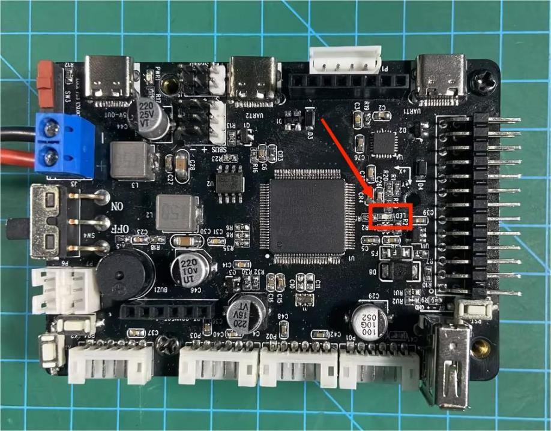

# 2. STM32 Development Fundamentals

## 2.1 Development Environment Setup

After installing the Keil software, please activate it. Otherwise, compilation failures may occur, affecting normal usage.

### 2.1.1 Keil Software Installation

Keil is specialized software designed for microcontrollers, with powerful functionality. Regardless of the version, the installation process is the same. This section uses V5.36 as an example:

1. Go to the folder '**Keil Installation Package and mcuisp Download Tool**', double-click the '**mdk536.exe**' file.

   

2. Check the options and agree to the installation agreement.


3)  Choose the installation path.


4)  User information needs to be filled in here, you can fill it in randomly.


5)  After filling in, click '**Next**' to proceed with the installation.


6. Wait for a moment, a prompt to install the ULink driver will pop up, click '**Install**' at this time.

   

7. After the installation is complete, click '**Finish**' to exit.

### 2.1.2 Configuration 

* **Add Chip Support Package**

After installing the Keil 5 software as described earlier, we need to manually install the required chip package, which can be found in this section's directory.

After opening it, click '**Next**'.


Wait for the installation to be completed, then click-on ‘**Finish**’ button.


Reopen the Keil software, then click-on **pack installer** icon.


Click-on ‘**Device**’ button. Then choose the correct device as pictured.


* **Install J-Link Driver**

J-Link is a commonly used debugger/emulator, used for microcontroller development and debugging in conjunction with Keil 5. Therefore, when using J-Link for programming and debugging microcontrollers in Keil 5, it is necessary to install the J-Link driver.

You can find the J-Link installation package in this section's directory, then double-click to open it, and click '**Next**'.


Choose ‘**I Agree**’.


Select the installation path to be the same directory as Keil 5.


Wait for the installation to be completed.


Installation completed. If a prompt for upgrade appears, as shown in the following image, simply close it.


### 2.1.3 Install STM32CubeMX

STM32CubeMX is a graphical tool for configuring STM32 microcontrollers. It assists developers in quickly configuring peripherals such as clocks, GPIOs, interrupts, DMA, etc., and generates initialization code. It supports various development environments, including Keil, IAR, and GCC.

The installation package can be found in this section's directory. Double-click to open it, and click '**Next**'.


Tick ‘**I accept the terms of this license agreement**’, and click-on ‘Next’ button.


You must check the first option above, then click '**Next**'.


Select the installation path, ensuring that the path does not contain any Chinese characters. Then continue by clicking '**Next**' and wait for the installation progress bar to complete.


After waiting for the installation to complete, continue by clicking '**Next**', then click '**Done**' to finish.

## 2.2 Light up LED

### 2.2.1 Preface

This lesson will use software to write a program for the LED on the STM32 main control board, controlling the onboard LED to blink.

### 2.2.2 Preparation

* **Software Preparation**

1.  Keil5 and related environment configuration (if not installed or configured, installation methods can be found in "**[2.1 Development Environment Setup->2.1.1 Keil Software Installation]()**").

2.  J-Link firmware installation (if not installed or configured, installation methods can be found in "**[2.1.2 Configuration ->Install J-Link Driver]()**") for burning.

* **Hardware Preparation**

1. STM32 Main Controller

   

2. The Jlink debugger and a Micro-USB data cable (self-provided) are used for code flashing.

   

### 2.2.3 Operation Steps

1. After connecting the Jlink debugger and the Micro-USB data cable, insert the DuPont female connector on the other end of the Jlink into the corresponding pin position on the STM32 main control board:

   

   Connect according to the corresponding positions (four wires connected in parallel):

   Red VCC connects to the 3V3 pin of the STM32.

   Green SWDIO connects to the PA13 pin of the STM32.

   Yellow SWCLK connects to the PA14 pin of the STM32.

   Black GND connects to the GND pin of the STM32.

   The STM32 pin layout is shown in the diagram below:

   

2. Download the program: For detailed download methods (Jlink download and Type-C serial port download), refer to '**[2.3 Project Compilation & Download]()**'".

### 2.2.4 Core Program Analysis

This code is an embedded program based on the STM32 microcontroller, used to control the on/off state of an LED. The program includes several header files, such as main.h, and some library files, such as the GPIO library and the RCC library. In the main function, a series of functions are called to initialize various modules of the STM32 microcontroller, including the system clock, GPIO pins, and the LED.

```py
#include "main.h"int main(void){ // MCU Configuration-------------------------------------------------------- HAL_Init(); //initialize MCU SystemClock_Config(); // Configure Clock MX_GPIO_Init(); // initialize GPIO pin while (1) {
HAL_GPIO_WritePin(GPIOE, GPIO_PIN_10, GPIO_PIN_RESET); // turn off LED HAL_Delay(2000);
HAL_GPIO_WritePin(GPIOE, GPIO_PIN_10, GPIO_PIN_SET); // turn on LED HAL_Delay(2000); }

}
```

In the while loop, the LED blinks every 2 seconds by calling the `HAL_GPIO_WritePin` function and the `HAL_Delay` function.

In the main function, the program first calls the `HAL_Init` function to initialize the MCU, and then calls the `SystemClock_Config` function and the `MX_GPIO_Init` function to configure the system clock and GPIO pins, respectively. These functions are generated by STM32 CubeMX to initialize various functional modules of the STM32 microcontroller.

In the while loop, the program calls the `HAL_GPIO_WritePin` function and the `HAL_Delay` function to make the LED blink every 2 seconds. The `HAL_GPIO_WritePin` function controls the voltage level of the GPIO pin, turning the LED off and on by passing the `GPIO_PIN_RESET` and `GPIO_PIN_SET` parameters, respectively. The `HAL_Delay` function creates a delay, pausing the program for a specified time before executing the next statement, which in this case, controls the blinking interval of the LED.

### 2.2.5 Program Outcome

After flashing the program, you can disconnect the Jlink programming cable and provide the STM32 with a 7.4V or 11.4V battery power supply. As shown in the two diagrams below, connect the '＋' terminal to the red positive terminal of the lithium battery and the '－' terminal to the negative terminal of the lithium battery.


<p style="text-align:center">Effect Diagram 1 (LED Light Off)</p>


<p style="text-align:center">Effect Diagram 2 (LED Light On)</p>

## 2.3 Project Compilation & Download

### 2.3.1 Project Compilation

Once the program is written, we need to compile it into machine language for execution on the embedded system. Keil5 comes with a built-in compiler that can translate program source code into executable files. The compiler can generate different target files based on different processor architectures and instruction sets. Additionally, the compiler can optimize the code to produce more efficient and stable executable files. The process of project compilation involves the following steps:

1)  Open the option to generate the hex file in settings:

In the Keil5 software interface menu bar, click on the '**Project**' option, then click on the 'Options for File '**app.c**'' button.


Click on the "**OutPut**" option, tick the three red options below, and then click "**OK**".


2. In the Keil5 software interface menu bar, click on the "**Project**" option, then select "**Build Target**" from the drop-down menu that appears to compile the project, as shown in the figure below:

   

   You can also compile by clicking on the corresponding icon on the toolbar, as shown in the figure below:

   

   The following message appeared in the "**Build Output**" window at the bottom of the software, indicating a successful compilation.

   

> [!NOTE]
>
> **Note: If the "Build Output" window displays error message(s) after compiling the project, it is necessary to double-click on the corresponding line to navigate to the relevant position and make corrections. Afterward, compile again. If there are warning message(s), these can be ignored.**

### 2.3.2 USB Download

After compiling the project, you can download the generated hex file to the STM32 main control board. The following software and hardware materials are required.

* **Software & Hardware Preparation**

**Software:** mcuisp (included in the attachments). For specific installation instructions, please refer to "**[Appendix]()**".


**Hardware:** Type-C cable and STM32 controller

* **Download Steps** 

1.  Type-C to USB cable is used to connect the computer and the STM32 main control board (hereinafter referred to as Type-C cable).


2.  STM32 Controller

The specific operation steps are as follows, with the programmed named "**Blinking LED**":

**（1）Hardware Connection:**

Insert the Type-C cable into the Type-C port (UART1) of the STM32 main control board and connect it to the USB port of the computer.


<p style="text-align:center">[UART1]</p>


<p style="text-align:center">[UART2]</p>

**（2）Basic Configuration:**

Open the mcuisp software, click on "**Search Serial Port**" in the menu bar at the top of the software, then set the baud rate (bps) to 115200.


Click on the "**STMISP**" option in the software interface.


Select "**DTR low level reset, RTS high level to enter BootLoader**" at the bottom.


**（3）Software Burning:**

Click on the button inside the red box in the mcuisp software interface, and select the hex file that needs to be burned.


Return to the previous interface and click on the "**Start ISP**" button to burn the generated hex file onto the STM32 main control board.


Burning in progress


If the sidebar displays the following image, it indicates that the burning process is complete.

> [!NOTE]
>
> **Note: The STM32 main control board comes with pre-loaded software (resulting in LED1 blinking blue every 1 second). If you need to burn the PS2 joystick control program, you can find the RosRobotControllerM4.hex file in the 'Chapter 1: Introduction to the Car Hardware and Usage / Section 2: PS2 Joystick Remote Control / Program / rosrobotcontrollerm4_motor_ps2 / MDK-ARM / RosRobotControllerM4' folder for burning.**


If burning fails, refer to the '**Troubleshooting Guide**' document in the '**[Appendix]()**' folder for assistance.

> [!NOTE]
>
> **Note: To avoid any abnormal occurrences during the burning process, users should follow the steps in sequence carefully!!!**

## 2.4 SWD Simulation Debugging

### 2.4.1 Preface

After the program is written, it can be tested through simulation debugging. There are two debugging methods available on the STM32:

JTAG (Traditional Debugging Method): Primarily used for internal chip testing. Most advanced devices, such as DSPs and FPGAs, support the JTAG protocol.

SWD Debugging (Serial Debugging): A communication protocol for ARM core debuggers. Compared to the JTAG protocol, SWD debugging uses fewer port resources. This article will introduce the SWD debugging method.

### 2.4.2 Debugging Instructions

**Software Preparation:** Keil5 software (refer to previous sections for installation and compilation methods).

Jlink driver (found and installed from the "**[Appendix]()**" folder).

**Hardware preparation:** Jlink emulator (self-supplied, with Dupont wires) and a MicroUSB cable.

* **Hardware Connection:**

Connect Jlink to the stm32 controller as below:


The wiring guidelines are as follows:

VCC (red) -\> 3V3

SWCLK (yellow) -\> PA14

GND (black) -\> GND

SWDIO (green) -\> PA13

After completing the wiring, you can start software debugging.

* **Set Up Debugging Environment**

Open the Keil5 software and click the button on the icon to enter the environment configuration interface.


Click the "**Debug**" button, then select "**J-LINK/J-TRACE Cortex**" from the "**Use**" dropdown menu.


Click-on ‘**Settings**’ to initiate configuration.


In the "**SN**" option, the serial number will be automatically recognized. Select it or keep the default setting. Then, in the "**Port**" option below, select "**SW**" and finally click "**OK**".


Return to the previous interface, click "**Device**", select the corresponding chip model, and then click "**OK**".


* **Debug**

Click the "**Debug**" button on the Keil5 software interface to enter the debugging interface.


If the "**Output**" pane at the bottom displays the debugging loading process and no errors occur, it indicates normal operation.


**\>\> Debugging Program Execution**

In the debug interface toolbar (as shown below), the contents within the red box, from left to right:


**Reset**: Resets the program; the reset type triggered depends on the configuration of the burner.

**Run**: Starts the current program to run at full speed until it encounters a breakpoint.

**Stop**: When the program is running at full speed, clicking this button stops the program. It stops where the program is currently executing.

**Step (F11)**: Executes a single statement according to the current debugging window's language. If encountering a function, it steps into the function. If in the disassembly window, it executes only one assembly instruction.

**Step Over (F10)**: If in a C language window, it executes one statement at a time. Unlike step debugging, it does not step into functions but runs them at full speed and jumps to the next statement.

**Step Out**: If in a C language window, it runs all the contents after the current function at full speed until returning to the previous level.

Run to Cursor Line.

* **Variable Checking**


The button in the image above is the variable monitoring button, used to observe the assignment of variables during program execution.

**Example:**

Pay attention to the msg variable in the program (users can choose the values they want to observe as examples during debugging).


After selecting the msg variable, right-click and choose "**Add 'msg' to**", then select the observation window Watch1 or Watch2.


You can now observe the real-time value of msg in the Watch1 window below.


> [!NOTE]
>
> **Note: To address any potential anomalies during the debugging process, users should follow the steps in order!**

## 2.5 Using a LED Blinking Program with FreeRTOS

### 2.5.1 Program Logic

This experiment utilizes the FreeRTOS operating system to create a user task. Within this task, the PE10 pin's high and low levels are manipulated to control the blinking of an LED.

### 2.5.2 Hardware Connection

The LED is connected to pin PE10, where it is off when the pin is at a high level and on when it is at a low level.

Below is the circuit diagram:


The LED on the controller is as below:



### 2.5.3 Program Download

The example program for this section is named "**Hiwonder_FreeRTOS_LED**".

### 2.5.4 Project Creation and Program Writing

* **Project Creation**

1. After double-clicking to open the STM32CubeMX software, the following interface will appear:

   

2. Click on "**File**". If you already have a project created by STM32CubeMX, you can click on the second option "**Load Project...**"; if you want to create a new project, click on the first option "**New Project**".


Wait for the plugins to finish loading.

3.  In the input box below, enter the selected chip model: STM32F407VET6


4.  After selecting the chip, you can choose the necessary chip information in this box.


5.  Then click on "**Start Project**" to begin creating a new project.


* **Chip Configuration & Project Creating**

**1. Chip Configuration Interface**

**(1) Pinout & Configuration :**

On the left are hardware configuration options, and on the right is the visual interface for chip operation, where you can configure the IO ports.


**(2) Clock Configuration**:

This interface is for configuring the clock of various parts of the chip.


**(3) Project Manager**:

This interface is the project management interface, where various parameters for generating project files are configured.


**(4) Tools**:

This interface is the tools interface, where these tools can be used during the development process.


**2. Pinout & Configuration Interface Configuration**

1. Click on "**Middle and Software Packs**", choose "**FreeRTOS**", then select the CMSIS_V2 version to use FreeRTOS in the project.

2. Configure the relevant parameters of the RTOS system in the configuration.

   

In the Configuration box, there are many options for creating system functionalities:

**Timers and Semaphores**: Create timers and semaphores.

**Mutexes**: Create mutexes.

**Events**: Create events.

**FreeRTOS Heap Usage**: Set up the heap for the system and tasks.

**Advanced Settings**: Advanced system settings.

**User Constants**: Create user constants.

**Tasks and Queues**: Create tasks and queues.

**Config Parameters**: Configure the system kernel.

**Include Parameters**: Configure the system include program.


**(1) Create Task**

Select the "**Tasks and Queues**" option, then click "**Add**" in the Task section to add a task.


The task creation interface is as below:


**Task Name**: The name of the task, where you can define your own task name.

**Priority**: The priority of the task, usually set to default.

**Stack Size**: The size of the task's stack, typically set to default.

**Entry Function**: The entry function of the task, where you write the task loop. You can name it as you wish.

**Code Generation Option**: Generates virtual function code for the task's entry function.

**Parameter**: Input parameters, usually set to NULL.

**Allocation**: The allocation method for the task, either dynamic or static. Here, we choose to create a static task.

**Buffer Name**: The name of the task's buffer, usually set to default.

**Control Block Name**: The name of the task's control block, usually set to default.

After configuring, click "**OK**" to create the task.

**(2) Configure IO Port**

One end of the LED on the development board is connected to 3.3V, and the other end is connected to the PE10 pin. Therefore, we need to configure the PE10 pin. When the pin is high, the LED is off (not conducting); when the pin is low, the LED is on (conducting).

Click on the PE10 pin in the visual interface and set it to GPIO_Output.


Select the "**System Core**" dropdown menu, click on the "**GPIO**" option, and configure it as follows:

**Default output**: High

**Output mode**: Output Push Pull

**Pull**: Pull-up

**Output speed**: Low

**User-defined label**: LED1 (you can name this as you wish, and it will be associated with the IO macro definition in the program).


**(3) Configure RCC**

Click on the RCC option, select External High Speed Clock (HSE) as Crystal/Ceramic Resonator (passive external oscillator).


**(4) Configure SYS**

Select TIM14 (Timer 14) as the system clock.


**3. Clock Configuration Interface Configuration**

Click on "**Clock Configuration**". The external oscillator of the development board is 8 MHz, so enter 8 in the "**Input frequency**" field, then configure according to the diagram below.


You only need to focus on the parameters at the end that will be used in the projects.


**4. Project Manage Interface Configuration**

Click on "**Project Manager**" to enter the project generation configuration, focusing mainly on the "**Project Settings**" under the "**Project**" tab.

**Project Name**: Name of the project

**Project Location**: Local path for the project

**Application Structure**: Choose "**Basic**"

**Toolchain Folder Location**: Default location

**Toolchain / IDE**: Choose the programming and compiling tool. We are using Keil5 for programming, so select "**MDK-ARM**"

**Min Version**: Select the minimum version as "**V5**"


Click-on ‘**GENERATE CODE**’ button at the upper right corner.


After generation, click "**Open Project**" to directly open the project with Keil5 software (Keil5 needs to be installed).


* **LED Program Editing**

Open main.c file in Application / User.


For project files generated by STM32CubeMX, users' program code and comments need to be added or modified within specific ranges, as shown below:

```py
/* USER CODE BEGIN xxx*/
//User comments and program code
/* USER CODE END xxx*/
```

If modifications are made outside of this range, they will be overwritten during the next configuration modification and regeneration in STM32CubeMX. Only the code and comments within this range will be preserved.

For files created and added manually, this restriction does not apply.

> [!NOTE]
>
> **Note: If you manually add this tag, STM32CubeMX software will not recognize it and will still overwrite the code outside of this range.**


The while loop in the `main()` function will not be reached by the system, so LED programs cannot be written here.


You need to find the `LED_Task_entry()` function that we defined as the task entry function when configuring the FreeRTOS system (section 2.3). Write your LED blinking logic inside this task function.

In the main.c file, you can find the declaration and virtual function definition of the `LED_Task_entry()` function.


Our LED blinking program can be placed inside this function. Make sure to write it within the range provided by the system for ease of reconfiguration later.


Program logic:

```py
for( ; ; ){
Set the LED pin to high level;
    Delay for 500ms;
    Set the LED pin to low level;
    Delay for 500ms;
}
```

After compilation, once there are no errors indicated below, you can proceed to download and burn the program.

