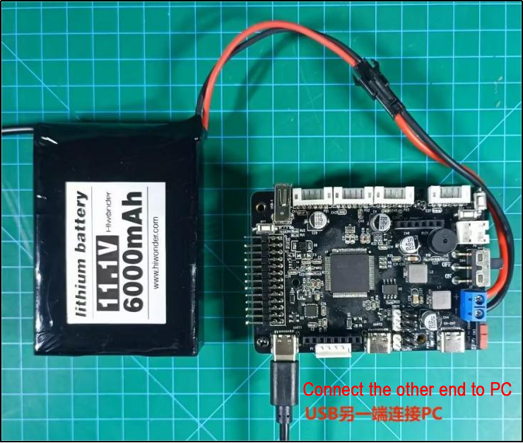
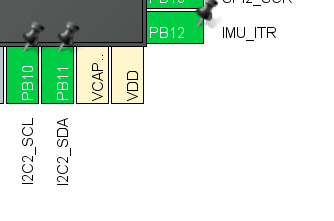
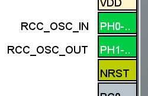
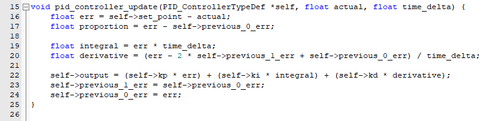
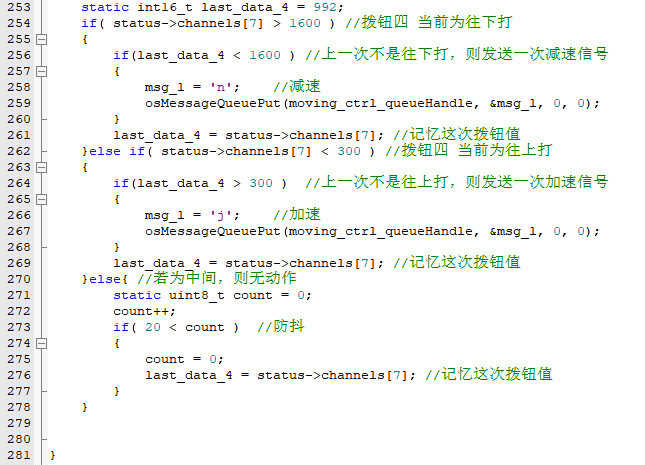
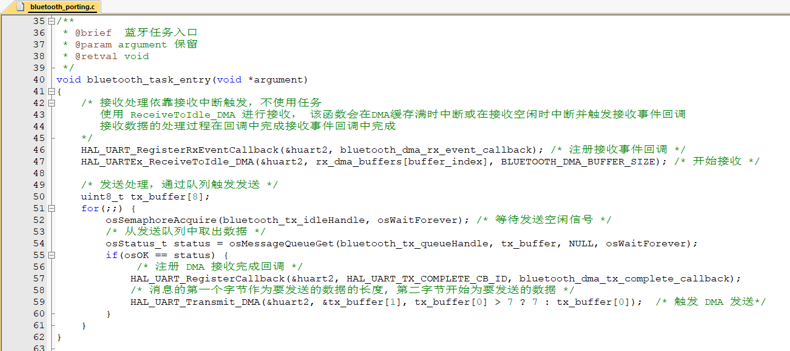
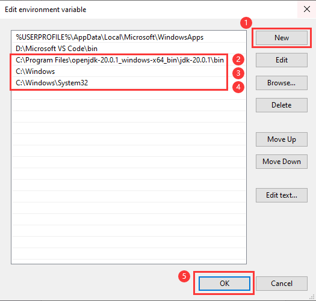
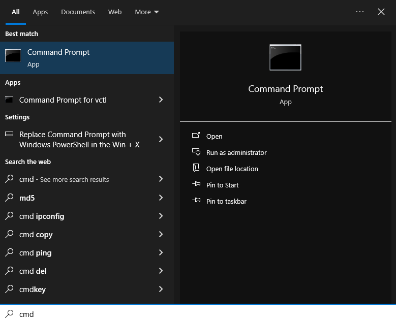

# 3. RosRobot Controller Program Analysis

## 3.1 RRC Program Architecture Analysis

### 3.1.1 Project Architecture Diagram

The project structure analysis diagram is a functional architecture diagram of the robot car. It outlines the main source code files that the robot car will use. As the original image is too long, it would take up a lot of space. You can refer to the "**RRC Project Structure Diagram.png**" file in the current folder for comparison. The contents of the files involved are located in the "**[Appendix](https://drive.google.com/drive/folders/1wYGlUMJuNYYNTIAeKbFgjqhX0qfjMQ66?usp=sharing)**" folder.

### 3.1.2 Architecture Analysis

The RRC program mainly consists of four main parts: Peripherals, Chassis, Porting, and System.

Next, each part will be explained.

* **Peripherals**


Peripherals involves the software initialization and execution functions of the relevant components on the STM32 main control board, including:

**Button (button.c)**: This file is used to implement hardware-independent button detection. The callback function for button presses is defined here. It enables implementing button detection functionality across different hardware platforms using the same code, requiring only a specific implementation for reading button states. It also supports various button events.

**LED (led.c)**: This file contains hardware- and system-independent code for LED functionality. It defines parameters, functions, and tasks related to LED operation.

**PWM Interface (pwm_servo.c)**: This file contains hardware-independent code for PWM servo control. It provides an interface to control PWM servos, allowing them to move to specific positions within specified time frames and enabling deviation correction.

* **Chassis**


The Chassis folder contains implementations of kinematic algorithms for different types of chassis (velocity, acceleration, turning radius), including:

**Differential Chassis (differential_chassis.c)**: Implementation of kinematic code for a differential drive chassis. The main functions to focus on are diff_chassis_move and set_velocity_radius.

**Mecanum Chassis (mecanum_chassis.c)**: Implementation of kinematic code for a mecanum drive chassis. The main functions to focus on are mecanum_chassis_set_velocity, mecanum_chassis_set_xy, and set_velocity_radius.

**Ackermann Chassis (ackermann_chassis.c)**: Implementation of kinematic code for an Ackermann drive chassis. The main functions to focus on are ackermann_velocity_difference, ackermann_chassis_move, and set_velocity_radius.

* **Porting**

Porting involves the implementation functions for the interfaces of components on the STM32 main control board and related sensor accessories that can be mounted. When calling these functions later on, particular attention can be paid to the "**hiwonder/Porting**" folder.


**LED (led_porting.c)**: Example and interface for controlling onboard LED lights. The main functions to focus on are:

1. leds_init: Used to initialize LED-related memory and variables.

2. led_set_pin: Used to set the state of the LED lights (on/off).

**Button (button_porting.c)**: Example and interface for controlling onboard buttons. The main functions to focus on are:

1. buttons_init: Used to initialize button-related memory and variables.

2. button_timer_callback: This is a timer callback function used for periodically scanning the state of the buttons.

**Buzzer (buzzer_porting.c)**: Example and interface for controlling the onboard buzzer. The main functions to focus on are:

1. buzzers_init: Used to initialize buzzer-related memory and variables.

2. buzzer1_set_pwm: Buzzer PWM setting interface used to set the PWM frequency of the buzzer.

**Odometer (imu_porting.c)**: Interface file for MPU6050, retrieving the three-axis angular values of the IMU odometer. The main functions to focus on are:

imus_init: Used to initialize the IIC address of MPU6050 and related parameters.

imu_task_entry: IMU task entry function. In the loop, it waits for a semaphore, then updates the IMU data, retrieves acceleration and gyroscope data, and sends these data packets.

**LCD Screen (lcd_porting.c)**: Interface file for the LCD screen. The main functions to focus on are:

lcds_init: Initialization function for the LCD screen. Used to initialize parameters such as screen dimensions, write frequency, and sleep frequency.

lcd1_spi_write: Writing content to the LCD screen.

**Motor Driver (motor_porting.c)**: Used to drive the motors for rotation.

The main functions to focus on are:

motors_init: Initialization function for the motors. Used to initialize parameters such as PID parameters and rotation speed limits.

set_motor_param: Writing PID parameters for the motors.

**PWM (pwm_servo_porting.c)**: Used for controlling PWM servos.

The main functions to focus on are:

pwm_servos_init: Initialization function for the PWM interface. This function initializes four PWM servo objects and configures a timer to generate PWM signals. Each servo object has a corresponding write function associated with it. These functions send PWM signals to the physical pins of the servo, thereby controlling its rotation.

pwm_servo1_write_pin: Control function for PWM servo 1.

**SBUS Receiver Protocol (sbus_porting.c)**: Used for receiving the SBUS protocol.

The main functions to focus on are:

sbus_init: Initializes SBUS-related memory and variables and starts SBUS reception.

sbus_dma_receive_event_callback: SBUS reception event callback function. Refer to the code comments for specific details.

**Bluetooth (bluetooth_porting.c)**: Used for implementing the Bluetooth serial protocol transmission and reception interface.

The main functions to focus on are:

1. bluetooth_task_entry: Bluetooth task entry function, executed using FreeRTOS. In the loop, it waits for the Bluetooth to send an idle semaphore, retrieves data from the Bluetooth data transmission queue, and sends data using DMA.

2. bluetooth_dma_rx_event_callback(UART_HandleTypeDef \*huart, uint16_t length): Bluetooth reception event callback function.

3. bluetooth_dma_tx_complete_callback(UART_HandleTypeDef \*huart): Callback function for Bluetooth DMA transmission completion.

Interface porting and memory space definition (lwmem_porting.c): Definition of memory space addresses.

Array of lwmem_region_t structures: Each structure defines a memory region. The first region starts at address 0x10000000 with a size of 64KB, used for RAM on the microcontroller. The second region is lwmem_ram, defined earlier, with a size of 38KB. The last item { NULL, 0 } serves as the end marker for the array.

**Chassis Control Interface (chassis_porting.c)**: Used for controlling chassis movement. It defines objects for five different types of mobile chassis, provided for user selection. When using it, users can choose the appropriate chassis for control.


1. chassis_init: Initializes the chassis.

2. set_chassis_type: Selects the type of chassis.

**u8g2 (u8g2_porting.c)**: Used for driving OLED screens with the u8g2 library. It serves as the OLED screen driver interface.

u8g2_init: Initializes the u8g2 object, registers relevant driver interfaces, and initializes the screen.

u8x8_gpio_and_delay: This function provides GPIO and delay operations for the u8g2 library.

u8x8_byte_hw_i2c: This function is a hardware-level interface of the u8g2 library used for implementing I2C communication with the OLED screen.

* **System**

The "**System**" folder contains system files responsible for initiating various tasks and other component-related initializations. It is mainly divided into four parts: battery detection, gamepad buttons, lvgl interface data, and main application logic.


**Battery Detection (battery_handle.c)**: Used for detecting battery voltage, calculating actual voltage, and sending low voltage alerts.

battery_check_timer_callback function: Key aspects include how to handle and report battery voltage, as well as how to respond to low voltage situations. This function covers several key functionalities: 1. Reading and filtering battery voltage. 2. Periodically sending battery voltage to GUI or Bluetooth. 3. Low battery alerts.

**Gamepad Buttons (gamepad_handle.c)**: Used for receiving button messages from PS2 gamepads and sending message handles.

USBH_HID_EventCallback function: Callback function for handling gamepad detection events. It connects and controls the gamepad.

A_T_C(int8_t analog_x, int8_t analog_y) function: This function interprets the position of the analog joystick based on its x and y values. It handles and interprets USB HID events, translating analog joystick movements from the gamepad into specific character directions.

**LVGL (gui_handle.c)**: Used for updating data, information, and display content in the LVGL interface.

update_sbus_view function: Displays SBUS protocol messages.

lvgl_timer_callback function: Callback function for LVGL events.

gui_task_entry function (compiled only when ENABLE_LVGL is true): The main loop waits for and processes events in the message queue. Depending on the event type, it can update battery voltage display or handle other LVGL tasks.

**Main Application Logic (app.c)**: The startup file for the main application program.

This typically contains major task entry functions, tasks created in FreeRTOS, and message queue tasks. This program describes the main application logic of a robot, involving hardware initialization, configuration, and response to button events.

> [!NOTE]
>
> **Note: Before making any modifications to the program, be sure to back up the original factory program. Avoid making direct modifications to the source code files to prevent any accidental parameter changes that may lead to robot malfunctions and become irreparable!!!**

## 3.2 RRC LED and Buzzer Source Code Analysis

### 3.2.1 Program Logic

This chapter mainly focuses on controlling the LEDs on the STM32 main control board, including turning them on, off, and making them blink.

### 3.2.2 Hardware Connection

The hardware connection diagram is as below:



### 3.2.3 Program Download

The example for this section is '**rosrobotcontrollerm4_LED_demo**'.

For specific instructions on how to download the program, refer to the document: '**[2. STM32 Development Fundamentals/2.3 Project Compilation and Download](https://wiki.hiwonder.com/projects/ROS-Robot-Control-Board/en/latest/docs/2_STM32_Development_Fundamentals.html#project-compilation-download)**'.

### 3.2.4 Program Outcome

Wait for 3 seconds for the LED to turn on, then another 3 seconds for it to turn off. Afterward, wait 3 seconds for the LED to start blinking (off for 200ms, on for 200ms). After blinking for 3 seconds, the LED will turn off.


### 3.2.5 State Machine Configuration

Use STM32CubeMX to check the information on software timers and state machines. In the '**Pinout & Configuration**' section, go to '**FreeRTOS**' and open '**Timers and Semaphores**'. You will find the details of '**led_task_handler**' there.


The current application is in Hiwonder/Peripherals/led.c

### 3.2.6 Source Code Analysis

The source code for this course is located in the same folder as this tutorial document, mainly analyzing the files Hiwonder/System/app.c and Hiwonder/Peripherals/led.c.

* **LED Functionality Implementation**


Above is the App.c file, where `app_task_entry()` serves as the user's entry function. The main programming flow is as follows:

An externally defined variable `led_timerHandle` is used as the timer handle.

The `leds_init` function is called to initialize the LEDs.

Then, the osTimerStart function is used to start the timer, passing LED_TASK_PERIOD as the timer's working interval. This enables the LED control function to be called in the timer interrupt.

First, the LED timer is started, waiting for 3 seconds for the LED to turn on.

Then, waiting for another 3 seconds for the LED to turn off. Subsequently, waiting for 3 seconds to begin LED blinking (off for 200ms, on for 200ms).

After 3 seconds of LED blinking, the light goes off.

The program uses a timer to control the blinking of the LED, and delay functions are used to control the on/off time of the LED and the number of blinks.

* **Control LED On, Off and Blinking**


Above is the LED.c file, which constructs an LED object and provides three methods to control the LED:

The `led_on()` function is a structure for turning the LED on.

The `led_off()` function is a structure for turning the LED off.

The `led_flash()` function is a structure for making the LED blink.

The `led_object_init(LEDObjectTypeDef *self)` function initializes the LED object. In this function, the state of the state machine is set to LED_STAGE_IDLE.

## 3.3 RRC Button Detection Source Code Explanation

### 3.3.1 Program Logic

This chapter mainly focuses on controlling the buzzer sound through the built-in buttons on the STM32 main control board, accompanied by different LED status blinking.

### 3.3.2 Hardware Connection

The hardware connection diagram is as below:


### 3.3.3 Program Download

The example for this section is '**rosrobotcontrollerm4_key_buzzer**'.

For specific instructions on how to download the program, refer to the document: '**[2. STM32 Development Fundamentals/2.3 Project Compilation and Download](https://wiki.hiwonder.com/projects/ROS-Robot-Control-Board/en/latest/docs/2_STM32_Development_Fundamentals.html#project-compilation-download)**'.

### 3.3.4 Program Outcome

1.  Press the K2 button twice at startup, and the buzzer will emit three consecutive beeps.

2.  Press the K1 button; upon a single press, the buzzer emits 3 beeps. After the first press, the LED turns off; after the second press, the LED turns on; after the third press, the LED starts blinking.


### 3.3.5 PIN Configuration

Using the STM32CubeMX software to check the pin information, according to the diagram below, it can be seen that the chip pin corresponding to the buzzer is PA8. The pin configuration corresponding to the buttons is PE1 and PE0.


### 3.3.6 Source Code Analysis

The source code for this lesson is located in the same folder as this tutorial document, primarily analyzing the files Hiwonder/System/app.c and Hiwonder/Peripherals/buzzer.c.

* **LED State and Buzzer State Change**


Above is the App.c file, where `button_event_callback()` serves as the button callback function. The main programming flow is as follows:

Button event detection;

Different buzzer sounds for pressing button 1 and button 2;

Different LED state changes based on the number of times button 1 is pressed.

* **Buzzer Activation, Deactivation, and Setting of Beep Duration**


Above is the buzzer.c file, where the `buzzer_on()` function is to turn on the buzzer. It initializes the buzzer control structure, sets the buzzer frequency, and sets other properties to make the buzzer continuously beep.

.ticks_off = 0, // Silence time is 0, indicating continuous buzzing

The `buzzer_off()` function is to turn off the buzzer.

.ticks_on = 0, // Beeping time is 0, indicating silence

The `buzzer_didi()` function is to set the buzzer's frequency and beep mode. It sets the buzzer's frequency, beeping time, silence time, and repeat count.

freq, ticks_on, ticks_off, repeat

* **A Callback Function and Button Status Task are Registered**


Above is the app.c file, where the `button_register_callback` function is used to register a callback function, `button_event_callback`, for specific buttons (here buttons\[0\] and buttons\[1\]). The `callback` function is invoked when specific events occur, such as pressing or releasing a button. When a button is pressed or released, the callback function `button_event_callback` is executed, triggering the corresponding code to run.


Above are the functions in the button.c file, including the `callback` function for registering button events and the default button event `callback` function.


Above are the functions in the `button.c file (partial screenshot omitted)`. The `button_task_handler` function handles different button states and events, including detecting button presses, releases, and long presses, and performs corresponding actions as needed.


The `button_porting` function periodically scans and updates the real-time status of the buttons.

## 3.4 RRC ADC Power Supply Voltage Detection

### 3.4.1 Program Description

This section primarily involves using the built-in ADC circuit in the STM32 main control board to read the battery voltage and output the voltage value via the serial port.

### 3.4.2 Hardware Connection

Connect the USB to serial port 1 and the other end to a PC. The hardware connection diagram is as follows:


### 3.4.3 Program Download

The example for this section is "**rosrobotcontrollerm4_ADC_battery**". For specific download methods, refer to the document: "**[2. STM32 Development Fundamentals/2.3 Project Compilation and Download](https://wiki.hiwonder.com/projects/ROS-Robot-Control-Board/en/latest/docs/2_STM32_Development_Fundamentals.html#project-compilation-download)**".

### 3.4.4 Program Outcome


Open the serial assistant (located in "**[Appendix](https://drive.google.com/drive/folders/1aXGtI4NxXUY_R-C1QPpTinZ5E3yDQ7kA?usp=sharing)**"), find the serial port connected to the development board (it may not necessarily be COM4, select based on actual conditions), and set it as follows:

Baud Rate: 115200

Data Bits: 8

Parity: None

Stop Bits: 1

Display Encoding Format: UTF-8

After opening the serial port, you will see continuously refreshed data, where the data following "**battery**" is the battery voltage.

### 3.4.5 Pin Configuration

Use the STM32CubeMX software to view pin information. During program operation, the ADC conversion function of the pin will be enabled. The corresponding chip pin is: PB0


### 3.4.6 Source Code Analysis

The source code for this course is located in the same folder as this tutorial document, mainly analyzing the Hiwonder/System/app.c and Hiwonder/System/battery_handle.c files.

* **Voltage Print Output**


The App.c file includes the user entry function `app_task_entry()`. The main programming flow is as follows:

Start the battery monitoring timer, which detects once every 50ms.

Then start the ADC conversion channel.

Finally, continuously print the battery voltage value.

The external variable `battery_volt` stores the measured battery voltage value. Therefore, by reading this value, you can obtain the voltage.

* **Reading Battery Voltage**


The battery_handle.c file contains the `battery_check_timer_callback()` function, which is the callback function for the battery monitoring timer and is entered every 50ms to read the voltage value. The ADC value read will be stored in the `adc_value array`. The program flow is as follows:

First, check if `adc_value[]` is an error read value.

If the read value is correct, calculate and convert the value to a voltage value and store it in the global variable `battery_volt`.

If incorrect, do nothing.

Start a new ADC value reading.

The `HAL_ADC_Start_DMA()` function enables the DMA method for ADC reading:

HAL_StatusTypeDef HAL_ADC_Start_DMA ( ADC_HandleTypeDef\* hadc,

uint32_t\* pData , uint32_t Length )

Parameter 1: ADC handle

Parameter 2: Storage address of the ADC value

Parameter 3: Size of the ADC data

This function allows the ADC value to be automatically stored in the storage address without needing the CPU.

This function allows the ADC value to be automatically stored in the storage address without needing the CPU.

## 3.5 RRC QMI8658 Accelerometer and Gyroscope Source Code Analysis

### 3.5.1 Program Description

This chapter focuses on reading data from the built-in MPU6050 on the STM32 development board, calculating the current attitude of the board, and outputting the data via the serial port and displaying it on the OLED.

### 3.5.2 Hardware Connection

Connect the OLED display to the main control board via I2C expansion interface. The hardware connection diagram is as follows:


### 3.5.3 Program Download

The example for this section is "**rosrobotcontrollerm4_IMU**".

### 3.5.4 Program Outcome

After downloading the program, press the **RESET** button to see the real-time attitude data of the development board displayed on the OLED screen.

After reset, the data displayed for the three axes is basically zero (with some minor errors), as shown below:


For forward and backward tilting, mainly the Roll data changes.


For left and right tilting, mainly the Pitch data changes.


For plane rotation, mainly the Yaw data changes.


### 3.5.5 Pin Configuration

View the pin information through stm32cubemx software. The MCU communicates with the IMU using I2C, and the IMU sends interrupt signals for the MCU to collect IMU data.

The corresponding I2C chip pins are PB10 and PB11; the interrupt pin is PB12.



### 3.5.6 Source Code Analysis

The source code for this section is located in the "**[Appendix](https://drive.google.com/drive/folders/1wYGlUMJuNYYNTIAeKbFgjqhX0qfjMQ66?usp=sharing)**" folder. The main program framework is designed as follows:

Analyze interrupts through the Application/User/Core/stm32f4xx_it.c file

Analyze the display task through the Hiwonder/System/app.c file

Analyze the IMU reading task through the Hiwonder/Porting/imu_porting.c file


The analysis is divided into three parts:

1.  External interrupt handling

2.  Loop reading task

3.  Loop display task

* **External Interrupt**

In the Application/User/Core/stm32f4xx_it.c file, the `EXTI15_10_IRQHandler()` function handles the external interrupt. Before IMU module provides a new set of data for host computer to read, it sends a signal (a voltage level change) through one of its INT pins to trigger the interrupt.

The main controller enables external interrupts on the pin connected to the IMU to detect voltage level changes, thereby monitoring the IMU data transmission status. When an external interrupt is triggered, it unblocks the flag indicating IMU data readiness (i.e., the semaphore IMU_data_readyHandle in the RTOS), as shown below:


* **IMU Reading Task**

The reading task first `calls begin()` to initialize the IMU and its parameters. After that, it enters a loop to continuously wait for and read IMU data.


The `osSemaphoreAcquire()` function in the RTOS system acquires the semaphore:

1. Parameter 1: Semaphore handle (here, the IMU semaphore handle)

2. Parameter 2: Timeout duration (ms), with osWaitForever meaning to wait indefinitely.

If there is no semaphore in the queue, the function waits and executes other tasks. When a semaphore is available, it retrieves it and continues running the subsequent program.

The `GetEulerAngles()` function is called to read the IMU's Euler angle data, which is then stored into the rpy array.

* **IMU Data Display Task**

This task prints the data stored in the IMU object to the serial port and displays it on the OLED. The program flow is as follows:

Initialize the OLED;

Loop:

The real-time Euler angle data stored in the rpy array is displayed on the OLED screen and also printed to the serial port using printf.

Delay for 150ms；


As described above, in the "**IMU reading task**," each time the semaphore changes, the real-time IMU data is immediately read and stored into the global rpy array. Therefore, in the current task, it is sufficient to continuously output the three elements of the rpy array (Euler angles) via the OLED display and serial port to represent the real-time attitude data.

Since refreshing the OLED screen takes time, a delay is required in each loop cycle to ensure proper display of the current data and smooth screen updates.

<p id="anchor_3_6"></p>

## 3.6 RRC PWM Servo Control Principle and Source Code Analysis

### 3.6.1 PWM Servo Description

A servo is a common motor drive device used to control the position, speed, and acceleration in a mechanical system. It typically consists of a motor, a control circuit, and a feedback system.

In terms of type, servos can be categorized into analog servos, PWM (pulse width modulation) servos, and bus servos. This section mainly focuses on PWM servos.

PWM servos use pulse width modulation signals to control the angular position of the servo. In simple terms, a PWM servo controls the angular position by varying the pulse width of the signal. The range of the pulse width determines the extreme angular positions of the servo, while the period of the control signal determines the refresh frequency of the signal. By adjusting the duration of the pulse width, precise control of the servo position can be achieved.

PWM achieves a level state between 0 and 1, meaning that when PWM is output, the voltage can be any value between 0 and 3.3V/5V.

When using PWM control, it is essential to know two parameters of the object being controlled:

Its PWM frequency (corresponding to the timer cycle)

Its operating pulse width (corresponding to the PWM duty cycle)

The control signal enters the signal modulation chip from the receiver channel to obtain a DC bias voltage. Inside, a reference circuit generates a reference signal with a period of 20ms and a width of 1.5ms. The obtained DC bias voltage is compared with the voltage of the potentiometer to produce a voltage difference output. Finally, the positive and negative outputs of the voltage difference are sent to the motor driver chip to determine the motor's forward and reverse rotation. When the motor speed is constant, the potentiometer is driven to rotate through the cascade reduction gear, ensuring the voltage difference becomes zero, and the motor stops rotating.

### 3.6.2 Wiring Method:

* **Required Stuffs**:

1.  stm32 controller

2.  LD-1501MG digital servo

* **Connection Instructions**

1.  The diagram below shows the reserved interfaces J1 and J2 provided by the STM32 main control board for the PWM servo.


The enlarged detail image below shows the reserved connection ports J1 and J2, highlighted in the red box. There are three types of connections: signal line (S), power supply (+5V), and ground (−), as indicated in the green box.


2. Connect the servo's 3-pin cable to the corresponding J2 or J1 interface, as shown below:

The connection method is as follows:

White -\> Signal line (S)

Red -\> Power supply (+5V)

Black -\> Ground (−)


<p style="text-align:center">Connect to J2</p>


<p style="text-align:center">Connect to J1</p>

The STM32 main control board can be powered by our 7.4V lithium battery pack. For detailed connection instructions, please refer to "**[3.6.7 Usage and Precautions of LiPo Batteries](#anchor_3_6_7)**" in the current document path.

> [!NOTE]
>
> **Attention: The servo motor must be connected according to the positions shown in the document diagram. Avoid connecting it incorrectly or mistakenly to prevent burning out the motor. Our company will not take any responsibility!!!**

### 3.6.3 Program Burning

The sample program can be found in '**[3.6 RRC PWM Servo Control Example/rosrobotcontrollerm4_pwmServo](https://drive.google.com/drive/folders/1vqrtvotG6MMS5nd01oj0acQY2ACpRavl?usp=sharing)**'. For the steps and precautions required for programming burning, please refer to '**[2. STM32 Development Fundamentals/2.3 Project Compilation and Download](https://wiki.hiwonder.com/projects/ROS-Robot-Control-Board/en/latest/docs/2_STM32_Development_Fundamentals.html#project-compilation-download)**' document. Simply compile the '**rosrobotcontrollerm4_pwmServo**' program located in the current document path to generate the hex file and proceed with the burning process.

### 3.6.4 Program Outcome

Based on the set PWM servo pulse width values, the servo rotates to the corresponding angles, as shown in the following diagram:


### 3.6.5 Code Analysis

* **Header File**

**File location: Hiwonder/Peripherals**

**Object PWMServoObjectTypeDef:**


Calling the PWM control object generated by the PWMServoObject structure.

**PWMServoObject Structure:**


This structure is used to configure PWM control objects.

Parameters:

Id: Servo ID

offset: Servo offset

target_duty: Target pulse width

current_duty: Current pulse width

duty_raw: Raw pulse width, the width finally written into the timer

Duration: Time for the servo to move from the current angle to the specified angle, controlling the speed

duty_inc: Pulse width increment for each position update

inc_times: Number of increments needed

is_running: Whether the servo is in the process of rotation

duty_changed: Whether the pulse width has been changed

Function write_pin:

This function is used for setting the IO port level. After initialization, this function will be used to set the 0-3 PWM servos.

It has the parameter 'new_state' representing the current pin's high or low level.

**Declare function pwm_servo_object_init:**


This function initializes the PWM servo object. Instantiation requires initializing the servo object pointer.

**Declare function pwm_servo_duty_compare**:


This function controls the PWM servo pulse width, calculates the pulse width change and the pulse width required for the current speed, and implements control. It needs to be called every 50ms and requires setting the servo object pointer for control.

**Declare function pwm_servo_set_position:**


Set the angle of the PWM servo. Actually, it only sets several internal variables of the servo object and does not immediately control the servo. The actual servo control is calculated and controlled by `pwm_servo_duty_compare`.

**Declare function pwm_servo_set_offset:**


Set the offset of the PWM servo, requiring the servo object pointer for control.

* **Source Code**

File location: Hiwonder/Peripherals

Function pwm_servo_duty_compare:


This function is used for controlling pulse width change comparison and speed control.

Parameters: PWMServoObjectTypeDef instantiated object that needs to be controlled.

Firstly, it calculates the control parameters of the servo according to the newly set target. Then, it controls the servo to gradually rotate to the corresponding new position based on the newly set position. Finally, when the last increment occurs, the new position will be assigned to the current position, ensuring the final position is correct.

**Function: pwm_servo_set_position：**


This function is used to set the rotation position of the servo.

Parameters: PWMServoObjectTypeDef instantiated object that needs to be controlled, rotation position (pulse width), required time.

Firstly, it is necessary to limit the duration of the movement as well as the maximum and minimum values of the pulse width. Then, assign the corresponding rotation position and time, as well as the switch to control the servo rotation, to the parameters corresponding to the instantiated PWMServoObjectTypeDef object.

**Function pwm_servo_set_offset:**


This function is used to set the offset of the servo.

Parameters: PWMServoObjectTypeDef instantiated object that needs to be controlled, PWM servo offset.

Here, the magnitude limit of the offset will be set. When the servo rotates, this parameter will be used for adjustment.

**Function pwm_servo_object_init:**


This function is the initialization function for the PWM servo `PWMServoObjectTypeDef` instantiated object.

Parameters: `PWMServoObjectTypeDef` instantiated object that needs to be controlled.

Firstly, new memory is allocated for initialization, and then the initial position of the PWM servo is set.

* **Initialization**

File location: Hiwonder/Porting

Instantiation of PWM servo objects:


Instantiate objects of the `PWMServoObjectTypeDef` structure for PWM servos 1-4.

Setting servo:


Here, four functions are used to configure the interfaces of four PWM servos. They call `HAL_GPIO_WritePin` to set the port number, pin, and high or low level for each PWM servo.

Parameter: `new_state` represents the current pin's high or low level.

PWM servo initialization:


This function is used for initializing PWM servos.

Firstly, it initializes the memory of existing PWM objects and resets them to their initial positions.

Then, it assigns the function for setting servo levels to the write_pin function of the PWM servo object.

Finally, it sets up the timer.

### 3.6.6 LD-1501MG Digital Servo


* **Product Introduction**

When use LD-1501MG Digital Servo, signal terminal sends a PWM signal with a period of 20ms. It controls servo angle by adjusting pulse width. The pulse width is available from 500 to 2500μs corresponding to angle from 0°to 180° .

This servo featuring high control accuracy, excellent linearity, fast respond and strong torque is usually applicable in joint design of various bionic robots.

* **Specification Instruction**

**1. Specification**

| Working Voltage       | DC 6-8.4V                                                    |
| --------------------- | ------------------------------------------------------------ |
| No-load current       | 100mA                                                        |
| Stall Current         | 2.4~3A                                                       |
| Control Method        | PWM                                                          |
| PWM Pulse Width Range | The pulse width from 500 to 2500μs corresponds to anglefrom 0 to180° |
| Pulse Period          | 20ms                                                         |
| Rotate Speed          | 0.16sec/60° (DC 7.4V)                                       |
| Stall Torque          | 13kg.cm (DC 6V) 15kg.cm (DC 6.5V)17kg.cm (DC 7.4V)        |
| Rotate Range          | 0~ 180°                                                      |
| Servo Accuracy        | 0.3°                                                         |
| Servo Wire            | 30cm                                                         |
| Gear Material         | Metal Gear                                                   |
| Dimension             | 54.38mm*20.04mm*45.5mm                                       |
| Weight                | 61g                                                          |
| Application           | All kinds of bionic robot joints                             |

**2. Servo Dimension Drawing**

Unit：mm


**3. Port Instruction**


| PIN        | PIN Instruction               |
| ---------- | ----------------------------- |
| White Wire | Signal Wire                   |
| Red Wire   | Positive pole of power supply |
| Black Wire | Ground Wire                   |

* **Project**

Using the sensor with UNO controller to help you get quick experience.

**1. Preparation**

1 UNO Controller \*1

2 LD-1501MG Digital Servo \*1

3 USB Cable \*1

4 Male to Male Dupont line \*3

**2 .Wiring diagram**

Take connecting servo to UNO controller with male-to-male Dupond line as example.


**3. Project Process**

Step 1: Download and install Ard uino IDE on your computer.

Step 2: Connect LD-1501MG digital servo to UNO board as the picture shown above.

Step 3: Connect UNO board to computer with USB cable. After opening Arduino IDE, please paste "**5. Example code"**in "**File/New**" .

Step 4: Select suitable demo board and port, then compile and upload the program.

**4. Project Outcome**

After the code is uploaded successfully, servo rotates within range from 0°to 180°.

**5. Example Code**

```py
/*******LD-1501MG Digital Servo Testing Program*******
* Arduino Type：Arduino UNO
**************************/
int servopin=8;
int pulsewidth;
int val;

void servo(int myangle)
{
pulsewidth=map(myangle,0, 180,500,2500);
digitalWrite(servopin,HIGH);
delayMicroseconds(pulsewidth);
digitalWrite(servopin,LOW);
delay(20-pulsewidth/1000);
}

void setup()
{
pinMode(servopin,OUTPUT);
}

void loop()
{
servo(0);
delay(1000);
servo(180);
delay(1000);
}
```

* **Q&A**

Q1: Why servo failed to display after uploading?

A: Please check the wiring. Signal terminal of the servo need to be connected to D8 port of UNO controller.

Q2: How should we supply UNO controller power?

A: We connect black DC plug to a external power as well as supply UNO board and servo power. The power voltage of UNO controller ranges from DC 7 to 12V and the working voltage of UNO board ranges from DC 6 to 8.4V.

Therefore, the provided power voltage is required to meet two demands above so that the voltage should range from DC 7 to 8.4V.

<p id="anchor_3_6_7"></p>

### 3.6.7 Usage and Precautions of LiPo Batteries

* **Precautions**

1)  When connecting the battery leads, do not connect them directly to the lithium battery without connecting them to the control board! Avoid contact between positive and negative terminals to prevent short circuits!


2)  When connecting the battery leads to the control board, ensure the red end connects to the positive terminal and the black end to the negative terminal, and do not reverse them!

3)  The battery leads are designed to prevent reverse insertion. Do not force them into the battery to avoid damaging the interface.

4)  Please use the charger provided with the lithium battery for charging.

5)  When the charger is connected to the battery without connecting to the power source, the indicator light is green.

6)  Store the battery in a cool, dry environment to prevent shortening its lifespan due to overheating or moisture.

7)  Do not strike, throw, or step on the battery.

8)  Avoid using the battery in environments with strong static electricity or magnetic fields, as this can damage the battery's safety protection mechanism.

9)  Do not use metal objects to connect the positive and negative terminals of the battery.

10)  Do not plug the battery into a power outlet.

* **Battery Connection Method**

Taking the example of powering with a 7.4V 3500mA battery:

1)  Take out the power connection cable and the Hiwonder Car Controller.


2. Loosen the screw on the power interface of the controller.

   

3. After loosening, connect the red wire of the power connection cable to the '+' terminal and the black wire to the '-' terminal of the controller's power interface (be extremely careful not to reverse the polarity, as it may damage the control board).


4. Once connected, tighten the screw securely.

   

5. Take out the 7.4V lithium battery.

   

6. Connect the power connection cable from the lithium battery to the controller's power connection cable, ensuring a 'red to red, black to black' connection (here, a reverse-insertion prevention design is used, so do not force it; if it doesn't fit, try rotating it to another side).


* **Charging Method**

1)  Connect the DC plug of the battery to the dedicated charger plug provided in the kit, as shown in the figure below:


2. Then, plug the charger into the socket. Users can check the indicator lights on the charger to understand the charging status. Red indicates charging, while green indicates charging is complete.


> [!NOTE]
>
> **Note: Please unplug the battery charger in time to avoid overcharging.**

## 3.7 Servo Motion Speed Control and Source Code Analysis

### 3.7.1 PWM Servo Description

A servo is a common motor drive device used to control the position, speed, and acceleration in a mechanical system. It typically consists of a motor, a control circuit, and a feedback system.

In terms of type, servos can be categorized into analog servos, PWM (pulse width modulation) servos, and bus servos. This section mainly focuses on PWM servos.

PWM servos use pulse width modulation signals to control the angular position of the servo. In simple terms, a PWM servo controls the angular position by varying the pulse width of the signal. The range of the pulse width determines the extreme angular positions of the servo, while the period of the control signal determines the refresh frequency of the signal. By adjusting the duration of the pulse width, precise control of the servo position can be achieved.

PWM achieves a level state between 0 and 1, meaning that when PWM is output, the voltage can be any value between 0 and 3.3V/5V.

When using PWM control, it is essential to know two parameters of the object being controlled:

Its PWM frequency (corresponding to the timer cycle)

Its operating pulse width (corresponding to the PWM duty cycle)

The control signal enters the signal modulation chip from the receiver channel to obtain a DC bias voltage. Inside, a reference circuit generates a reference signal with a period of 20ms and a width of 1.5ms. The obtained DC bias voltage is compared with the voltage of the potentiometer to produce a voltage difference output. Finally, the positive and negative outputs of the voltage difference are sent to the motor driver chip to determine the motor's forward and reverse rotation. When the motor speed is constant, the potentiometer is driven to rotate through the cascade reduction gear, ensuring the voltage difference becomes zero, and the motor stops rotating.

### 3.7.2 Wiring Method:

* **Required Stuffs:**

1.  stm32 controller

2.  LD-1501MG digital servo

* **Connection Instructions**

1.  The diagram below shows the reserved interfaces J1 and J2 provided by the STM32 main control board for the PWM servo.


The enlarged detail image below shows the reserved connection ports J1 and J2, highlighted in the red box. There are three types of connections: signal line (S), power supply (+5V), and ground (−), as indicated in the green box.


2. Connect the servo's 3-pin cable to the corresponding J2 or J1 interface, as shown below:

The connection method is as follows:

White -\> Signal line (S)

Red -\> Power supply (+5V)

Black -\> Ground (−)


> [!NOTE]
>
> **Attention: The servo motor must be connected according to the positions shown in the document diagram. Avoid connecting it incorrectly or mistakenly to prevent burning out the motor. Our company will not take any responsibility!!!**

### 3.7.3 Program Download 

The sample program is '**rosrobotcontrollerm4_pwmServo_speed**'.

After downloading the program (refer to '**[2. STM32 Development Fundamentals/2.3 Project Compilation and Download](https://wiki.hiwonder.com/projects/ROS-Robot-Control-Board/en/latest/docs/2_STM32_Development_Fundamentals.html#project-compilation-download)**' for details on how to download the program), you need to press the RESET button to reset the microcontroller, which will then start executing the new program.

### 3.7.4 Program Outcome

After pressing reset, the servo will first initialize to 90°, then move to 0°, and finally rotate to 180° at a speed of 60 degrees per second.

### 3.7.5 Source Code Analysis

This program is only for speed control. For detailed PWM servo control routines, please refer to '**[3.6 RRC PWM Servo Control Principle and Source Code Analysis](#anchor_3_6)**'.


The program is located in the app.c file under /Hiwonder/System.

The **`pwm_servo_set_position()`** function controls the rotation of the servo. The required parameters are defined as follows:

Parameter 1: Servo object

Parameter 2: Target angle of the servo

Parameter 3: Movement time

The rotation speed can be obtained by dividing the rotation angle by the movement time. The program logic is as follows:

①Initialize the servo

②Set the servo to a known initial angle

③Delay to allow the servo to complete the movement. The delay time must be greater than or equal to the movement time of the servo, otherwise, the servo cannot reach the target position.

④Move the servo to the target angle and specify the movement time.

⑤Delay to allow the servo to complete the movement.

The servo movement speed can be calculated by dividing the known angle difference by the movement time.

## 3.8 RRC Bus Servo Control and Source Code Analysis

### 3.8.1 Bus Servo ID Writing and Source Code Analysis

* **Servo Description**

It is an automatic control system composed of a DC motor, reduction gears, a sensor, and control circuitry, which specifies the rotation angle of the output shaft by sending signals.

Differences between a servo and a motor:

A servo generally has a maximum rotation angle, while a DC motor rotates continuously. Therefore, a servo can only rotate within a certain angle and cannot rotate continuously like a DC motor. A regular DC motor cannot provide feedback on its rotation angle, whereas a servo can. (Digital servos can switch between servo mode and motor mode.)

* **Serial Bus Servo**

A regular DC motor typically rotates continuously to provide power, while a servo is used to control the rotation of an object to a specific angle.

A bus servo is a derivative of a digital servo that communicates via an asynchronous serial bus, meaning it can be controlled by sending and receiving command packets, forming a closed-loop control system. Due to this feature, bus servos can be daisy-chained, making wiring simpler and reducing the use of serial ports. Because of this, when connecting bus servos, each servo's ID must be set in advance, or they cannot be individually controlled.

Bus servos use high-precision potentiometers internally, and unlike PWM servos, they can provide feedback on position, temperature, voltage, and other information. Their accuracy and linearity are excellent, resulting in more stable robot operation and significantly extending the servo's lifespan.

Additionally, before assembling the servo, it must be set to its midpoint position. The servo midpoint refers to its initial position, considered the "**zero point**" from which it rotates to positive and negative angles. Therefore, the servo must be adjusted to the midpoint before being installed onto the servo horn.

This is because, during rotation, the moving parts drive the potentiometer. The software assumes the midpoint as the "**zero point**"; otherwise, the potentiometer might enter a "**blind spot**," causing the entire component to malfunction. Consequently, when using the robot, the specified angles may not be achieved, or the corresponding action sets may not match.

* **Procedure**

1)  We notice that the program defaults to setting the bus servo ID as 1, but this ID can be changed to other numbers.


2)  We can change the ID number to 5.


3)  After recompiling and burning the program, connect the servo debugging board to the computer's serial port. Open the Bus Servo Terminal software , select the communication port, for example, COM15, click on parameter settings, and upon reading, it will show the ID number as 5, indicating that the ID has been successfully set.


2.  5ms ---------- 180 degrees

* **Code Analysis**

File locations: Hiwonder/app.c


File locations: The function `serial_servo_set_id()` in Hiwonder/serial_servo.c is used to change the ID of a specific servo from old_id to new_id. The servo ID is sent to the servo via a serial data frame (defined by the array buf\[\]).


The function `serial_servo_set_position()` is used to set the position and duration of motion for the servo. Specific position and duration information is sent to the servo via a serial data frame (defined by the array buffer\[\]).


The `serial_servo_stop()` function is designed to send a command to stop the servo via the serial port.

Execution process:

\(1\) Define a buffer to store the sent data frame.

\(2\) Fill the content of the data frame: frame header, servo ID, data length, stop servo, checksum, and finally send the data frame via the serial port.


### 3.8.2 RRC Bus Servo Simple Rotation and Source Code Analysis

* **Servo Description**

It's an automatic control system consisting of a DC motor, reduction gear set, sensor, and control circuitry, which specifies the rotation angle of the output shaft by sending signals.

Differences between a servo and a motor:

Servos generally have a maximum rotation angle; DC motors rotate in full circles. Therefore, servos can only rotate within a certain angle and cannot rotate continuously like DC motors. Regular DC motors cannot provide feedback on their rotation angle, while servos can. (Digital servos can switch between servo mode and motor mode.)

* **Serial Bus Servo**

Regular DC motors typically rotate in full circles to provide power, while servos are used to control the rotation of an object to a specific angle.

Bus servos are derivatives of digital servos that communicate via an asynchronous serial bus, meaning control is achieved through the sending and receiving of instruction packets, representing a closed-loop control system. Due to this feature, bus servos can be daisy-chained, simplifying wiring and reducing serial port usage. Consequently, when connecting bus servos, it's necessary to set the ID for each servo beforehand; otherwise, it would be impossible to differentiate between them during control.

Bus servos internally utilize high-precision potentiometers. Compared to PWM servo control, they not only have the ability to provide feedback on position, temperature, voltage, and other information, but also exhibit excellent accuracy and linearity. This makes robot operation more stable and significantly extends the lifespan of servos.

Additionally, before assembling servos, it's essential to perform a midpoint operation. The midpoint of the servo refers to its initial position, which serves as the "**zero point**" for positive and negative angle rotations. Therefore, servos should be adjusted to the midpoint before installation onto servo horns.

This is because, during servo rotation, the moving parts drive the potentiometer. The software assumes the midpoint as the "**zero point**"; otherwise, the potentiometer might enter a "**blind spot**," causing the entire component to malfunction. Consequently, when using the robot, the specified angles may not be achieved, or the corresponding action sets may not match.

* **Program Outcome**

We rotated the servo counterclockwise by 90 degrees, then returned it to 0 degrees, and finally stopped the servo.

* **Code Analysis**

File location: Hiwonder/app.c. This file implements the simple angle rotation of the servo and sets the position and duration of the servo's movement.


The function `serial_servo_set_position()` is used to set the position and duration of movement for the servo. Specific position and duration information is sent to the servo via a serial data frame (defined by the array buffer\[\]). The execution process of the function is as follows:

1)  Define a buffer to store the sent data frame.

2)  If the target position is greater than 1000, it is set to 1000.

3)  Fill the content of the data frame: frame header, servo ID, buffer\[3\] setting data length, set the position and movement duration of the servo.

4)  Store the low byte and high byte of the target position in buffer\[5\] and buffer\[6\], and store the low byte and high byte of the movement duration in buffer\[7\] and buffer\[8\]. Calculate the checksum, and finally send the data frame via the serial port.


The `serial_servo_stop()` function is designed to send a command to stop the servo via the serial port. The execution process is as follows:

1. Define a buffer to store the sent data frame.

2. Fill the content of the data frame: frame header, servo ID, data length, stop the servo, calculate the checksum, and finally send the data frame via the serial port.


### 3.8.3 Hiwonder Bus Servo Communication Protocol

* **Summary**

Using asynchronous serial bus communication method, theoretically, up to 253 robot servos can be connected into chain through the bus, you can unify control them through the UART asynchronous serial interfaces. Each servo can be set to a different node address, multiple servos can be unified or controlled independently. Communicating with the user's host computer software(controller or PC) through the asynchronous serial interface, you can set its parameters, function control. Sending instructions to servo through the asynchronous serial interface, the servo can be set to the motor control mode or position control mode. In the motor control mode, servo can be used as a DC reduction motor with adjustable speed; In the position control mode, servo has 0-240 degrees of rotation range with Plus ± 30 ° deviation adjustable range, in this range with precise position control performance, speed adjustable.

Half-duplex UART asynchronous serial interface which conforms to the protocol can communicate with the servo and control servo in different ways.

* **UART Interface schematic diagram**

Servo uses the program code to perform the timing control to the UART asynchronous serial interface, realizes the half-work asynchronous serial bus communication, the communication baud rate is 115200bps, and the interface is simple, the protocol is simplified. In your own designed controller, the UART interface for communication with the servo must be handled as shown below.


* **Command Packet**

Command packet format Table 1:

| Header    | ID number | Data Length | Command | Parameter      | Checksum |
| --------- | --------- | ----------- | ------- | -------------- | -------- |
| 0x55 0x55 | ID        | Length      | Cmd     | Prm 1... Prm N | Checksum |

Header: Two consecutive 0x55 are received indicating the arrival of data packets.

**ID**：Each servo has an ID number. ID number ranges from 0 ~ 253, converted to hexadecimal 0x00 ~ 0xFD.

**Broadcast ID**: ID No. 254 (0xFE) is the broadcast ID. If the ID number issued by the controller is 254 (0xFE), all servos will receive instructions, but they all do not return the response message, (except for reading the servo ID number, Please refer to the following instructions for detailed instructions) to prevent bus conflict.

**Length(data)**: Equal to the length of the data that is to be sent (including its own one byte). That is, the length of the data plus 3 is equal to the length of this command packet, from the header to the checksum.

**Command**: Control the various instructions of servo, such as position, speed control.

**Parameter**: In addition to commands, parameter are control informations that need to add.

**Checksum**: The calculation method is as follows:

Checksum=~(ID+ Length+Cmd+ Prm1+...PrmN)If the numbers in the brackets are calculated and exceeded 255,Then take the lowest one byte, "~" means Negation.

* **Command type**

There are two kinds of commands, write command and read command. Write command: normally, it followed by parameters, write the parameters of the corresponding function into the servo to complete a certain action.

Read command: normally, it will not followed by parameters, when the servo received "**read command**", it will return the corresponding data immediately , the returned command value with parameters is the same as the "**read command**" value that sent to the servo. So the PC software must immediately prepare to change itself to "**read condition**" after it sends the reading command.

The following table is command that the PC software send to servos.

| Command name               | Command value | Length |
| -------------------------- | ------------- | ------ |
| SERVO_MOVE_TIME_WRITE      | 1             | 7      |
| SERVO_MOVE_TIME_READ       | 2             | 3      |
| SERVO_MOVE_TIME_WAIT_WRITE | 7             | 7      |
| SERVO_MOVE_TIME_WAIT_READ  | 8             | 3      |
| SERVO_MOVE_START           | 11            | 3      |
| SERVO_MOVE_STOP            | 12            | 3      |
| SERVO_ID_WRITE             | 13            | 4      |
| SERVO_ID_READ              | 14            | 3      |
| SERVO_ANGLE_OFFSET_ADJUST  | 17            | 4      |
| SERVO_ANGLE_OFFSET_WRITE   | 18            | 3      |
| SERVO_ANGLE_OFFSET_READ    | 19            | 3      |
| SERVO_ANGLE_LIMIT_WRITE    | 20            | 7      |
| SERVO_ANGLE_LIMIT_READ     | 21            | 3      |
| SERVO_VIN_LIMIT_WRITE      | 22            | 7      |
| SERVO_VIN_LIMIT_READ       | 23            | 3      |
| SERVO_TEMP_MAX_LIMIT_WRITE | 24            | 4      |
| SERVO_TEMP_MAX_LIMIT_READ  | 25            | 3      |
| SERVO_TEMP_READ            | 26            | 3      |
| SERVO_VIN_READ             | 27            | 3      |
| SERVO_POS_READ             | 28            | 3      |
| SERVO_OR_MOTOR_MODE_WRITE  | 29            | 7      |
| SERVO_OR_MOTOR_MODE_READ   | 30            | 3      |
| SERVO_LOAD_OR_UNLOAD_WRITE | 31            | 4      |
| SERVO_LOAD_OR_UNLOAD_READ  | 32            | 3      |
| SERVO_LED_CTRL_WRITE       | 33            | 4      |
| SERVO_LED_CTRL_READ        | 34            | 3      |
| SERVO_LED_ERROR_WRITE      | 35            | 4      |
| SERVO_LED_ERROR_READ       | 36            | 3      |

**Command name**:Just for easy identification, the user can also set according to their own habits. Command name suffix "**\_WRITE**" which represents write command, and the suffix "**\_READ**" represents read command.

**Command value**: That is, the command Cmd in command packet of Table 1

**Length**: that is the length(data length) in table 1

**1\. Command name: SERVO_MOVE_TIME_WRITE Command value:1 Length: 7**

Parameter 1: lower 8 bits of angle value

Parameter 2: higher 8 bits of angle value.range 0~1000. corresponding to the servo angle of 0 ~ 240 ° , that means the minimum angle of the servo can be varied is 0.24 degree.

Parameter 3: lower 8 bits of time value

Parameter 4: higher 8 bits of time value. the range of time is 0~30000ms.

When the command is sent to servo, the servo will be rotated from current angle to parameter angle at uniform speed within parameter time. After the command reaches servo, servo will rotate immediately.

**2\. Command name: SERVO_MOVE_TIME_READ Command value: 2 Length: 3**

Read the angle and time value which sent by SERVO_MOVE_TIME_WRITE t o the servo

For the details of the command packet that the servo returns to host computer, please refer to the description of Table 4 below.

**3\. Command name: SERVO_MOVE_TIME_WAIT_WRITE Command value: 7 Length : 7**

Parameter1: lower 8 bits of preset angle

Parameter2: higher 8 bits of preset angle. range 0~1000. corresponding to the servo angle of 0 ~ 240 ° . that means the minimum angle of the servo can be varied is 0.24 degree.

Parameter3: lower 8 bits of preset time

Parameter3: higher 8 bits of preset time. the range of time is 0~30000ms.

The function of this command is similar to this

"**SERVO_MOVE_TIME_WRITE**" command in the first point. But the difference is that the servo will not immediately turn when the command arrives at the servo,the servo will be rotated from current angle to parameter angle at unifor m speed within parameter time until the command name SERVO_MOVE_ST ART sent to servo(command value of 11), then the servo will be rotated from current angle to setting angle at uniform speed within setting time.

**4\. Command name: SERVO_MOVE_TIME_WAIT_READ Command value: 8 Length: 3**

Read the preset angle and preset time value which sent by SERVO_MOVE_TIME_WAIT_WRITE to the servo.

For the details of the command packet that the servo returns to host computer, please refer to the description of Table 3 below.

**5\. Command name: SERVO_MOVE_START Command value: 11 Length: 3**

With the use of command SERVO_MOVE_TIME_WAIT_WRITE, described in point 3.

**6\. Command name: SERVO_MOVE_STOP Command value: 12 Length: 3**

When the command arrives at the servo, it will stop running immediately if the servo is rotating, and stop at the current angle position.

**7\. Command name: SERVO_ID_WRITE Command value: 13 Length: 4** 

Parameter 1: The servo ID, range 0 ~ 253, defaults to 1. The command will re-write the ID value to the servo and save it even when power-down.

**8\. Command name: SERVO_ID_READ Command value: 14 Length: 3**

Read servo ID, For the details of the command package that the servo returns to host computer,please refer to the description of Table 4 below.

**9\. Command name: SERVO_ANGLE_OFFSET_ADJUST Command value: 17 Length: 4**

Parameter 1: servo deviation, range -125~ 125, The corresponding angle of -30 ° ~ 30 ° , when this command reach to the servo, the servo will immediately rotate to adjust the deviation.

> [!NOTE]
>
> Note 1:The adjusted deviation value is not saved when power-down by this command, if you want to save please refer to point 10.
>
> Note 2: Because the parameter is "**signed char**" type of data, and the command packets to be sent are "**unsigned char**" type of data, so before sending, parameters are forcibly converted to "**unsigned char**" data and then put them in command packet.

**10\. Command name: SERVO_ANGLE_OFFSET_WRITE Command value: 18 Length: 3**

Save the deviation value, and support "**power-down save**" . The adjustment of the deviation is stated in point 9

**11\. Command name: SERVO_ANGLE_OFFSET_READ Command value: 9 Length: 7**

Read the deviation value set by the servo,

For the details of the command packet that the servo returns to host computer, please refer to the description of Table 4 below.

**12\. Command name: SERVO_ANGLE_LIMIT_WRITE Command value: 20 Length: 7**

Parameter 1: lower 8 bits of minimum angle

Parameter 2: higher 8 bits of minimum angle, range 0~1000

Parameter 3: lower 8 bits of maximum angle

Parameter 4: higher 8 bits of maximum angle, range 0~1000

And the minimum angle value should always be less than the maximum angle value. The command is sent to the servo, and the rotation angle of the servo will be limited between the minimum and maximum angle. And the angle limit value supports ‘**power-down save**' .

**13\. Command name: SERVO_ANGLE_LIMIT_READ Command value: 21 Length: 3**

Read the angle limit value of the servo, for the details of the instruction packet that the servo returns to host computer, please refer to the description of Table 4 below.

**14\. Command name: SERVO_VIN_LIMIT_WRITE Command value: 22 Length: 7**

Parameter 1: lower 8 bits of minimum input voltage

Parameter 2: higher 8 bits of minimum input voltage, range 4500~12000mv

Parameter 3: lower 8 bits of maximum input voltage

Parameter 4: higher 8 bits of maximum input voltage, range 4500~12000mv And the minimum input voltage should always be less than the maximum input voltage. The command is sent to the servo, and the input voltage of the servo will be limited between the minimum and the maximum. If the servo is out of range, the led will flash and alarm (if an LED alarm is set). In order to protect the servo, the motor will be in the unloaded power situation, and the servo will not output torque and the input limited voltage value supports for power-down save.

**15\. Command name: SERVO_VIN_LIMIT_READ Command value: 23 Length: 3**

Read the angle limit value of the servo, for the details of the instruction packet that the servo returns to host computer, please refer to the description of Table 4 below.

**16\. Command name: SERVO_TEMP_MAX_LIMIT_WRITE Command value: 24 Length: 4**

Parameter 1: The maximum temperature limit inside the servo range

50~100°C, the default value is 85°C, if the internal temperature of the servo exceeds this value the led will flash and alarm (if an LED alarm is set). In order to protect the servo, the motor will be in the unloaded power situation, and the servo will not output torque until the temperature below this value of the servo, then it will once again enter the working state.and this value supports for power-down save.

**17\. Command name: SERVO_TEMP_MAX_LIMIT_READ Command value: 25 Length: 3**

Read the maximum temperature limit value inside the servo, for the details of the command package that the servo returns to host computer, please refer to the description of Table 4 below.

**18\. Command name: SERVO_TEMP_READ Command value: 26 Length: 3**

Read the Real-time temperature inside the servo, for the details of the instruction packet that the servo returns to host computer, please refer to the description of Table 4 below.

**19\. Command name: SERVO_VIN_READ Command value: 27 Length: 3**

Read the current input voltage inside the servo, for the details of the instruction packet that the servo returns to host computer, please refer to the description of Table 4 below.

**20\. Command name: SERVO_POS_READ Command value: 28 Length: 3**

Read the current angle value of the servo, for the details of the instruction packet that the servo returns to host computer, please refer to the description of Table 4 below.

**21\. Command name: SERVO_OR_MOTOR_MODE_WRITE Command value: 29 Length: 7**

Parameter 1: Servo mode, range 0 or 1, 0 for position control mode, 1 for motor control mode, default 0,

Parameter 2: null value

Parameter 3: lower 8 bits of rotation speed value

Parameter 4: higher 8 bits of rotation speed value. range -1000~1000,

Only in the motor control mode is valid, control the motor speed, the value of the negative value represents the reverse, positive value represents the forward rotation. Write mode and speed do not support power-down save.

> [!NOTE]
>
> **Note: Since the rotation speed is the "signed short int" type of data, it is forced to convert the data to "unsigned short int "type of data before sending the command packet.**

**22\. Command name: SERVO_OR_MOTOR_MODE_READ Command value: 30 Length: 3**

Read the relative values of the servo, for the details of the command package that the servo returns to host computer, please refer to the description of Table 4 below.

**23\. Command name: SERVO_LOAD_OR_UNLOAD_WRITE Command value: 31 Length: 4**

Parameter 1: Whether the internal motor of the servo is unloaded power-down or not, the range 0 or 1, 0 represents the unloading power down, and the servo has no torque output. 1 represents the loaded motor, then the servo has a torque output, the default value is 0.

**24\. Command name: SERVO_LOAD_OR_UNLOAD_READ Command value: 32 Length: 3**

Read the state of the internal motor of the servo. for the details of the command package that the servo returns to host computer, please refer to the description of Table 4 below.

**25\. Command name: SERVO_LED_CTRL_WRITE Command value: 33 Length: 4**

Parameter 1: LED light/off state, the range 0 or 1, 0 represents that the LED is always on. 1 represents the LED off, the default 0, and support power-down save.

**26\. Command name: SERVO_LED_CTRL_READ Command value: 34 Length3**

Read the state of the LED light. For the details of the command packet that the servo returns to host computer, please refer to the description of Table 4 below.

**27\. Command name: SERVO_LED_ERROR_WRITE Command value: 35 Length: 4**

Parameter 1: what faults will cause LED flashing alarm value, range 0~7

There are three types of faults that cause the LED to flash and alarm, regardless of whether the LED is in or off. The first fault is that internal temperature of the servo exceeds the maximum temperature limit (this value is set at point 16). The second fault is that the servo input voltage exceeds the limit value (this value is set at 14 points). The third one is when locked-rotor occurred.

This value corresponds to the fault alarm relationship as shown below:

| 0    | No alarm                                    |
| ---- | ------------------------------------------- |
| 1    | Over temperature                            |
| 2    | Over voltage                                |
| 3    | Over temperature and over voltage           |
| 4    | Locked-rotor                                |
| 5    | Over temperature and stalled                |
| 6    | Over voltage and stalled                    |
| 7    | Over temperature , over voltage and stalled |

**28\. Command name: SERVO_LED_ERROR_READ command value: 36 Length: 3**

Read the servo fault alarm value. For the details of the command packet that the servo returns to host computer, please refer to the description of Table 4 below.

Table4

| Command name              | Command value | length |
| ------------------------- | ------------- | ------ |
| SERVO_MOVE_TIME_READ      | 2             | 7      |
| SERVO_MOVE_TIME_WAIT_READ | 8             | 7      |
| SERVO_ID_READ             | 14            | 4      |
| SERVO_ANGLE_OFFSET_READ   | 19            | 4      |
| SERVO_ANGLE_LIMIT_READ    | 21            | 7      |
| SERVO_VIN_LIMIT_READ      | 23            | 7      |
| SERVO_TEMP_MAX_LIMIT_READ | 25            | 4      |
| SERVO_TEMP_READ           | 26            | 4      |
| SERVO_VIN_READ            | 27            | 5      |
| SERVO_POS_READ            | 28            | 5      |
| SERVO_OR_MOTOR_MODE_READ  | 30            | 7      |
| SERVO_LOAD_OR_UNLOAD_READ | 32            | 4      |
| SERVO_LED_CTRL_READ       | 34            | 4      |
| SERVO_LED_ERROR_READ      | 36            | 4      |

Table 4 is the command that servo return to the host computer, these commands will only return when host computer send a read command to servo, what's more, the returned command value is consistent with the read command that the host computer sent to servo. the difference is that the returned value has parameters. The format of the returned data command packet is the same as the command package that the host computer sent to servo, as in Table 1.

**1.Command name: SERVO_MOVE_TIME_READ Command value: 2Length: 7**

Parameter 1: lower 8 bits of angle value

Parameter 2: higher 8 bits of angle, range 0~1000

Parameter 3: lower 8 bits of time value

Parameter 4: higher 8 bits of time value, range 0~30000ms

**2\. Command name: SERVO_MOVE_TIME_READ Command value: 8 Length: 7**

Parameter 1: lower 8 bits of preset angle value

Parameter 2: higher 8 bits of preset angle, range 0~1000

Parameter 3: lower 8 bits of preset time value

Parameter 4: higher 8 bits of preset time value, range 0~30000ms

**3\. Command name: SERVO_ID_READ Command value: 14 Length: 4**

Parameter 1: servo ID value, default value is 1

Description: ID read is a little bit special compared with other read commands , if the command packet ID is broadcast ID:254 (0xFE), the servo will return the response information, and other read commands will not return the response message when ID is broadcast ID. The purpose of this design is to inquiry the servo ID number via broadcast ID without knowing the ID number of the servo, but the limit is that the bus can only access a servo, or it will return data caused bus conflict.

**4\. Command name: SERVO_ANGLE_OFFSET_READ Command value: 19 Length: 4**

Parameter 1: The deviation set by the servo, range-125~125, default value is 0

**5\. Command name: SERVO_ANGLE_LIMIT_READ Command value: 21 Length: 7**

Parameter 1: lower 8 bits of minimum angle value

Parameter 2: higher 8 bits of minimum angle, range 0~1000

Parameter 3: lower 8 bits of maximum angle value

Parameter 4: higher 8 bits of maximum angle value, range 0~1000,The default value is 0, the maximum angle is 1000

**6\. Command name: SERVO_VIN_LIMIT_READ Command value: 23 Length: 7**

Parameter 1: lower 8 bits of input voltage value

Parameter 2: higher 8 bits of input voltage value ,range 6500~10000mv

Parameter 3: lower 8 bits of maximum input voltage value

Parameter 4: higher 8 bits of maximum input voltage value,range

6500~12000mv,The default value is 6500v, the maximum voltage is 12000

**7\. Command name: SERVO_TEMP_MAX_LIMIT_READ Command value: 25 Length: 4**

Parameter 1: The maximum temperature limit inside the servo, range 50~100°C, default value is 85°C

**8\. Command name: SERVO_TEMP_READ Command value: 26 Length: 4**

Parameter 1: The current temperature inside the servo, no default value

**9\. Command name: SERVO_VIN_READ Command value: 27 Length: 5**

Parameter 1: lower 8 bits of current input voltage value

Parameter 2: higher 8 bits of current input voltage value, no default

**10\. Command name SERVO_POS_READ Command value: 28 Length: 5**

Parameter 1: lower 8 bits of current servo position value

Parameter 2: higher 8 bits of current servo position value, no default

Description: Returned the angular position value need to be converted to the "signed short int" type of data, because the read angle may be negative

**11\. Command name: SERVO_OR_MOTOR_MODE_READ Command value:30 Length: 7**

Parameter 1: The current mode of the servo, 0 for the position control mode, 1 for the motor control mode, the default 0

Parameter 2: Null, set to 0

Parameter 3: lower 8 bits of rotation speed value

Parameter 4: higher 8 bits of rotation speed value ,range-1000~1000,Only valid in the motor control mode , control the motor speed, the negative value represents the reverse, positive value represents the forward.

**12\. Command name: SERVO_LOAD_OR_UNLOAD_READ Command value:32 Length: 4**

Parameter 1: Whether the internal motor of the servo is unloaded power-down or not, range 0 or 1, 0 represents the unloading power down, and now servo has no torque output. 1 represents the loaded motor, then the servo has a torque output, the default value of 0.

**13\. Command name: SERVO_LED_CTRL_READ Command value: 34 Length: 4**

Parameter 1: LED light /off state, the range 0 or 1, 0 represents that the LED is always on. 1 represents LED is always off, the default 0.

**14\. Command name: SERVO_LED_ERROR_READ Command value: 36 Length: 4**

Parameter 1: What faults in the servo cause LED flash and alarm, range 0~7. The corresponding relation between the numerical value and the fault is shown in table 3.

## 3.9 RRC Brushed DC Motor Program Analysis

### 3.9.1 Preface

The DC motors available in the market are mainly divided into two types: brushless motors and brushed motors. This chapter focuses on explaining brushed DC motors.

**Brushed Motors:**

In brushed DC motors, current flows through the armature coil, generating a magnetic field that interacts with the magnetic field of the permanent magnet, causing the motor to rotate. The following diagram illustrates the working model of a brushed DC motor.


**Components:** Permanent magnet, armature coil, brushes, bearings. Speed control principle: By changing the voltage of the power supply, the force on the rotor coil will also change, thereby changing the motor speed.

Commutation principle: Changing the direction of current in the coil can achieve motor commutation.

**Brushless Motors:**

Working principle: The stator of a brushless DC motor is a coil winding armature, and the rotor is a permanent magnet. The real-time position of the motor rotor is detected, and then different phase currents are applied to the motor according to the rotor position, so that the stator generates a uniformly changing rotational magnetic field, allowing the motor to follow the magnetic field and rotate.

In the previous section, we learned about the principle of brushed DC motors. In this chapter, we will learn about the source code of brushed DC motors. To do this, we need to prepare STM32CubeIDE or Keil5, and a brushed DC motor.

### 3.9.2 Program Storage Path

The example routine for this particular content is named "**Motor_Demo**":

Program path: Motor_Demo\motor_porting.c

STM32CubeMX path: Motor_Demo\Motor_Demo.ioc

### 3.9.3 Configure the Timer


In STM32CubeIDE, open the STM32CubeMX Configurator. In the Peripherals section, locate TIM1 and enable it. Then, in the Configuration tab, set TIM1 for PWM Generation CH3 and CH4. This will be used for generating PWM signals.

Next, in the STM32CubeMX Configurator, go to TIM1 Configuration. In the PWM Generation Channel 3 and PWM Generation Channel 4 sections, set the appropriate PWM frequency and duty cycle. Click OK to save the settings.

Click on Project \> Generate Code to generate the initialization code.

### 3.9.4 Clock configuration




### 3.9.5 Program Source Code Analysis

**Program Structure Diagram**


* **Initialize Motor Timer**


Reset the counter of the TIM1 timer using the `__HAL_TIM_SET_COUNTER()` function.

Start the TIM1 timer counting using the `__HAL_TIM_ENABLE()` function.

Enable the Main Output Enable (MOE) of the TIM1 timer to enable PWM signal output using the `__HAL_TIM_MOE_ENABLE()` function.

* **Control Motor Speed and Direction**


The function `motor1_set_pulse()` controls a DC motor by adjusting the duty cycle of the PWM signal, thereby controlling the motor's rotation speed and direction.

If the value of '**speed**' is greater than 0, the motor will rotate forward. The function sets the duty cycle of `TIM_CHANNEL_3` to 0 and sets the duty cycle of `TIM_CHANNEL_4` to '**speed**'.

If the value of '**speed**' is less than 0, the motor will rotate backward. The function sets the duty cycle of `TIM_CHANNEL_4` to 0 and sets the duty cycle of `TIM_CHANNEL_3` to the absolute value of '**speed**'.

If the value of '**speed**' is equal to 0, the motor will stop. The function sets the duty cycle of both `TIM_CHANNEL_3` and `TIM_CHANNEL_4` to 0.

Finally, the function starts the generation of PWM signals on `TIM_CHANNEL_3` and `TIM_CHANNEL_4`.

* **Call in the Main Function**


Within the while loop in the main function, there is a call to the motor1 motor structure object declaration. Here, motor1.rps and motor1.counter respectively represent the number of revolutions per second of the motor and the current count value obtained by the motor's counter.


The following is the structure definition for the encoder motor object. You can refer to the comments for detailed information.

## 3.10 RRC DC Brushed Motor AB Quadrature Encoder Principles and Source Code Analysis

### 3.10.1 Preface

DC gear motor is a high-torque, high-load motor available in 8V and 12V variants, equipped with an encoder. This chapter focuses on controlling the operation of the JGA27-310 DC gear motor (referred to as the 310 motor) using an STM32 main control board.

**Principle of AB quadrature encoder:**

The rotary quadrature encoder is a digital IC (integrated circuit), so it uses binary code. Square waves indicate digital signals in high (1) and low (0) states.


The operation of the encoder under 5V (using 5V as an example) power supply is illustrated in the above diagram, where the lines show low 0V (ground) and high 5V states.

**Velocity determination:** The number of pulses per revolution of the disk depends on the number of marks on its surface. This principle is the basic definition of encoder resolution. Therefore, two output signals represent the number of pulses in a specific time period. Using these values, the control system can determine angular velocity, distance, and acceleration.

**Direction determination:**

Two pins are placed sequentially. Thus, when simultaneously viewing the two waveform lines, you will notice a slight offset. Output channels A and B are specifically positioned on the disk at a certain distance, causing them to have a 90-degree phase offset on the waveform. The cycle is also divided into 4 equal parts.


If the encoder moves forward (clockwise), line A is at the highest point (1), and channel B is at the lowest point (0). This results in combinations like 1 and 0, followed by 11, 00, and so on.

Starting from the same point in different directions (counterclockwise), you will see that this line will first be at the highest point (11), followed by combinations like 01, 00, and so on.

### 3.10.2 Hardware Connection

Required materials: 7.4V lithium battery pack, STM32 main control board, 310 motor.

The hardware connection diagram is as shown below:


Wiring method: Connect the 7.4V lithium battery and the DC power line of the STM32 main control board, then connect the 310 motor to the corresponding motor interface of the STM32 main control board according to the diagram.

### 3.10.3 Program Download

The example routine for this content is named "**EncoderMotor_PID_Demo**":

Specific instructions for program download can be found in "**[2. STM32 Development Fundamentals / 2.3 Project Compilation and Download](https://wiki.hiwonder.com/projects/ROS-Robot-Control-Board/en/latest/docs/2_STM32_Development_Fundamentals.html#project-compilation-download)**" of the document. Simply replace the hex file mentioned in the document with the hex file generated from this example routine (EncoderMotor_PID_Demo.hex) for downloading.

### 3.10.4 Program Outcome

After powering on the STM32 control board, the motor rotates slowly for a period of time, then rotates quickly for another period of time, cycling repeatedly between these two operating states.

### 3.10.5 PIN Configuration

Using STM32CubeMX software to view pin information, during program execution, the external interrupt function will enable TIM5 timer loading. According to the diagram below, the corresponding chip pins are: PA0 and PA1.


### 3.10.6 Source Code Analysis

The program source code for this course is located in the "**Encoder_Demo**" folder. The program framework is designed based on the functionality as shown in the diagram below, with the main analysis conducted in the **main.c** file.


The program is divided into three parts: timer initialization, motor initialization, and motor speed acquisition.

By initializing the timer and motor, and acquiring the motor speed, the program verifies whether the AB phase control direction of the motor is correctly connected.

* **Initialize Timer**


In the main function of the main.c file, three timers are initialized as shown in the diagram below: timers 1, 5, and 6 are configured with parameters. You can also refer to the tim.c file for details. These three timers have been configured through the interface in the STM32CubeMX software (it is recommended to use STM32CubeMX software for a more intuitive view).


**Timer 1**


**Timer 5**


**Timer 6**

* **Motor Initialization**

Before controlling the motor operation, it is necessary to initialize the relevant parameters of the motor in the main function located in the main.c file.


From the above diagram, it can be observed that:

The initialized structure (encoder_motor_object_init):


The parameters of motor1's structure are shown in the diagram, and the specific parameter contents can be referred to in the annotations. In the entire program, the parameter to pay attention to is rps, which is used to calculate the motor speed obtained.


Using Timer 1 to generate PWM signals, as shown in the diagram below:


Using TIM5 to control the encoder of the encoder motor for acquisition and startup, as shown below:


Using TIM6 to calculate the encoder value once to obtain the speed, as shown below:


* **Speed Obtaining**

Using a while loop to obtain the motor speed and print it via serial port:


From the above diagram, it can be seen that the motor speed can be obtained through the motor.rps parameter. By printing the current motor rotation speed via serial port, it is possible to verify the accuracy of the motor's AB phase data. To ensure that the motor speed is not lost due to being too fast, a 100-millisecond delay is implemented using the `HAL_Delay` function.

> [!NOTE]
>
> **Note: The main focus of the source code analysis is on the key structure of the DC motor drive program. This helps users quickly understand the structure and content of the code. Users can refer to the code and corresponding comments for detailed learning and reference.**

## 3.11 RRC DC Brushed Motor PID Control and Source Code Analysis

### 3.11.1 Preface

This chapter mainly focuses on PID algorithm control of DC geared motors via the STM32 main control board. Through hardware connections and program downloads, the written code is burnt onto the STM32 main control board via a data connection cable to control the motor's movement. The final section analyzes the source code of the PID control algorithm.

### 3.11.2 Hardware Connection

The encoder motor is connected close to the USB-HOST port, with a RESET button nearby. The Type-C interface below is for serial port logging, connecting to the computer end to observe the printed data. The physical connection diagram is as follows:


### 3.11.3 Program Download

The example routine for this section is called '**EncoderMotor_PID_Demo**'.

After downloading the program (specific downloading instructions can be found in "**[2. STM32 Development Fundamentals/2.3 Project Compilation and Download](https://wiki.hiwonder.com/projects/ROS-Robot-Control-Board/en/latest/docs/2_STM32_Development_Fundamentals.html#project-compilation-download)**"), press the RESET button to reset the microcontroller for the new program to start executing.

### 3.11.4 Program Outcome

After powering on the STM32 control board, the motor runs in both slow and fast states. When viewed from top to bottom, the motor rotates counterclockwise, first at a speed of 1 r/s (rotations per second) for 10 seconds, then at a speed of 0.5 r/s for another 10 seconds, repeating this cycle.


Open the serial assistant (located in "**[Appendix](https://drive.google.com/drive/folders/1aXGtI4NxXUY_R-C1QPpTinZ5E3yDQ7kA?usp=sharing)**"), find the serial port connected to the development board (may not necessarily be COM4, choose the appropriate COM based on actual connection), and configure it as shown below:

**Baud Rate = 115200;**

**Data Bits = 8;**

**Parity = None;**

**Stop Bits = 1;**

**Display Encoding = UTF-8.**

**Then, you can open the serial port.**

The middle box in the figure displays the data received by the microcontroller through the serial port. The data after '**set**' indicates the set speed (r/s), while the data after '**actual**' represents the motor's current speed calculated by the encoder. You may observe a slight deviation between the actual and preset speeds, which is normal.

### 3.11.5 PIN Info Configuration

From the circuit schematic, it can be determined that PE13 and PE14 are used as the motor drive pins for Motor1, while PA0 and PA1 are used as the encoder pins for Motor1. The schematic is as follows:


### 3.11.6 Source Code Analysis

The source code for this lesson is located in the same folder as this tutorial document, mainly for analysis of the following files:

Application/User/Core/main.c,

Hiwonder/motor_porting.c, and

Hiwonder/encoder_motor.c.

* **PID Principle**

The encoder is a sensor used to measure the position of a motor. Its principle involves detecting changes in the sensor's magnetic field during motor rotation to determine the motor's position. As the motor rotates, the encoder outputs a binary code representing the current motor position.


PID control is a commonly used closed-loop control algorithm for controlling the speed or position of a motor. The PID controller consists of three parts:

Proportional (P): The proportional part controls the output based on the difference between the motor position and the target position.

Integral (I): The integral part adjusts the output based on the cumulative difference in position.

Derivative (D): The derivative part adjusts the output based on the rate of change in position.

In motor PID control, the encoder is used to measure the actual motor position. The PID controller calculates based on the difference between the target position and the actual position, and outputs a control signal to control the motor's movement. The PID controller can adjust the control signal based on changes in the actual position to better control the motor's movement.

For more information on PID principles, refer to "**[3. RosRobot Controller Program Analysis/3.11 RRC DC Brushed Motor PID Control and Source Code Analysis/PID Basic Learning](https://drive.google.com/drive/folders/1wMCM6pqnxcxhLWRqinE5B3NAuTmA_pP6?usp=sharing)**."

* **Code Analysis**

In the main.c file located in the Application/User/Core folder, the `main()` function serves as the entry point of the project.

**1. Basic Configuration Initialization**


The diagram illustrates the initialization process including system clock initialization (SystemClock_Config), GPIO initialization (MX_GPIO_Init), UART initialization (MX_USART_UART_Init), timer 1, 5, and 6 initialization (MX_TIM1_Init, MX_TIM5_Init, MX_TIM6_Init), and interrupt initialization (MX_NVIC_Init). To delve into specific details, you can select the corresponding function and press 'F12' to enter the function body and review the comments provided.

**2. Motor Initialization**


The diagram above shows the motor initialization function, which is located in the motor_porting.c file in the Hiwonder folder. The specific function is as depicted in the following diagram:


Initialize the motor structure, then set the parameters corresponding to the motor structure (here, parameters need to be set according to the motor model; simply find the corresponding motor parameters in the encoder_motor.h file and replace the parameters here).


Start the motor control timer TIM1, set and start the encoder timer TIM5, then configure and start the speed calculation timer TIM6.

**3. Motor Loop Control**

Within the loop｛

Set the motor speed to 1.0 r/s；

Loop 10 times, printing data each time, with a delay of 100ms between iterations；

Set the motor speed to 0.5 r/s；

Loop 10 times, printing data each time, with a delay of 100ms between iterations；

｝

The specific program is as below:


The printed data: the data after 'set' represents the set speed (r/s), while the data after 'actual' represents the current motor speed calculated by the encoder.

**4. Timer**

The function of Timer 6 is to calculate motor speed and update PID parameters. It generates an update interrupt every 10ms. The update interrupt function is as follows (located in the motor_porting.c file in the Hiwonder folder):


`encoder_update()` is the function responsible for calculating the updated motor speed based on the encoder count. Its specific implementation is as follows (located in the encoder_motor.c file in the Hiwonder folder):


encoder_motor_control() is the function for updating the encoder motor speed control. It first updates the PID parameters, corrects the output PWM, and generates a new PWM signal. Its specific implementation is as follows (located in the encoder_motor.c file in the Hiwonder folder)


The `PID_controller_update` function, `pid_controller_update()`, is the core of PID control, specifically speed PID control.

It first calculates the error '**err**', then calculates the proportional, integral, and derivative values based on time. Next, it calculates the correction value for the output, and finally updates the error parameters.

The specific code implementation is shown in the diagram below.



In this context:

\- 'err' represents the error between the current target value and the actual value.

\- 'proportion' is the difference between the current error and the previous error, used for calculating the derivative.

\- 'integral' accumulates the time without friction, used in combination with the derivative for calculation.

\- 'derivative' represents the derivative parameter.

\- Finally, the function stores the result in the 'output' field of the PID_ControllerTypeDef structure."

<p id="anchor_3_12"></p>

## 3.12 RRC PS2 Controller USB Receiver Signal Processing Explanation and Source Code Analysis

### 3.12.1 PS2 Controller USB Receiver Signal Processing Principles

In the previous course "**Wireless Controller Usage**," you should have learned the basic operation of the controller. In this lesson, we will learn about the working process of the PS2 controller, the principle of how the USB receiver receives the controller signal, and the working process of the STM32.

* **Program Flow**

The flow process of the PS2 controller sending information to the USB receiver, and then the USB receiver sending the data to the STM32 for processing:


1.  The PS2 controller sends commands wirelessly to the USB receiver.

2.  The USB receiver's job is to receive the controller's commands.

3.  The USB receiver first needs to establish a connection with the PS2 controller. Once connected, it transmits the received commands from the PS2 controller to the STM32.

4.  The STM32 decodes the received information and executes corresponding operations based on the decoded information (e.g., making a car move forward). The car will then perform this operation.

* **Source Code Path**

The source code for this section is located at "**[Appendix/Programs/PS2 Controller Signal Processing](https://drive.google.com/drive/folders/1Ebhqdic1G7MTrq-KN6KckFSHEi7Ii7yx?usp=sharing)**" under "**Hiwonder/System**" in "**gampad_handle.c**" and "**app.c**". You can also use Keil5 (refer to previous content for installation details) to open the project file. This can be found under "**Appendix/Programs/PS2 Controller Signal Processing**" in the "**MDK-ARM**" section on the left side of "**Hiwonder/System**".

* **Working Principle Analysis**

**1. PS2 Controller Command Sending Process**

The controller sends information via DI, DO (data lines): When you operate the controller, such as pressing a button, the button information is encoded into an electrical signal and sent out through the data lines.


**2. Working Process of USB Receiver and STM32**


1. The USB receiver transmits the electrical signal received from the controller over differential signals on a pair of data lines (D+ and D-), then sends it to the STM32 for decoding.

2. STM32 Decoding Operation: The STM32 reads the electrical signal on the data lines and converts these electrical signals into binary data. The STM32 decodes this data into specific commands based on the PS2 protocol rules, such as "**press the X button**". Then, it executes the corresponding operation, such as "**move the car forward when the X button is pressed**."

**3. Knowledge Expansion**

**PS2 Protocol:**

1. Data Format: Data is sent in bytes (8 bits). Each byte includes a start bit (low level), 8 data bits (sent from the least significant bit first), a parity bit, and a stop bit (high level).

2. Clock and Data Lines: The controller generates the clock signal and reads or writes data on the data line. The clock signal frequency is usually 250kHz, so the data transmission rate is 250kbps.

3. Handshake Process: Before each data exchange, the host and controller perform a handshake. The host first sends a command byte to the controller, and the controller responds with one or more data bytes.

4. Commands and Data: Common commands include request status (0x01) and read data (0x42). The controller's response data includes button status and analog joystick values.

**USB Protocol:**

USB is a universal serial bus standard used for device connection, communication, and power supply. In the USB protocol, data is serially transmitted over a pair of data lines (D+ and D-) using differential signals. Here are the basic principles of USB data reception:

1. Data Encapsulation and Serial Transmission: The sending device encapsulates the data into a series of packets and sends these packets serially over the D+ and D- lines. The data packet format includes synchronization sequences, data payload, checksum, etc.

2. Differential Reception: The receiving device receives data by measuring the voltage difference between the D+ and D- lines. The USB interface has strong resistance to power noise and external interference due to the use of differential signals.

3. Packet Parsing and Checksum: The receiving device reassembles the received serial data into packets, then parses and checks them. If the packet checksum does not match the data payload, the receiving device can request the sending device to resend the data packet.

### 3.12.2 PS2 Controller USB Receiver Reception and Processing Source Code Analysis

* **Preface**

In the previous lesson, we learned about the analysis of the principles behind the reception and processing of PS2 controller USB receivers. In this lesson, we will continue from where we left off and conduct a source code analysis based on the principles covered in the previous session.

* **Program Storage Path**

The source code implemented in this section is located in the '**[3.12 RRC PS2 Controller USB Receiver Reception and Processing Routine/ rosrobotcontrollerm4_motor_ps2](https://drive.google.com/drive/folders/1snmZQovbk0a4gumk_EQ5ssLzRWAznHWO?usp=sharing)**' of Hiwonder/System's 'gampad_handle.c' and 'usbh_hid_gamepad.h'. To open the project files, use Keil5 (for specific installation instructions, please refer to the previous content).

* **Define the Relevant Structures for USB HID Gamepad**

**1. HID_GAMEPAsD_Info_TypeDef Structure**


Defined a set of buttons, a switch, as well as the X and Y coordinates of the left and right joysticks.

**2. SBH_HID_GamepadInit and USBH_HID_GetGamepadInfo Function**


`USBH_HID_GamepadInit` is used to initialize data related to the gamepad.

`USBH_HID_GetGamepadInfo` is used to retrieve information about the gamepad.

**3. Defined Masks Representing Each Button on the Gamepad**


Defined masks representing various buttons on the gamepad, such as L2, R2, SELECT, START, and others.

`GAMEPAD_GET_BUTTON` is a macro used to check if a given button in the gamepad information is pressed.

* **Program Analysis**

 **1. Import Header File**


USB host (usb_host.h and usbh_core.h).

Handling functions for HID devices (usbh_hid.h and usbh_hid_gamepad.h).

As well as the message queue of the CMSIS-RTOS operating system (cmsis_os2.h).

ATC_THRESHOLD defines the threshold for analog joysticks, used to determine if joystick movement exceeds the set threshold.

**2. A_T_C Function**


This is used to handle inputs from analog joysticks, returning a character representing the direction based on the joystick's x and y coordinates.

It checks if the x coordinate exceeds the set threshold, then checks if the y coordinate exceeds the set threshold, and finally returns a character representing the direction based on the results of these two coordinates.

**3. USBH_HID_EventCallback Function**


`USBH_HID_EventCallback` is a callback function of the USB host library.

This function is called when the status of a USB device changes. Within the function, different processing is performed based on the type of device.

If the device type is a gamepad (0xFF), it retrieves information from the gamepad and processes the status of joysticks and buttons. The processing results are then sent to the message queue.

**4. USBH_HID_GetDeviceType(phost)**


This program checks the type of device.

The function retrieves the current connected device type using `USBH_HID_GetDeviceType(phost)`.

If a gamepad's information is obtained using `USBH_HID_GetGamepadInfo(phost)`, it proceeds to the next step of processing if the device type is 0xFF (gamepad); otherwise, it exits.

**5. Check info-\>hat Status**


This segment of the program is used to handle the gamepad's directional keys:

By checking the status of info-\>hat, it determines whether the gamepad's directional keys are pressed. If pressed, it converts the status of the directional keys into a character and sends this character to the message queue.

**6. A_T_C(info-\>lx, info-\>ly) Function**


The above image shows a portion of the program for the gamepad's joysticks.

The function A_T_C(info-\>lx, info-\>ly) is called to convert the x and y coordinates of the joystick into a character representing the direction. If the joystick is not moved, the returned character will be 'I', and in this case, there is no need to send a message to the message queue. If the joystick is moved, the character representing the direction is sent to the message queue (as shown below).


**7. last_button Handles Gamepad Buttons**


The above image shows a portion of the program for the gamepad buttons.

For each button on the gamepad, it checks whether it is pressed. If a button is pressed, it sends the character representing that button to the message queue. Then, it executes the function associated with that command.

Finally, the function copies the current gamepad information to last_info for use in the next call.

## 3.13 RRC Flight Control SBUS Reception Principle and Source Code Analysis

### 3.13.1 Program Logic

This chapter mainly focuses on receiving instructions from the remote control for aircraft models, controlling the movement of the vehicle, and the rotation of the pan tilt.

### 3.13.2 Hardware Connection

The hardware connection diagram of the flight controller receiver is as follows:


### 3.13.3 Program Download

The example routine for this section is '**[3.13 RRC Flight Control SBUS Reception Routines/ (Corresponding Car Model)/RosRobotCOntrollerM4_SBUS_AirplaneSystem](https://drive.google.com/drive/folders/1hSvc3X6PYxYulHnlwtv0HNyeOJnHO2KR?usp=sharing)**'. You need to burn the program according to the corresponding chassis type.

### 3.13.4 Program Outcome

After the development board is powered on, the flight controller receiver will slowly flash once per second when no remote control is connected;

Pressing the small button on the flight controller receiver will activate the pairing mode, indicated by rapid flashing four times per second;

Next, turn on the switch of the remote control. When the indicator light on the remote control remains solid, the connection is successful.


①: Power switch. Short press to turn on, long press to turn off;

②: Button 1, with three positions. Default to the middle position. Press once downward to trigger a single beep from the buzzer; press upward to activate intermittent beeping of the buzzer, with no action in the middle position;

③: Button 2, with two positions. Press upward to enable left and right translation control of the vehicle using the left joystick (this function applies only to Mecanum wheel vehicles, not to other types); press downward to control left and right turns or spins of the vehicle using the left joystick;

④: Button 3, with two positions. Press upward to lock the gimbal in the center position, preventing rotation control with the right joystick; press downward to enable gimbal selection control with the right joystick;

⑤: Button 4, with three positions, controlling the vehicle speed. Default position is the middle gear. Press upward once and release to increase the vehicle speed by one gear; press downward once and release to decrease the vehicle speed by one gear;

⑥: Left joystick: Controls the vehicle to move straight forward and backward, turn left and right, or spin. Also controls forward and left/right turning, as well as backward left/right turning. Left/right movement mode is controlled by button 2;

⑦: Right joystick: Controls gimbal rotation. Left/right movement controls gimbal rotation left and right, while forward/backward movement controls gimbal pitch and rotation.

⑧⑨: Adjust the joystick centering parameters. When adjusted, it will emit a long beep. (!!! Users should not adjust it casually!!!).

⑩: Configure the remote control mode. Start from the left and move to the middle position for the first dial, then downward for the following dials. (!!! Incorrect configuration may cause confusion in remote control operation!!!).

###  3.13.5 PIN Info Configuration

The flight controller receiver communicates with the development board via the SBUS protocol, similar to the UART protocol, and only requires data reception. By using STM32CubeMX software to view pin information, according to the diagram below, the corresponding chip pin is PD2.


###  3.13.6 Source Code Analysis

The program source code for this session is located in '**[3.13 RRC Flight Control SBUS Reception Principle and Source Code Analysis / RosRobotControllerM4_SBUS_AirplaneSystem](https://drive.google.com/drive/folders/1hSvc3X6PYxYulHnlwtv0HNyeOJnHO2KR?usp=sharing)**'. The program framework is designed according to the functionality as shown in the diagram below. The analysis mainly focuses on the '**Hiwonder/Misc/sbus.c**' file and the '**Hiwonder/Porting/sbus_porting.c**' file.


The content is divided into three parts: Interrupt Event Callback Handling, SBUS Reception Processing Task, and Motion Control Task.

* **Interrupt Event Callback Handling**

The SBUS reception utilizes the hardware UART5 port. In the main.c file, UART5 is enabled.


The **`sbus_dma_receive_event_callback()`** function in the sbus_porting.c file serves as the interrupt event callback function for UART5. It receives data from UART5 and pushes it into the custom data storage buffer subs1_rx_dma_buffers\[\]. The code is as shown in the diagram below:


* **SBUS Reception Processing Task**

**1. SBUS Reception Processing Task**

The **`sbus_rx_task_entry()`** function in the sbus_porting.c file is the entry point for the SBUS reception task. The code logic is as follows:

1) Initialize SBUS

2) Terminate the UART, set up and register the callback event for data reception

3) Loop:

① Wait for data reception. If no data is received, go back to step 2) to reset; if data is received, continue;

② Attempt to parse the data. If parsing is successful, process the data; if parsing fails, move to the next received byte and start parsing again;

The specific function is as below:


**2. Flight Controller Data Processing Function**

After the SBUS reception task parses the data, it passes the values to the flight controller data processing function `deal_SbusData()`. This function converts the changing values into corresponding motion control command values (these command values are the same as those for gamepad control and Bluetooth control) and sends them to the motion control function through a queue.

 (1)Process the Joystick Value

The midpoint value of the joystick is 992, with a range of \[192, 1792\]. The joystick has two data points: one for horizontal and one for vertical movement. When the vertical joystick value is greater than 1400 or less than 600, it is considered to be tilted left or right, requiring the vehicle to perform the corresponding movement. The corresponding motion command is then sent to the moving_ctrl_queueHandle queue using the `osMessageQueuePut()` function. Upon receiving the command, the motion control task will control the vehicle accordingly.


There are two types of toggles. One is a two-position toggle: toggling up receives a value of 192, toggling down receives a value of 1792. The other is a three-position toggle: toggling up receives a value of 192, the middle position is 992, and toggling down receives a value of 1792.

The right joystick controls the pan-tilt movement, and toggle switch three provides a mode selection for pan-tilt centering lock. If toggled up, it activates the centering lock mode, skipping the processing of the right joystick values. If toggled down, it activates the joystick control mode, and the right joystick values are processed. The corresponding pan-tilt control command is then sent to the moving_ctrl_queueHandle queue using the `osMessageQueuePut()` function.


 (2)Processing Toggle Values

When toggle one is flipped up (value of 192), the buzzer sounds once every 100 counts to create an intermittent beeping effect. When toggle one is flipped down, it beeps once and stores the current value. If the stored value matches the current value, it indicates that the beep has already sounded once, so the beep action command should be skipped.


When toggle four is flipped up and then returned to the middle, it should increase the speed by one level and send an acceleration command. When toggle four is flipped down and then returned to the middle, it should decrease the speed by one level and send a deceleration command. To eliminate mechanical jitter that causes data errors when the toggle returns to the middle position, a 20-count check is performed to ensure stable acceleration and deceleration functionality.



**3. Motion Control Task**

The `app_task_entry()` function in the app.c file is the entry point for the motion control task.

Its content is the same as that of the gamepad remote control. Please refer to

'**[Lesson 12 RRC PS2 Controller USB Receiver Signal Processing Explanation and Source Code Analysis](#anchor_3_12)**"

<p id="anchor_3_14"></p>

## 3.14 RRC Communication Protocol with the Host Computer Analysis

### 3.14.1 Description

This chapter mainly analyzes the communication protocol between the RRC development board and the host computer (ROS package), laying the foundation for subsequent learning about the host computer.

### 3.14.2 Communication Protocol

Common instruction examples can be found in: Common Communication Instruction Examples

Instructions are written in hexadecimal. If you are not familiar with the calculation method, you can refer to: Using a calculator tool for hexadecimal conversion. For converting negative numbers and floating-point numbers to hexadecimal, please search for online tutorials.

Instruction format:

| Frame Header |    Function Code    |    Data Length    | Parameter |    Checksum     |
| :----------: | :-----------------: | :---------------: | :-------: | :-------------: |
|  0xAA 0x55   |  (uint8_t)Function |  (uint8_t)Length |   Data    |  (uint8_t) CRC |

1. Frame Header: Continuous reception of 0xAA, 0x55 indicates the arrival of a data packet.

2. Function Code: Used to indicate the purpose of an information frame.

3. Data Length: Number of parameters.

4. Parameters: Additional control information other than function instructions.

5. Checksum: Verifies the correctness of the data using CRC checksum method (CRC calculation of Function, Length, and Data values, taking the lower 8 bits).

* **User-Initiated Data Transmission to the Control Board Section**

The development board already has a dedicated UART to USB circuit, so communication only requires connecting the UART3 port to the host computer using a data cable.

**1. LED control: Instruction name PACKET_FUNC_LED, value 1**

| Frame Header |  Function Code  | Data Length |                          Parameter                           | Checksum |
| :----------: | :-------------: | :---------: | :----------------------------------------------------------: | :------: |
|  0xAA  0x55  | PACKET_FUNC_LED |      7      | Parameter 1: (uint8_t)led_id<br />Parameter 2: (uint16_t)light-on duration(ms)<br />Parameter 3: (uint16_t)light-off duration(ms)<br />Parameter 4: (uint16_t)number of cycles |   CRC    |

Example:

**(1) Control the LED to blink 5 times, with each cycle having the light on for 100ms and off for 100ms:**

| Frame Header | Function Code   | Data Length |                          Parameter                           | Checksum |
| :----------: | --------------- | :---------: | :----------------------------------------------------------: | :------: |
|  0xAA  0x55  | PACKET_FUNC_LED |      7      | Parameter 1: 0x01 (1)<br />Parameter 2: 0x64 0x00 (100)<br />Parameter 3: 0x64 0x00 (100)<br />Parameter 4: 0x05 0x00 (5) |   CRC    |

> [!NOTE]
>
> **Note: This is little-endian mode. For example, the uint32_t value 5 (decimal) is written as 0x00 0x05. In little-endian mode, the least significant byte comes first, so when sending data, it should be written as 0x05 0x00.**

**(2) Control the LED to blink 10 times, with each cycle having the light on for 500ms and off for 300ms**

| Frame Header | Function Code   | Data Length |                          Parameter                           | Checksum |
| ------------ | --------------- | :---------: | :----------------------------------------------------------: | :------: |
| 0xAA  0x55   | PACKET_FUNC_LED |      7      | Parameter 1：0x01 (1)<br />Parameter 2：0xF4 0x01 (500)<br />Parameter 3：0x2C 0x01 (300)<br />Parameter 4：0x0A 0x00 (10) |   CRC    |

**2. Buzzer control: Instruction name PACKET_FUNC_BUZZER, value 2**

| Frame Header |   Function Code    | Data Length |                          Parameter                           | Checksum |
| :----------: | :----------------: | :---------: | :----------------------------------------------------------: | :------: |
|  0xAA  0x55  | PACKET_FUNC_BUZZER |      8      | Parameter 1： (uint16_t)frequency (Hz)<br />Parameter 2： (uint16_t)beeping duration(ms)<br />Parameter 3： (uint16_t)no-beeping duration(ms)<br />Parameter 4： (uint16_t)number of cycles |   CRC    |

Example：

(1) Control the buzzer to sound 5 times, with a frequency of 1400Hz, each lasting for 100ms followed by a 100ms pause

| Frame Header |   Function Code    | Data Length |                          Parameter                           | Checksum |
| :----------: | :----------------: | :---------: | :----------------------------------------------------------: | :------: |
|  0xAA  0x55  | PACKET_FUNC_BUZZER |      8      | Parameter 1：0x78 0x05 (1400)<br />Parameter 2：0x64 0x00 (100)<br />Parameter 3：0x64 0x00 (100)<br />Parameter 4：0x05 0x00 (5) |   CRC    |

(2) Control the buzzer to sound 10 times, with a frequency of 1000Hz, each lasting for 500ms followed by a 300ms pause.

| Frame Header |   Function Code    | Data Length |                          Parameter                           | Checksum |
| ------------ | :----------------: | :---------: | :----------------------------------------------------------: | -------- |
| 0xAA  0x55   | PACKET_FUNC_BUZZER |      8      | Parameter 1：0xE8 0x03 (1000)<br />Parameter 2：0xF4 0x01 (500)<br />Parameter 3：0x2C 0x01 (300)<br />Parameter 4：0x0A 0x00 (10) | CRC      |

**3. Encoder motor control: Instruction name PACKET_FUNC_MOTOR, value 3**

**(1) Control Single Motor**

| Frame Header |   Function Code   | Data Length |                          Parameter                           | Checksum |
| :----------: | :---------------: | :---------: | :----------------------------------------------------------: | :------: |
|  0xAA  0x55  | PACKET_FUNC_MOTOR |      6      | Parameter 1： (uint8_t)0x00 (subcommand)<br />Parameter 2： (uint8_t)motor_id<br />Parameter 3： (float)speed value (positive and negative) |   CRC    |

(Note: float type is 4 bytes)

Example: Control motor 1 to rotate at -1r/s speed:

| Frame Header |   Function Code   | Data Length |                          Parameter                           | Checksum |
| :----------: | :---------------: | :---------: | :----------------------------------------------------------: | :------: |
|  0xAA  0x55  | PACKET_FUNC_MOTOR |      6      | Parameter 1：0x00Parameter 2：0x01<br />Parameter 3：0x00 0x00 0x80 0xBF (-1) |   CRC    |

**(2) Control Multiple Motors**

| Frame Header | Function Code     | Data Length | Parameter                                                    | Checksum |
| ------------ | ----------------- | ----------- | ------------------------------------------------------------ | -------- |
| 0xAA  0x55   | PACKET_FUNC_MOTOR | 5N+2        | Parameter 1： (uint8_t)0x01 (subcommand)<br />Parameter 2： (uint8_t)motor quantity<br />Parameter 3： (uint8_t)motor_id_1<br />Parameter 4： (float)speed _1······<br />Parameter 2N+1： (uint8_t)motor_id_N<br />Parameter 2N+2： (float)speed _N (Format reference parameters 3, 4) | CRC      |

(Note: float type is 4 bytes)

Example:

Control motor 1 and motor 2 to rotate at speeds of -1r/s and 2r/s respectively:

| Frame Header |   Function Code   | Data Length |                          Parameter                           | Checksum |
| :----------: | :---------------: | :---------: | :----------------------------------------------------------: | :------: |
|  0xAA  0x55  | PACKET_FUNC_MOTOR |     12      | Parameter 1：0x01 (subcommand)<br />Parameter 2：0x02<br />Parameter 3：0x01<br />Parameter 4：0x00 0x00 0x80 0xBF (-1)<br />Parameter 5：0x02<br />Parameter 6：0x00 0x00 0x00 0x40 (+2) |   CRC    |

**(3) Control Single Motor to Stop**

| Frame Header |   Function Code   | Data Length |                          Parameter                           | Checksum |
| :----------: | :---------------: | :---------: | :----------------------------------------------------------: | :------: |
|  0xAA  0x55  | PACKET_FUNC_MOTOR |      2      | Parameter 1： (uint8_t)0x02 (subcommand)<br />Parameter 2： (uint8_t)motor_id |   CRC    |

Example:

Control motor 1 to stop:

| Frame Header |   Function Code   | Data Length |                       Parameter                        | Checksum |
| :----------: | :---------------: | :---------: | :----------------------------------------------------: | :------: |
|  0xAA  0x55  | PACKET_FUNC_MOTOR |      2      | Parameter 1：0x02 (subcommand)<br />Parameter 2：0x01 |   CRC    |

**(4) Control several motors to stop:**

| Frame Header |   Function Code   | Data Length |                          Parameter                           | Checksum |
| :----------: | :---------------: | :---------: | :----------------------------------------------------------: | :------: |
|  0xAA  0x55  | PACKET_FUNC_MOTOR |      2      | Parameter 1： (uint8_t)0x03 (subcommand)<br />Parameter 2： (uint8_t)motor mask |   CRC    |

Example:

Control motor 0 and motor 2 to stop:

| Frame Header | Function Code     | Data Length |                          Parameter                           | Checksum |
| ------------ | ----------------- | :---------: | :----------------------------------------------------------: | :------: |
| 0xAA  0x55   | PACKET_FUNC_MOTOR |      2      | Parameter 1：0x03 (mode)<br />Parameter 2：0x05 (Binary 00000101) |   CRC    |

**4. PWM servo control：instruction name PACKET_FUNC_PWM_SERVO，value 4**

**(1) Control several PWM servos**

| Frame Header |     Function Code     | Data Length |                          Parameter                           | Checksum |
| :----------: | :-------------------: | :---------: | :----------------------------------------------------------: | :------: |
|  0xAA  0x55  | PACKET_FUNC_PWM_SERVO |    3N+3     | Parameter 1： (uint8_t)0x01 (subcommand)<br />Parameter 2： (uint16_t)motion time(ms)<br />Parameter 3： (uint8_t)servo_id_1<br />Parameter 4： (uint16_t)pulse width······<br />Parameter 2N+1： (uint8_t)servo_id_N<br />Parameter 2N+2： (uint16_t)pulse width |   CRC    |

Example: Control servo 1 and servo 2 to rotate to 90° and 180° respectively, corresponding to pulse widths of 1500 and 2500, within 2 seconds:

| Frame Header |     Function Code     | Data Length |                          Parameter                           | Checksum |
| :----------: | :-------------------: | :---------: | :----------------------------------------------------------: | :------: |
|  0xAA  0x55  | PACKET_FUNC_PWM_SERVO |      9      | Parameter 1：0x01 (subcommand)<br />Parameter 2：0xD0 0x07 (2000)<br />Parameter 3：0x01 (1)<br />Parameter 4：0xDC 0x05 (1500)<br />Parameter 5：0x02 (2)<br />Parameter 6：0xC4 0x09 (2500) |   CRC    |

**(2) Control single PWM servo**

| Frame Header |     Function Code     | Data Length |                          Parameter                           | Checksum |
| :----------: | :-------------------: | :---------: | :----------------------------------------------------------: | :------: |
|  0xAA  0x55  | PACKET_FUNC_PWM_SERVO |      6      | Parameter 1： (uint8_t)0x03 (subcommand)<br />Parameter 2： (uint16_t)motion time(ms)<br />Parameter 3： (uint8_t)servo_id<br />Parameter 4： (uint16_t)pulse width |   CRC    |

The pulse width ranges from \[500, 2500\], corresponding to \[0°, 180°\].

Example:

Control servo 1 to rotate to the 90° position within 1 second, with a pulse width of 1500:

| Frame Header |     Function Code     | Data Length |                          Parameter                           | Checksum |
| :----------: | :-------------------: | :---------: | :----------------------------------------------------------: | :------: |
|  0xAA  0x55  | PACKET_FUNC_PWM_SERVO |      6      | Parameter 1：0x03 (subcommand)<br />Parameter 2：0xE8 0x03 (1000)<br />Parameter 3：0x01 (1)<br />Parameter 4：0xDC 0x05 (1500) |   CRC    |

**(3) Read PWM servo position**

| Frame Header |     Function Code     | Data Length |                          Parameter                           | Checksum |
| :----------: | :-------------------: | :---------: | :----------------------------------------------------------: | :------: |
|  0xAA  0x55  | PACKET_FUNC_PWM_SERVO |      2      | Parameter 1： (uint8_t)0x05 (subcommand)<br />Parameter 2： (uint8_t)servo_id |   CRC    |

After sending the command to read the position, the control board will send the position data of the corresponding PWM servo with the ID to the host computer.

**(4) Set PWM Servo Deviation**

| Frame Header |     Function Code     | Data Length |                          Parameter                           | Checksum |
| :----------: | :-------------------: | :---------: | :----------------------------------------------------------: | :------: |
|  0xAA  0x55  | PACKET_FUNC_PWM_SERVO |      3      | Parameter 1： (uint8_t)0x07 (subcommand)<br />Parameter 2： (uint8_t)servo_id<br />Parameter 3： (uint8_t)deviation parameter (Convert to int8_t type, valid range is -100 to +100) |   CRC    |

Example:

Set the offset of servo 2 to +10

| Frame Header |     Function Code     | Data Length |                          Parameter                           | Checksum |
| :----------: | :-------------------: | :---------: | :----------------------------------------------------------: | :------: |
|  0xAA  0x55  | PACKET_FUNC_PWM_SERVO |      3      | Parameter 1：0x07 (subcommand)<br />Parameter 2：0x02 (2)<br />Parameter 3：0x0A (10) |   CRC    |

**(5) Read PWM Servo Deviation**

| Frame Header |     Function Code     | Data Length |                          Parameter                           | Checksum |
| :----------: | :-------------------: | :---------: | :----------------------------------------------------------: | :------: |
|  0xAA  0x55  | PACKET_FUNC_PWM_SERVO |      2      | Parameter 1： (uint8_t)0x09 (subcommand)<br />Parameter 2： (uint8_t)servo_id |   CRC    |

After sending the command to read the position, the control board will send the offset data of the corresponding PWM servo with the ID to the host computer.

**5. Serial bus servo control: Instruction name PACKET_FUNC_BUS_SERVO，value 5**

**(1) Control serial bus servo to move**

| Frame Header |     Function Code     | Data Length |                          Parameter                           | Checksum |
| :----------: | :-------------------: | :---------: | :----------------------------------------------------------: | :------: |
|  0xAA  0x55  | PACKET_FUNC_BUS_SERVO |    3N+4     | Parameter 1： (uint8_t)0x01 (subcommand)<br />Parameter 2： (uint16_t)motion time(ms)<br />Parameter 3： (uint8_t)servo quantity<br />Parameter 4： (uint8_t)servo_id_1<br />Parameter 5： (uint16_t)Pulse width······<br />Parameter 2N+1： (uint8_t)servo_id_N<br />Parameter 2N+2： (uint16_t)Pulse width |   CRC    |

Example:

Control bus servo 1 and servo 2 to rotate to 200° and 240° respectively, corresponding to pulse widths of 833 and 1000, within 1 second:

| Frame Header |     Function Code     | Data Length |                          Parameter                           | Checksum |
| :----------: | :-------------------: | :---------: | :----------------------------------------------------------: | :------: |
|  0xAA  0x55  | PACKET_FUNC_BUS_SERVO |     10      | Parameter 1：0x01 (subcommand)<br />Parameter 2：0xE8 0x03 (1000)<br />Parameter 3：0x02 (2)<br />Parameter 4：0x01 (1)<br />Parameter 5：0x41 0x03 (833)<br />Parameter 4：0x02 (2)<br />Parameter 5：0xE8 0x03 (1000) |   CRC    |

**(2) Read position command**

| Frame Header |     Function Code     | Data Length |                          Parameter                           | Checksum |
| :----------: | :-------------------: | :---------: | :----------------------------------------------------------: | :------: |
|  0xAA  0x55  | PACKET_FUNC_BUS_SERVO |      2      | Parameter 1： (uint8_t)0x05 (subcommand)<br />Parameter 2： (uint8_t)servo_id |   CRC    |

After sending the command to read the position, the control board will send the position data of the corresponding bus servo with the ID to the host computer.

**(3) Read the input voltage command**

| Frame Header |     Function Code     | Data Length |                          Parameter                           | Checksum |
| :----------: | :-------------------: | :---------: | :----------------------------------------------------------: | :------: |
|  0xAA  0x55  | PACKET_FUNC_BUS_SERVO |      2      | Parameter 1： (uint8_t)0x07 (subcommand)<br />Parameter 2： (uint8_t)servo_id |   CRC    |

After sending the command to read the input voltage, the control board will send the input voltage data of the corresponding bus servo with the ID to the host computer.

**(4) Read temperature command**

| Frame Header |     Function Code     | Data Length |                          Parameter                           | Checksum |
| :----------: | :-------------------: | :---------: | :----------------------------------------------------------: | :------: |
|  0xAA  0x55  | PACKET_FUNC_BUS_SERVO |      2      | Parameter 1： (uint8_t)0x09 (subcommand)<br />Parameter 2： (uint8_t)servo_id |   CRC    |

After sending the command to read the temperature, the control board will send the temperature data of the corresponding bus servo with the ID to the host computer.

**(5) Motor power-off command**

| Frame Header |     Function Code     | Data Length |                          Parameter                           | Checksum |
| :----------: | :-------------------: | :---------: | :----------------------------------------------------------: | :------: |
|  0xAA  0x55  | PACKET_FUNC_BUS_SERVO |      2      | Parameter 1： (uint8_t)0x0B (subcommand)<br />Parameter2： (uint8_t)servo_id |   CRC    |

After sending the command to unload power, the control board will unload the power of the corresponding bus servo with the ID.

**(6) Motor power-on command**

| Frame Header |     Function Code     | Data Length |                          Parameter                           | Checksum |
| :----------: | :-------------------: | :---------: | :----------------------------------------------------------: | :------: |
|  0xAA  0x55  | PACKET_FUNC_BUS_SERVO |      2      | Parameter 1： (uint8_t)0x0C (subcommand)<br />Parameter 2： (uint8_t)servo_id |   CRC    |

After sending the command to load power, the control board will load power to the corresponding bus servo with the ID.

**(7) ID writing command**

| Frame Header |     Function Code     | Data Length |                          Parameter                           | Checksum |
| :----------: | :-------------------: | :---------: | :----------------------------------------------------------: | :------: |
|  0xAA  0x55  | PACKET_FUNC_BUS_SERVO |      3      | Parameter1: (uint8_t)0x10 (subcommand)<br />Parameter 2: (uint8_t)servo_id<br />Parameter3: (uint8_t)save_id |   CRC    |

After sending the ID write command, the control board will overwrite the ID number of the corresponding bus servo.

**(8) ID reading command**

| Frame Header |     Function Code     | Data Length |                          Parameter                           | Checksum |
| :----------: | :-------------------: | :---------: | :----------------------------------------------------------: | :------: |
|  0xAA  0x55  | PACKET_FUNC_BUS_SERVO |      2      | Parameter1： (uint8_t)0x12 (subcommand)<br />Parameter2： (uint8_t)0xFE (Broadcast Query) |   CRC    |

After sending the ID read command, the control board will upload the ID number of the bus servo to the host computer.

> [!NOTE]
>
> **Note: There can only be one bus servo here. Otherwise, multiple bus servos returning data simultaneously will cause bus conflicts.**

**(9) Deviation adjusting command**

| Frame Header |     Function Code     | Data Length |                          Parameter                           | Checksum |
| :----------: | :-------------------: | :---------: | :----------------------------------------------------------: | :------: |
|  0xAA  0x55  | PACKET_FUNC_BUS_SERVO |      3      | Parameter 1： (uint8_t)0x20 (subcommand)<br />Parameter 2： (uint8_t)servo_id<br />Parameter 3： (uint8_t)deviation adjustment value |   CRC    |

After sending the offset adjustment command, the control board will set the offset value of the corresponding bus servo with the value of parameter 3.

**(10) Deviation reading command**

| Frame Header |     Function Code     | Data Length |                          Parameter                           | Checksum |
| :----------: | :-------------------: | :---------: | :----------------------------------------------------------: | :------: |
|  0xAA  0x55  | PACKET_FUNC_BUS_SERVO |      2      | Parameter 1： (uint8_t)0x22 (subcommand)<br />Parameter 2： (uint8_t)servo_id |   CRC    |

After sending the offset read command, the control board will read the offset value of the corresponding bus servo and upload it to the host computer.

**(11) Deviation saving command**

| Frame Header |     Function Code     | Data Length |                          Parameter                           | Checksum |
| :----------: | :-------------------: | :---------: | :----------------------------------------------------------: | :------: |
|  0xAA  0x55  | PACKET_FUNC_BUS_SERVO |      2      | Parameter 1： (uint8_t)0x24 (subcommand)<br />Parameter 2： (uint8_t)servo_id |   CRC    |

After sending the offset save command, the control board will enable the corresponding bus servo with the ID to save its current offset value.

**(12) Position limit setting command**

| Frame Header |     Function Code     | Data Length |                          Parameter                           | Checksum |
| :----------: | :-------------------: | :---------: | :----------------------------------------------------------: | :------: |
|  0xAA  0x55  | PACKET_FUNC_BUS_SERVO |      6      | Parameter 1： (uint8_t)0x30 (subcommand)<br />Parameter 2： (uint8_t)servo_id<br />Parameter 3： (uint16_t)lower limit<br />Parameter 4： (uint16_t)higher limit |   CRC    |

The numerical range of the limit is \[0, 1000\].

After sending the position limit setting command, the control board will set the limit parameters for the corresponding ID of the bus servo.

**(13) Position limit reading command**

| Frame Header |     Function Code     | Data Length |                          Parameter                           | Checksum |
| :----------: | :-------------------: | :---------: | :----------------------------------------------------------: | :------: |
|  0xAA  0x55  | PACKET_FUNC_BUS_SERVO |      2      | Parameter 1： (uint8_t)0x32 (subcommand)<br />Parameter 2： (uint8_t)servo_id |   CRC    |

After sending the position limit read command, the control board will upload the limit parameters of the corresponding bus servo to the host computer.

**(14) Voltage Limit Setting Command**

| Frame Header |     Function Code     | Data Length |                          Parameter                           | Checksum |
| :----------: | :-------------------: | :---------: | :----------------------------------------------------------: | :------: |
|  0xAA  0x55  | PACKET_FUNC_BUS_SERVO |      6      | Parameter 1： (uint8_t)0x34 (subcommand)<br />Parameter  2： (uint8_t)servo_id<br />Parameter 3： (uint16_t)lower limit<br />Parameter 4： (uint16_t)higher limit |   CRC    |

The low voltage limit value should be greater than 4500, and the high voltage limit value should be less than 14000.

After sending the voltage limit setting command, the control board will set the voltage limit parameters for the corresponding ID of the bus servo.

**(15) Voltage limit reading command**

| Frame Header |     Function Code     | Data Length |                          Parameter                           | Checksum |
| :----------: | :-------------------: | :---------: | :----------------------------------------------------------: | :------: |
|  0xAA  0x55  | PACKET_FUNC_BUS_SERVO |      2      | Parameter 1： (uint8_t)0x36 (subcommand)<br />Parameter 2： (uint8_t)servo_id |   CRC    |

After sending the voltage limit read command, the control board will upload the voltage limit parameters of the corresponding bus servo to the host computer.

**(16) Temperature limit setting command**

| Frame Header |     Function Code     | Data Length |                          Parameter                           | Checksum |
| :----------: | :-------------------: | :---------: | :----------------------------------------------------------: | :------: |
|  0xAA  0x55  | PACKET_FUNC_BUS_SERVO |      3      | Parameter 1： (uint8_t)0x38 (subcommand)<br />Parameter 2： (uint8_t)servo_id<br />Parameter 3： (uint8_t)high temperature threshold |   CRC    |

The parameter value for the high-temperature threshold should be less than 100.

After sending the temperature limit setting command, the control board will set the high-temperature threshold parameter for the corresponding ID of the bus servo.

**(17) Temperature limit reading command**

| Frame Header |     Function Code     | Data Length |                          Parameter                           | Checksum |
| :----------: | :-------------------: | :---------: | :----------------------------------------------------------: | :------: |
|  0xAA  0x55  | PACKET_FUNC_BUS_SERVO |      2      | Parameter 1： (uint8_t)0x3A (subcommand)<br />Parameter 2： (uint8_t)servo_id |   CRC    |

After sending the temperature limit setting command, the control board will upload the high-temperature threshold parameter of the corresponding bus servo to the host computer.

**2.2 Data sent by the control board to the user**

**1. Bus Servo Data Upload: Command name PACKET_FUNC_BUS_SERVO, value 5**

**(1) Serial bus servo position upload**

| Frame Header |     Function Code     | Data Length |                          Parameter                           | Checksum |
| :----------: | :-------------------: | :---------: | :----------------------------------------------------------: | :------: |
|  0xAA  0x55  | PACKET_FUNC_BUS_SERVO |      5      | Parameter 1： (uint8_t)servo_id<br />Parameter 2： (uint8_t)0x05 (subcommand)<br />Parameter 3： (int8_t)Was the read successful? (0：success；-1：fail)<br />Parameter 4： (int16_t)servo position |   CRC    |

When a read command is received, the corresponding servo's position parameter is read and uploaded to the host computer.

Example:

The angle of servo 5 is uploaded as 30°, corresponding to a pulse width of 833:

| Frame Header |     Function Code     | Data Length |                          Parameter                           | Checksum |
| :----------: | :-------------------: | :---------: | :----------------------------------------------------------: | :------: |
|  0xAA  0x55  | PACKET_FUNC_BUS_SERVO |      5      | Parameter 1：0x05 (5)<br />Parameter 2：0x05 (subcommand)<br />Parameter 3：0x00 (0)<br />Parameter 4：0x41 0x03 (833) |   CRC    |

**(2) Bus Servo Voltage Upload**

| Frame Header |     Function Code     | Data Length |                          Parameter                           | Checksum |
| :----------: | :-------------------: | :---------: | :----------------------------------------------------------: | :------: |
|  0xAA  0x55  | PACKET_FUNC_BUS_SERVO |      5      | Parameter 1： (uint8_t)servo_id<br />Parameter 2： (uint8_t)0x07 (subcommand)<br />Parameter 3： (int8_t)Was the read successful? (0：success；-1：fail)Parameter 4： (uint16_t) servo voltage |   CRC    |

When a read command is received, the voltage parameter of the corresponding servo is read and uploaded to the host computer.

**(3) Bus Servo Temperature Upload**

| Frame Header |     Function Code     | Data Length |                          Parameter                           | Checksum |
| :----------: | :-------------------: | :---------: | :----------------------------------------------------------: | :------: |
|  0xAA  0x55  | PACKET_FUNC_BUS_SERVO |      4      | Parameter 1： (uint8_t)servo_id<br />Parameter 2： (uint8_t)0x09 (subcommand)<br />Parameter 3： (int8_t)Was the reading successful (0：success；-1：fail)<br />Parameter 4： (uint8_t)servo temperature |   CRC    |

When a read command is received, the temperature parameter of the corresponding servo is read and uploaded to the host computer.

**(4) Serial Bus Servo ID Upload**

| Frame Header |     Function Code     | Data Length |                          Parameter                           | Checksum |
| :----------: | :-------------------: | :---------: | :----------------------------------------------------------: | :------: |
|  0xAA  0x55  | PACKET_FUNC_BUS_SERVO |      4      | Parameter 1： (uint8_t)0xFE (broadcast command)<br />Parameter 2： (uint8_t)0x12 (subcommand)<br />Parameter 3： (int8_t)Was the reading successful (0：success；-1：fail)<br />Parameter 4： (uint8_t)read servo_id |   CRC    |

When a read command is received, the ID number of the servo is read and uploaded to the host computer.

**(5) Serial Bus Servo Deviation Parameter Upload**

| Frame Header |     Function Code     | Data Length |                          Parameter                           | Checksum |
| :----------: | :-------------------: | :---------: | :----------------------------------------------------------: | :------: |
|  0xAA  0x55  | PACKET_FUNC_BUS_SERVO |      4      | Parameter 1： (uint8_t)0xFE (previous broadcast command)<br />Parameter 2： (uint8_t)0x22 (subcommand)<br />Parameter 3： (int8_t)Was the reading successful (0：success；-1：fail)<br />Parameter 4： (uint8_t)servo deviation |   CRC    |

When a read command is received, the deviation parameter of the corresponding servo is read and uploaded to the host computer.

**(6) Bus Servo Position Limit Parameter Upload**

| Frame Header |     Function Code     | Data Length |                          Parameter                           | Checksum |
| :----------: | :-------------------: | :---------: | :----------------------------------------------------------: | :------: |
|  0xAA  0x55  | PACKET_FUNC_BUS_SERVO |      7      | Parameter 1： (uint8_t)servo_id<br />Parameter 2： (uint8_t)0x32 (subcommand)<br />Parameter 3： (int8_t)Was the reading successful (0：success；-1：fail)<br />Parameter 4： (uint16_t)lower limitParameter 5： (uint16_t)higher limit |   CRC    |

When a read command is received, the position limit parameters of the corresponding servo are read and uploaded to the host computer.

**(7) Serial Bus Servo Voltage Limit Parameter Upload**

| Frame Header |     Function Code     | Data Length |                          Parameter                           | Checksum |
| :----------: | :-------------------: | :---------: | :----------------------------------------------------------: | :------: |
|  0xAA  0x55  | PACKET_FUNC_BUS_SERVO |      7      | Parameter 1： (uint8_t)servo_id<br />Parameter 2： (uint8_t)0x36 (subcommand)<br />Parameter 3： (int8_t)Was the reading successful (0：success；-1：fail)<br />Parameter 4： (uint16_t)lower limit<br />Parameter 5： (uint16_t)higher limit |   CRC    |

When a read command is received, the voltage limit parameters of the corresponding servo are read and uploaded to the host computer.

**(8) Bus Servo Temperature Limit Parameter Upload**

| Frame Header |     Function Code     | Data Length |                          Parameter                           | Checksum |
| :----------: | :-------------------: | :---------: | :----------------------------------------------------------: | :------: |
|  0xAA  0x55  | PACKET_FUNC_BUS_SERVO |      4      | Parameter 1： (uint8_t)servo_id<br />Parameter 2： (uint8_t)0x3A (subcommand)<br />Parameter 3： (int8_t)Was the reading successful (0：success；-1：fail)<br />Parameter 4： (uint8_t)temperature limit |   CRC    |

When a read command is received, the temperature limit parameters of the corresponding servo are read and uploaded to the host computer.

**2. Upload Button Message: Instruction Name PACKET_FUNC_KEY, Value 6**

| Frame Header |  Function Code  | Data Length |                          Parameter                           | Checksum |
| :----------: | :-------------: | :---------: | :----------------------------------------------------------: | :------: |
|  0xAA  0x55  | PACKET_FUNC_KEY |      2      | Parameter 1：(uint8_t) button_id<br />Parameter 2：(uint8_t) button event |   CRC    |

Partial button event callback values are as follows:

BUTTON_EVENT_PRESSED = 0x01, /\* Button pressed /

BUTTON_EVENT_LONGPRESS = 0x02, / Button long pressed /

BUTTON_EVENT_CLICK = 0x20, / Button clicked /

BUTTON_EVENT_DOUBLE_CLICK = 0x40, / Button double-clicked \*/

Example:

Send a message indicating that button 1 is pressed:

| Frame Header |  Function Code  | Data Length |                Parameter                 | Checksum |
| :----------: | :-------------: | :---------: | :--------------------------------------: | :------: |
|  0xAA  0x55  | PACKET_FUNC_KEY |      2      | Parameter 1：0x01<br />Parameter 2：0x01 |   CRC    |

**3. Upload IMU Data: Command Name PACKET_FUNC_IMU, Value 7**

| Frame Header |  Function Code  | Data Length |                          Parameter                           | Checksum |
| :----------: | :-------------: | :---------: | :----------------------------------------------------------: | :------: |
|  0xAA  0x55  | PACKET_FUNC_IMU |     24      | Parameter 1：(float) accel_x data<br />Parameter 2：(float) accel_y data<br />Parameter 3：(float) accel_z data<br />Parameter 4：(float) gyro_x data<br />Parameter 5：(float) gyro_y data<br />Parameter 6：(float) gyro_z data |   CRC    |

**4. Upload Gamepad Data: Command Name PACKET_FUNC_GAMEPAD, Value 8**

| Frame Header |  Function Code  | Data Length |                          Parameter                           | Checksum |
| :----------: | :-------------: | :---------: | :----------------------------------------------------------: | :------: |
|  0xAA  0x55  | PACKET_FUNC_IMU |      7      | Parameter 1：(uint16_t) button<br />Parameter 2：(uint8_t) hat value<br />Parameter 3：(int8_t) left joystick x value<br />Parameter 4：(int8_t) left joystick y value<br />Parameter 5：(int8_t) right joystick x value<br />Parameter 6：(int8_t) right joystick y value |   CRC    |

**5. Upload SBUS model aircraft remote control data: Command name PACKET_FUNC_SBUS, value 9**

| Frame Header |  Function Code   | Data Length |                          Parameter                           | Checksum |
| :----------: | :--------------: | :---------: | :----------------------------------------------------------: | :------: |
|  0xAA  0x55  | PACKET_FUNC_SBUS |     36      | Parameter 1：(int16_t[16])16 channel values<br />Parameter 2：(uint8_t)ch17<br />Parameter 3：(uint8_t)ch18<br />Parameter 4：(uint8_t)signal_loss<br />Parameter 5：(uint8_t)fail_safe |   CRC    |

The data for all 16 channels of the model aircraft's joysticks and switches are contained in parameter 1.

**6. PWM servo control: Command name PACKET_FUNC_PWM_SERVO, value 4**

**(1) PWM servo position upload**

| Frame Header |     Function Code     | Data Length |                          Parameter                           | Checksum |
| :----------: | :-------------------: | :---------: | :----------------------------------------------------------: | :------: |
|  0xAA  0x55  | PACKET_FUNC_PWM_SERVO |      4      | Parameter 1：(uint8_t)servo_id<br />Parameter 2：(uint8_t)0x05 (subcommand)<br />Parameter 3：(uint16_t)pulse width |   CRC    |

Upon receiving the read command, read the pulse width of the corresponding servo and upload it to the host computer.

**(2) PWM servo deviation upload**

| Frame Header |     Function Code     | Data Length |                          Parameter                           | Checksum |
| :----------: | :-------------------: | :---------: | :----------------------------------------------------------: | :------: |
|  0xAA  0x55  | PACKET_FUNC_PWM_SERVO |      3      | Parameter 1：(uint8_t)servo_id<br />Parameter 2：(uint8_t)0x05 (subcommand)<br />Parameter 3：(int8_t)servo deviation |   CRC    |

Upon receiving the read command, read the pulse width of the corresponding servo and upload it to the host computer.

### 3.14.3 Common Communication Protocol Examples

**Preparation:**

Open the serial port assistant, connect via type-C to UART2, set the baud rate to 1000000, and select HEX (hexadecimal transmission).

Examples:

1. Control the buzzer to sound 5 times, at a frequency of 1400Hz, each time for 100ms and stop for 100ms:

AA 55 02 08 78 05 64 00 64 00 05 00 F0

2. Control the buzzer to sound 10 times, at a frequency of 1000Hz, each time for 500ms and stop for 300ms:

AA 55 02 08 E8 03 F4 01 2C 01 0A 00 8B

3. Control the LED light to flash 10 times, each time on for 500ms and off for 300ms:

AA 55 01 07 01 F4 01 2C 01 0A 00 04

4. Control the LED light to flash 5 times, each time on for 100ms and off for 100ms:

AA 55 01 07 01 64 00 64 00 05 00 37

5. Single motor control movement: Control motor 1 to rotate at -1r/s speed:

AA 55 03 06 00 01 00 00 80 BF DA

6. Control motor 1 to stop:

AA 55 03 02 02 01 08

7. Control motor 1 and motor 2 to rotate at -1r/s and 2r/s respectively:

AA 55 03 0C 01 02 01 00 00 80 BF 02 00 00 00 40 FB

8. Control motors 0 and 2 to stop:

AA 55 03 02 03 05 AD

9. Control servo 1 and servo 2 to rotate to 90° and 180° respectively, corresponding to pulse widths of 1500, 2500, 2s:

AA 55 03 09 01 D0 07 01 DC 05 02 C4 09 83

10. Control PWM servo 1 to move to 1000:

 AA 55 04 06 03 e8 03 01 e8 03 e4

11. Set PWM servo deviation: Set the deviation of servo 2 to +10:

 AA 55 03 03 07 02 0A 53

12. Control bus servo rotation: Control bus servo No. 1 and No. 2 to 200° and 240° respectively, the corresponding pulse widths are 833 and 1000, and it takes 1s:

 AA 55 05 0A 01 E8 03 02 01 41 03 02 E8 03 9F

13. Control the bus servo to rotate: Control bus servo No. 1 and No. 2 to rotate to 0°, the corresponding pulse width is 0, and the time is 1s:

 AA 55 05 0A 01 E8 03 02 01 00 00 02 00 00 D2

14. Control the bus servo with ID 1 to power off:

 AA 55 05 02 0B 01 B3

15. Control the bus servo with ID 1 to power on:

 AA 55 05 02 0C 01 DD

16. Change the ID of the bus servo with ID 1 to 2:

 AA 55 05 03 10 01 02 68

### 3.14.4 Expansion—Using the Calculator Tool for Base Conversion

Using the Windows Calculator for Base Conversion:

①：Open the Start menu, search for Calculator, and open it.


②：Click on the Open Navigation button in the top left corner, and select Programmer.


③：Four bases are available for selection. Choose one base, input a value, and the equivalent values in the other three bases will be displayed.


## 3.15 RRC Communication with the Host Computer - Sending Processing Source Code Analysis

### 3.15.1 Instructions for Modifying Host Computer Routine (MUST READ!!!)

To adapt to different types of chassis, the source code needs to be modified with the type parameter values and low voltage alarm thresholds!!!

Since the RRC communication routine with the host computer is compatible with multiple chassis types, only the code of this routine needs to be modified.

If the type parameters are not modified, the motors may become uncontrolled!!!

If the low voltage alarm threshold is not modified, low voltage warnings cannot be correctly executed!!!

* **Change Chassis Type**

1) Open the app.c file under the Hiwonder/System folder, and replace it with the corresponding chassis type value.


2) Optional type macro definitions


CHASSIS_TYPE_JETAUTO —— Mecanum-wheel chassis

CHASSIS_TYPE_JETTANK —— Big continuous track chassis

CHASSIS_TYPE_TI4WD —— Four-wheel differential chassis

CHASSIS_TYPE_TANKBLACK —— Small continuous track chassis

* **Revise Voltage Alarm Threshold**

1) Open the global_conf.h file under the Hiwonder/System folder.


2) If the battery voltage is 12V, choose 9600; if it is 8V, choose 6300.

Configuration for an 8V battery is as follows:


Configuration for a 12V battery is as follows:


### 3.15.2 Program Logic

This section mainly analyzes the source code for sending communication between the RRC development board and the host computer.

### 3.15.3 Hardware Connection

The hardware connection diagram is shown below:


### 3.15.4 Program Download

The example for this section is "RosRobotControllerM4-armclang.

### 3.15.5 Program Outcome

After porting the ROS package, you can call the host computer interface to receive messages from the car chassis bus servo, button messages, IMU messages, gamepad messages, and SBUS model remote control messages.

### 3.15.6 Pin Configuration

The development board's microcontroller uses UART3 serial port, converted to USB signal to communicate with the host computer through a conversion circuit. Pin information can be viewed in the stm32cubemx software. The corresponding chip pins are: PD8 and PD9.


### 3.15.7 Source Code Analysis

The program source code for this course is located in "**[RRC and Host Computer Communication Routine](https://drive.google.com/drive/folders/1q7jdiZnsVk2aNSQNwyROBGa1V7Rjq7qB?usp=sharing)**" . The program framework is designed as shown below.


The messages sent by the development board to the host computer are divided into five categories: bus servo messages, button messages, IMU messages, gamepad messages, and SBUS model remote control messages.

* **Button Message Upload**

Each button action corresponds to a button event. When a button event is triggered, the corresponding button event message is uploaded to the host computer. In Hiwonder/System/app.c, the `button_event_callback()` function handles the event callback for buttons 1 and 2. When a button action changes, it enters this callback function, stores the button ID and its triggered event in the report structure, and uploads the button message to the host computer via the `packet_transmit()` function.


By enabling the commented-out printf function, compiling, and burning the program, you can see the button ID and event type values sent to the host computer in the serial port.

* **IMU Message Upload**

After the IMU issues an interrupt, the microcontroller reads its current value and uploads it to the host computer. In the Hiwonder/Porting/imu_porting.c file, the `imu_task_entry()` function is responsible for reading IMU data. When this task reaches the `osSemaphoreAcquire()` function, it waits for a semaphore signal from the interrupt. Once the IMU issues an interrupt, the microcontroller interrupt sends a semaphore signal. When `osSemaphoreAcquire()` receives the signal, it continues executing the program, reads the IMU data, and uploads the message to the host computer via the `packet_transmit()` function. In the Application/User/Core/stm32f4xx_it.c file, the IMU interrupt triggers the following microcontroller interrupt to send a semaphore signal.


The reading task is as below:


By enabling the commented-out printf function, compiling, and burning the program, you can see the IMU attitude values sent to the host computer in the serial port. 

> [!NOTE]
>
> **Note: The IMU sends data at a high frequency. It is best to turn off IMU printing when testing other messages to avoid interference.**

* **Handle Message Upload**

When the gamepad receiver is plugged in, it continuously triggers the gamepad data reception task and uploads the received gamepad data. In the Hiwonder/System/gamepad_handle.c file, the `USBH_HID_EventCallback()` function handles the event callback for gamepad data reception. The program logic is as follows:

1. When the microcontroller receives gamepad data, it enters this event callback function once.

2. The `USBH_HID_GetGamepadInfo()` function assigns the retrieved gamepad data structure to the info pointer.

3. The content of info is assigned to the report structure for sending.

4. The gamepad data is uploaded to the host computer via the packet_transmit() function.

   

* **packet_transmit() Function Source Code Analysis**

In the Hiwonder/Misc/packet.c file, the `packet_transmit()` function is defined as follows:


Parameter 1: Protocol controller object

Parameter 2: Function code

Parameter 3: Data to be sent

Parameter 4: Length of the data


When sending data, you only need to pass in the default protocol controller object, defined in the Hiwonder/Porting/packet_porting.c file. The function codes are defined in the packet.h file, with nine available function codes. Detailed information can be found in "**[3.14 RRC Communication Protocol with the Host Computer Analysis](#anchor_3_14)**"

1)  The `packet_serialize()` function combines the function code, data, and data length into a protocol structure and returns it. The `packet_serialize()` function process is as follows:

(1) Create a structure variable and assign it to pointer p.

(2) Sequentially assign the protocol header, data length, function code, data, and CRC checksum to p.

(3) Return the structure pointed to by p.


2. The `send_packet()` structure member function uploads the assembled protocol data. The send_packet() function sends the data to the packet_tx queue.


The `packet_tx_task_entry()` protocol packet sending task function, defined in packet_porting.c, completes the data transmission to the host computer.


The protocol data is sent via the UART serial port to the conversion circuit, which converts the data to USB format and sends it to the host computer.

This completes the entire protocol sending process.

## 3.16 RRC and Host Computer Communication Receiving Processing Source Code Analysis

### 3.16.1 Instructions for Modifying Host Computer Routine (MUST READ!!!)

To adapt to different types of chassis, the source code needs to be modified with the type parameter values and low voltage alarm thresholds!!!

Since the RRC communication routine with the host computer is compatible with multiple chassis types, only the code of this routine needs to be modified.

If the type parameters are not modified, the motors may become uncontrolled!!!

If the low voltage alarm threshold is not modified, low voltage warnings cannot be correctly executed!!!

* **Change Chassis Type**

1) Open the app.c file under the Hiwonder/System folder, and replace it with the corresponding chassis type value.


2) Optional type macro definitions


CHASSIS_TYPE_JETAUTO —— Mecanum-wheel chassis

CHASSIS_TYPE_JETTANK —— Big continuous track chassis

CHASSIS_TYPE_TI4WD —— Four-wheel differential chassis

CHASSIS_TYPE_TANKBLACK —— Small continuous track chassis

* **Revise Voltage Alarm Threshold**

1) Open the global_conf.h file under the Hiwonder/System folder.


2) If the battery voltage is 12V, choose 9600; if it is 8V, choose 6300.

Configuration for an 8V battery is as follows:


Configuration for a 12V battery is as follows:


### 3.16.2 Program Logic

This section mainly analyzes the source code for receiving and processing communication between the RRC development board and the host computer.

### 3.16.3 Hardware Connection

The hardware connection diagram is as below:


### 3.16.4 Program Download

The example for this section is "**[RosRobotControllerM4-armclang](https://drive.google.com/drive/folders/18Lal9crX7ypoQxrp0pbXD2TBmQw4h4O0?usp=sharing)**".

### 3.16.5 Program Outcome

After porting the ROS package, you can control the car's LED lights on and off, activate the buzzer, rotate the encoder motors, rotate PWM servos, and rotate bus servos by calling the host computer interface.

### 3.16.6 PIN Info Configuration

The development board's microcontroller uses UART3 serial port, which communicates with the host computer via a conversion circuit to USB signal. In STM32CubeMX software, you can view pin information. According to the diagram below, the corresponding chip pins are: PD8 and PD9.


### 3.16.7 Source Code 

The program source code for this session is located in '**[3.16 RRC and Host Computer Communication Receiving Processing Source Code Analysis](https://drive.google.com/drive/folders/18Lal9crX7ypoQxrp0pbXD2TBmQw4h4O0?usp=sharing)**'. The program framework is designed according to the functionality, as shown in the diagram below.


The messages sent by the host computer to control the development board are divided into five categories: LED control messages, buzzer control messages, encoder motor control messages, PWM servo control messages, and bus servo control messages.

* **Reception of LED Control Messages**

The `packet_led_handle()` function in the Hiwonder/System/packet_handle.c file is the callback function for handling LED serial commands. Upon receiving LED control messages, it enters this callback function to execute LED control. The specific program is shown in the diagram below:


The parameter frame of `packet_led_handle()` is a pointer parameter used to store the control information sent by the host computer. This data is strictly stored according to the LED control structure `LedCommandTypeDef`. Therefore, the data stored in the frame can be directly converted into the LED control structure to obtain the correct control parameters. The program flow is as follows:

1.  Convert the data into the LED control structure.

2.  Check if the LED ID number is correct:

If correct, use the structure data to control the LED change.

If incorrect, skip directly.

The definition of the LED control structure `LedCommandTypeDef` is as follows:


For specific parameter details, please refer to the LED control section in the '**[3.14 RRC Communication Protocol with the Host Computer Analysis](#anchor_3_14)**' document.

* **Reception of Buzzer Control Messages**

The `packet_buzzer_handle()` function in the **Hiwonder/System/packet_handle.c** file is the callback function for handling buzzer serial commands. Upon receiving a buzzer control message, it enters this callback function to execute buzzer control. The specific program is shown in the diagram below:


The parameter '**frame**' is strictly stored according to the `BuzzerCommandTypeDef` buzzer control structure, so converting the data stored in '**frame**' directly into the buzzer control structure retrieves the correct control parameters. The program flow is as follows:

①：Convert the data into the buzzer control structure.

②：Use the structure data to control the buzzer activation.

The definition of the `BuzzerCommandTypeDef` buzzer control structure is as follows:


For specific parameter details, please refer to the buzzer control section in the '**[3.14 RRC Communication Protocol with the Host Computer Analysis](#anchor_3_14)**' document.

* **Reception of Encoder Motor Control Messages**

The `packet_motor_handle()` function in the Hiwonder/System/packet_handle.c file is the callback function for handling encoder motor serial commands. Upon receiving an encoder motor control message, it enters this callback function to execute encoder motor control. The specific program is shown in the diagram below:


To streamline the control of encoder motors, the first control data represents the sub-command for motor control. There are a total of 4 sub-commands, each corresponding to a specific structure and functionality as follows:

(`MotorSingalCtrlCommandTypeDef`) Single motor movement

(`MotorMutilCtrlCommandTypeDef`) Multiple motor movement

(`MotorSingalStopCommandTypeDef`) Single motor stop

(`MotorMultiStopCommandTypeDef`) Multiple motor stop functions

The parameter **`frame`** is strictly stored according to the corresponding structure of encoder motor control based on each sub-command. Therefore, converting the data stored in **`frame`** directly into the corresponding encoder motor control structure retrieves the correct control parameters. The program flow is as follows:

①：Read the first data to determine which sub-function it corresponds to.

②：Enter the specified sub-function section and convert the incoming data into the corresponding sub-function structure parameters.

③：Use the structure parameters to control the movement of the encoder motor.

The definitions of various structures for encoder motor control are as follows:


For specific parameter details, please refer to the encoder motor control section in the '**[3.14 Analysis of RRC and Host Computer Communication Protocol](#anchor_3_14)**' document.

* **Reception of Bus Servo Control Messages**

The `packet_serial_servo_handle()` function in the Hiwonder/System/packet_handle.c file serves as the `callback` function for handling bus servo serial commands. Upon receiving a bus servo control message, the program enters this `callback` function to execute bus servo control. The specific program is illustrated in the diagram below:


Bus servos have multiple sub-commands corresponding to different sub-functions, with the first control data representing the sub-command for motor control.

The parameter **`frame`** is strictly stored according to the control structure corresponding to the bus servo sub-function. If it's a sub-command for controlling motion, it's stored according to the `SerialServoSetPositionCommandTypeDef` structure to store control parameters. By directly converting the data stored in **`frame`** into the bus servo control structure, the correct control parameters can be obtained. The program flow is as follows:

1\. Read the first data to determine which sub-function it corresponds to.

2\. Enter the specified sub-function section and convert the incoming data into the corresponding sub-function structure parameters.

3\. Use the structure parameters to control the movement of the bus servo.

The definition of the bus servo control structure `SerialServoSetPositionCommandTypeDef` is as follows:


For specific parameter details, please refer to the bus servo control section in the '**[3.14 RRC Communication Protocol with the Host Computer Analysis](#anchor_3_14)**' document.

* **Source Code Analysis of Serial Protocol Reception Task**

The `packet_rx_task_entry()` function in the Hiwonder/Porting/packet_porting.c file serves as the entry point for the serial protocol reception task. This task handles messages received from the serial port and executes control. The program logic is as follows:

①：Initialize and clear the semaphore in the queue.

②：Register the callback function `packet_uart_error_callblack()` for handling serial port receive error events.

③：Register callback functions corresponding to serial port message function codes with the message controller.

④：Start the hardware reception of the serial port and register the message processing callback function.

⑤：Loop for receiving and processing：

(1) Wait to acquire the semaphore. When a message is received, a semaphore is sent in the interrupt, which can be obtained here.

(2) Process the message and control the car functions.

The reception task program is as below:


Among them, the `packet_dma_receive_event_callback()` function prevents serial port failure due to startup issues by restarting when a serial port error occurs. The function is defined as follows:


The `packet_handle_init()` function registers the callback functions for the corresponding function codes. The function is defined as follows:


The `packet_start_recv()` function starts the serial port reception hardware and registers the interrupt handling callback function. The function is defined as follows:


The `packet_dma_receive_event_callback()` function is triggered during an interrupt. It pushes the received data into the data buffer and sends a semaphore to start the processing program in the reception task. The function is defined as follows:


The received data is ultimately processed in the `packet_recv()` function within the reception task. The `packet_recv()` function handles the serial protocol by analyzing the received serial data. After parsing the correct data, it calls the callback function for the corresponding function code to process the control message in the data segment. The program code is as follows:


In the checksum verification segment of the above program, the callback function for the corresponding function code is called, achieving the host computer control functionality. The code snippet is shown below:


## 3.17 RRC Bluetooth Control Reception and Processing Source Code Analysis

### 3.17.1 Program Logic

This section mainly covers controlling the car's movement and pan-tilt servo rotation via the app's Bluetooth.

### 3.17.2 Hardware Connection

Correctly insert the Bluetooth module into the car control board. The installation position and orientation are shown in the diagram below:


### 3.17.3 Program Download

The example for this section is '**rosrobotcontrollerm4_app_ctl**'.

### 3.17.4 APP Usage

The car supports Bluetooth control via the app, allowing you to control its movement in three modes: button remote control, gravity sensing, and joystick remote control. The movement speed is measured in mm/s (millimeters per second). You can control the speed of the car chassis, and each press of the acceleration or deceleration button increases or decreases the speed by 50 mm/s. Additionally, you can control the rotation and centering of the pan-tilt on the car.

* **Bluetooth App Use Instructions**

**1. Bluetooth App Interface Introduction**

The **top left corner** provides a detailed introduction to the app.

connected, the Bluetooth icon flashes, and the battery voltage is not displayed.

The **left section** is for selecting the car's movement control mode and control interface.

The **top right section** is for controlling the two-degree-of-freedom gimbal. The joystick controls the **left and right rotation** of the gimbal, while the buttons control the gimbal's tilt and centering functions.

The **middle right section** displays the phone's gravity sensor values for monitoring the car's gravity sensing mode.

The **bottom right section** has the acceleration and deceleration buttons for the car. Each press increases or decreases the car's speed by 50 mm/s.


The app offers three control modes: button mode, gravity sensing mode, and joystick mode:

**(1) Button Mode:** This mode allows the car to move forward, backward, rotate left, turn left forward, rotate right, turn right forward, stop, move left, and move right (refer to the previous diagram).

**(2) Gravity Sensing Mode:** The movements are the same as in button mode, but the car is controlled by tilting the phone. Focus on the gravity sensor values. When the X-axis value is less than -3, the car moves forward; when it is greater than 3, the car moves backward. When the Y-axis value is less than -3, the car moves left; when it is greater than 3, the car moves right.


**(3) Joystick Mode:** This mode adds two more movements compared to button mode, allowing for upper left, upper right, lower left, and lower right turns, corresponding to wide turns in each direction.


Whether the car can perform a spinning motion depends on its structure. Mecanum wheel cars and tracked cars can spin, while Ackermann steering cars and four-wheel differential cars can only turn. Only Mecanum wheel cars can perform lateral movements; the other cars will not respond to the lateral movement buttons.

**2. Turn on the car's power, and then turn on Bluetooth and the app on your phone.**

> [!NOTE]
>
> **Important:**
>
> **Please ensure the Bluetooth module is properly connected to the RRC control board before powering it on. This is necessary for the RRC to correctly initialize its Bluetooth functionality.**
>
> **If the Bluetooth module is connected after the board is powered on, the RRC will not emit a beep upon successful Bluetooth connection, and the mobile app will not be able to control the RRC as expected.**
>
> **If you must connect the Bluetooth module after powering on, please press the onboard RST button to reset the program and enable normal operation.**

When not connected, the light on the Bluetooth module will flash.

Once the car's Bluetooth is connected, the indicator light on the Bluetooth module will remain solid, and the buzzer will beep once.


**3. Click on the Bluetooth icon in the top right corner of the app to search for and connect to the car's Bluetooth, enabling control of the car's movement.**

Turn on Bluetooth on your phone. Open the app and click on the Bluetooth icon in the top right corner. Once you find the car's Bluetooth, click to connect. Once connected, the indicator light on the car's Bluetooth module will remain solid, and the car's battery voltage will be displayed in the top right corner of the app.


### 3.17.5 PIN Info Configuration

By checking the pin information using STM32CubeMX software, you can find that the communication between the Bluetooth module and the microcontroller is through UART communication. The corresponding chip pins are: PD6 and PD5.


### 3.17.6 Source Code Analysis

* **Control Diagram**


As shown in the diagram above, the process is as follows:

The mobile app sends signals to the Bluetooth module, which communicates with the microcontroller via UART.

When the Bluetooth receives information, it triggers a Bluetooth interrupt, receives the Bluetooth information, and sends it to the motor control task through an RTOS queue, thereby controlling the car's movement.

After the battery voltage is periodically detected, the voltage data is sent to the Bluetooth transmission task through a queue. The Bluetooth transmission task sends the data to the Bluetooth module via UART, and then the Bluetooth module sends the information to the mobile app, displaying it in the top right corner of the app.

* **Code Analysis**

1.  Analysis of the Code for UART Interrupt Reception of Bluetooth Module Data:


In the '**bluetooth_porting.c**' file under the '**Hiwonder/Porting**' project folder, the Bluetooth receive interrupt event callback function is registered.


In the '**bluetooth_porting.c**' file, the **`bluetooth_dma_rx_event_callback()`** callback function sends the information received from the Bluetooth module through the '**moving_ctrl**' queue to the motor control task.

2.  The motor control task receives and controls the motor movement.


The '**`app_task_entry()`**' function in the **'app.c'** file under the '**Hiwonder/System**' project folder is the entry function for the motor control task.

Within the for loop, it waits for information from the **'moving_ctrl**' queue. If there is information available, it passes it to the chassis control function to control the movement of the car.


3.  Battery Voltage Timed Monitoring

In the '**`app_task_entry()`**' function in the '**app.c**' file under the '**Hiwonder/System**' project folder, a timer is started to check the voltage every 50ms.


The '**`battery_check_timer_callback()`**' function in the '**battery_handle.c**' file under the '**Hiwonder/System**' project folder is the callback function for the timer. It runs every time the 50ms interval is reached.

This function first checks if the ADC sampling value is correct. If it is, it converts it into a battery voltage value and continues sampling. Then, it checks if the number of detections has reached (1 \* 1000 / BATTERY_TASK_PERIOD) times (i.e., 200 times, totaling 1 second). When the time is up, it sends the battery data once to the '**bluetooth_tx**' queue."


4.  Bluetooth Sending Task

In the '**bluetooth_porting.c**' file under the '**Hiwonder/Porting**' project folder, the '**`bluetooth_task_entry()`**' function is the entry function for the Bluetooth transmission task.

Within the for loop, it waits for idle signals (time when the microcontroller is not processing other tasks). If there is idle time, it retrieves the battery data from the '**bluetooth_tx**' queue. Then, it checks if the UART is ready. If it is, it sends the battery message to the Bluetooth module.



**Appendix:**

The Bluetooth Secondary Development Control Protocol Table is as follows:

| Character | Contained Info                                               |
| --------- | ------------------------------------------------------------ |
| A         | Go forward                                                   |
| B         | Turn left with a wide curve                                  |
| C         | Turn left                                                    |
| D         | Turn left with a wide curve to the rear left                 |
| E         | Reverse                                                      |
| F         | Turn right with a wide curve to the rear right               |
| G         | Turn right                                                   |
| H         | Turn right with a wide curve to the front right              |
| I         | Chassis stop                                                 |
| J         | Pan-tilt downward rotation                                   |
| K         |                                                              |
| L         | Pan-tilt rotation to the left                                |
| M         |                                                              |
| N         | Pan-tilt rotation upwards                                    |
| O         |                                                              |
| P         | Pan-tilt rotation to the right                               |
| Q         |                                                              |
| R         | Pan-tilt reset                                               |
| f         | One short beep from the buzzer                               |
| S         | Speed up by one level                                        |
| j         | Slow down by one level                                       |
| n         | Left lateral movement (only available for Mecanum wheel chassis) |
| l         | Right lateral movement (only available for Mecanum wheel chassis) |
| p         | Phone receives battery voltage, with the character 'V' as a delimiter, and the battery voltage string in between |
| VxxxV     | Pan-tilt reset                                               |

Examples:

1.  Need continuous forward movement of the car chassis: The phone Bluetooth sends the character '**A**' to the Bluetooth module at a frequency of 10 times per second. When the transmission stops, the car chassis stops moving.

2.  Need the buzzer to beep once: The phone Bluetooth sends the character '**S**' to the Bluetooth module, and the buzzer beeps once.

3.  Need the pan-tilt to rotate left: The phone Bluetooth sends the character '**L**' to the Bluetooth module at a frequency of 10 times per second. When the transmission stops, the pan-tilt stops rotating.

4.  Need to increase the speed of the car chassis by one level: The phone Bluetooth sends the character '**j'** to the Bluetooth module, and the speed of the car chassis increases by one level.

5.  Phone Bluetooth receives the battery voltage of the car chassis: If the phone Bluetooth receives the string "**V7400V**", it means the current battery voltage is 7400mV, or 7.4V.

## 3.18 RCC SPI LCD Screen Driver Principles and Source Code Analysis

### 3.18.1 LCD Parameter Description

* **Physical Diagram**


* **Parameter Description**

<table class="docutils-nobg" border="1">
<colgroup>
<col style="width: 24%" />
<col style="width: 24%" />
<col style="width: 25%" />
<col style="width: 25%" />
</colgroup>
<tbody>
<tr>
<td>Size</td>
<td>0.96 inch</td>
<td>Display area</td>
<td>10.8X21696(mm)</td>
</tr>
<tr>
<td>Operating voltage</td>
<td>3.3V</td>
<td>Physical dimension</td>
<td>24*30(mm)</td>
</tr>
<tr>
<td>Module weight</td>
<td>5g</td>
<td>Connector type</td>
<td>SPI port</td>
</tr>
<tr>
<td>Control chip</td>
<td>ST7335</td>
<td>Number of PIN</td>
<td>7PIN</td>
</tr>
<tr>
<td>Displayed color</td>
<td>65K full-color</td>
<td>Operating temperature</td>
<td>-20°C~70°C</td>
</tr>
<tr>
<td>Material</td>
<td colspan="3">The brand new IPS color screen features colors that are more vibrant compared to regular TET LCD screens.</td>
</tr>
<tr>
<td>Resolution</td>
<td colspan="3">The display orientation of 80*160 can be adjusted, supporting both landscape and portrait modes</td>
</tr>
<tr>
<td>Pin definition</td>
<td colspan="3"><p>1&gt; GND (power ground);</p>
<p>2&gt; VCC (power positive 3.3~5V);</p>
<p>3&gt; SCL (SPI clock line)</p>
<p>4&gt; SDA (SPI data line);</p>
<p>5&gt; RES (OLED reset - OLED needs to be reset once after powering on)</p>
<p>6&gt; DC (SPI data/command selection pin)</p>
<p>7&gt; BLK (LCD backlight control - the default can be left floating at a low level to turn off the backlight)</p></td>
</tr>
</tbody>
</table>

* **Size & Structure**


* **Use Instructions**

For information on how to use the LCD, please refer to: "**[3.19 RCC LVGL Introduction and Source Code Analysis](#anchor_3_19)**".

### 3.18.2 Principle

The ST7735 is an SPI-driven LCD screen, which sends register commands and display data to operate the LCD via SPI. The timing diagram of the ST7735S chip is shown below. From the diagram, it can be observed that: When CSX is at a high level, data transmission starts by pulling it low, simultaneously SCL is pulled low, SDA starts transmitting data, then SCK is pulled high. This sequence repeats 8 times, after which CS is pulled high, indicating the completion of data writing.


### 3.18.3 Physical Image of the Module

The physical images of the ST7735S LCD screen are shown in the following two pictures:


Pin connection rules (a total of 8 pins are connected to):

| Wire Name |                Corresponding Pin or Function                 |
| :-------: | :----------------------------------------------------------: |
|    GND    |                             GND                              |
|    VCC    |                             3.3V                             |
|    SCL    |                        SPI clock wire                        |
|    SDA    |                       SPI data writing                       |
|    RES    |                          Reset pin                           |
|    DC     | Command mode and data mode switching bit, low level for command mode, high level for data mode |
|    CS     |                     SPI Chip Select (CS)                     |
|    BLK    |   Backlight, high level for brightness, low level for off    |

The wiring positions on the STM32 development board are as shown in the diagram below:


Connect the LCD module to the position indicated by the red box in the diagram above. After connecting, it should appear as shown in the diagram below:


**Content Expansion:**

**SPI stands for Serial Peripheral Interface, which was first introduced by Motorola as a synchronous serial transmission protocol. It is also a serial peripheral chip extension interface for microcontrollers. SPI is a high-speed, full-duplex, synchronous communication bus, allowing data to be sent and received at the same time. SPI does not define a speed limit and typically achieves speeds of up to or even exceeding 10 Mbps.**

### 3.18.4 Source Code Analysis

After understanding the driving principles of the LCD screen, you can design the program structure diagram accordingly (as shown in section 2.1), and then write code for experimental testing. This section will design a program to display different colors on the LCD screen.

* **Program Structure**

The program structure diagram is shown in the figure below:


From the diagram, it can be seen that when driving the LCD screen, it is necessary to initialize the LCD screen according to the LCD principle first, then enable the LCD screen before the program execution, and finally write functions based on the designed effects.

* **Program Analysis**

The following content involves the program located in the folder 'RosRobotControllerM4_LCD' in the current directory, under the section titled '**RCC SPI LCD Screen Driver Example**' The program can be opened and viewed using Keil5 software.


**1. Initialize screen**

Before powering on the screen, it's necessary to initialize the parameters of the LCD screen, which are located in the "**Hiwonder/System/app.c**" file. The function is as shown below:


The image below illustrates the content of the lcd_init function:


st7735 is an instantiation of a structure object st7735s, with the following parameters:

base.height represents the height, set to 80 pixels.

base.width represents the width, set to 160 pixels.

base.x_offset represents the offset in the x-direction.

base.y_offset represents the offset in the y-direction.

set_backlight sets the background contrast of the LCD screen.

set_dc_cs sets the data/command and chip select pins interface (ST7735ObjectTypeDef \*self, uint32_t new_dc, uint32_t new_cs).

set_res similarly sets the data/command and chip select pins interface (ST7735ObjectTypeDef \*self, uint32_t new_res).

sleep_ms represents a delay interface, indicating a time delay event, measured in milliseconds.

The final statement lcd = (DisplayObjectTypeDef\*)st7735 represents the conversion of st7735 into DisplayObjectTypeDef, which is the base class inside the ST7735ObjectTypeDef structure. This facilitates subsequent program writing.

**2. Enable the LCD screen**

The function to enable the LCD screen is display_on. For specific implementation details, refer to the "**Hiwonder/Peripherals/display_st7735.c**" file.


The function to enable the LCD screen is display_on. For specific implementation details, refer to the "**Hiwonder/Peripherals/display_st7735.c**" file.

**3. Set and Display Color**

After enabling the LCD screen, you can use it to display colors. The function for displaying colors can also be found in the app.c file in the Hiwonder/System directory:


The image above shows that within the for loop, the color of the LCD screen is set to ST7735_RED (red). After programming, the effect is as shown below:


Similarly, changing the function ST7735_RED to ST7735_BLUE (blue) yields the effect shown in the image below:


For more color settings, you can refer to the display_st7735.h file in the Hiwonder/Peripherals directory (the definition section is shown below). Simply change the second parameter of the set_fill_image function.


<p id="anchor_3_19"></p>

## 3.19 RCC LVGL Introduction and Source Code Analysis

### 3.19.1 Introduction 

LVGL is a free and open-source graphics library, often considered a lightweight display framework, providing all the necessary features to create embedded graphical user interfaces, including easy-to-use graphical elements, good visual effects, and low memory consumption. It is written in C language, follows the MIT license, and can be freely used and modified. LVGL supports various operating systems such as Linux, Windows, RTOS, etc., and can also run on development boards. LVGL also supports various display drivers and touchscreen drivers, making it compatible with displays of different sizes and resolutions. LVGL (Graphics Library) features lightweight, multifunctional, flexible, and portable characteristics, and it is also compatible with the C++ programming language.


### 3.19.2 Source Code Analysis

* **Source Code Structure**

According to the LVGL official website's downloaded archive (located at: "**[3.19 RCC LVGL Introduction and Source Code Analysis/RCC LVGL Source Code and Porting Routines/Source Code and Projects to be Ported](https://drive.google.com/drive/folders/1rhboQ8PjIrPZ4vwHeMrE-hIyyOuVWRtA?usp=sharing)**"), proceed with program design after porting.


* **Source Code Structure Analysis**

The upcoming program analysis will be based on the "**rosrobotcontrollerm4_LVGL**" project file located in "**[2.19 RCC LVGL Introduction and Source Code Analysis / Ported Example](https://drive.google.com/drive/folders/1rhboQ8PjIrPZ4vwHeMrE-hIyyOuVWRtA?usp=sharing)**". Users can refer to it for comparison.

**1. Porting：**

The "**Porting**" folder contains three C files and their corresponding header files.


Among them, **lv_port_disp.c** and its corresponding header file are commonly used, which contain the driver functions for driving the LVGL screen. The main functions to pay attention to inside are as follows:

lv_port_disp_init：


Selects the graphic buffer mode, whether to use one buffer, two buffers, or three buffers. Here, only one buffer is used.

Initializes the display driver structure.


Sets the screen resolution size, for example, in this case, the screen is 80x160 pixels (width x height).


**Specifies the refresh call function**. Here, the `default disp_flush()` function from the official example is used. This function needs to be written and completed by the user, primarily for drawing functions on the screen.


**Sets the screen display buffer mode.** Here, draw_buf_dsc_1 is chosen for low power consumption. It's recommended to keep the default setting.


Another important function is the refresh function (disp_flush):


This function directly provides the screen drawing interface to LVGL, allowing for the direct scanning, refreshing, and filling of individual pixels on the screen.

The lv_port_fs file is related to the file system, providing functions for reading and writing to files. Users can refer to the comments associated with each function for understanding and learning. These functions mainly include file opening, reading, writing, and closing operations.


The `lv_port_indev` file is related to touch screen drivers. When the screen has touch functionality, the functions inside can be called for use. For example:


1. `touchpad_init(void)`: Initializes the touchpad of the screen.

2. `touchpad_read()`: Reads touch signals.

3. `touchpad_is_pressed(void)`: Reads press signals.

4. `touchpad_get_xy()`: Retrieves the x and y coordinates of the touch position.


Similarly, the file includes functions for mouse and keyboard operations.

- Control source code src file:


The src folder contains many source files of the LVGL library, including:

1. core: This folder contains core files of LVGL, covering many built-in initialization and driver settings. Users can call corresponding functions according to their needs.

2. draw: This folder deals with screen font style settings. When users need to adjust the style of their interface, they can refer to the functions in this folder for customization.

3. extra: This folder contains complex widgets created from other widgets, or modifications to existing widgets with special events, styles, or animations. Users can explore the contents for additional functionalities that can be used as LVGL plugins.

4. font: This folder contains various font styles for users to customize and beautify their interfaces. It's important to choose fonts based on the memory size of the screen.

5. gpu: When the screen has a GPU driver, the contents of this folder can be called for settings.

6. hal: This folder provides hardware-accelerated interfaces for GPU acceleration. Users can refer to implementations in lv_port_disp.c for CPU-based hardware acceleration.

7. misc: This folder contains miscellaneous functionalities, such as image rotation and stretching. Users can explore the source files in this folder for function calls related to image styling.

8. Widgets: This folder contains pre-configured widget styles, such as sliders, buttons, and text areas.

9. Configuration file lv_conf.h：

This file contains macro definitions related to screen configuration, used for settings.

**1. Define maximum LCD screen resolution**

LV_HOR_RES_MAX is used to set the horizontal length of the LCD screen, and LV_VER_RES_MAX is used to set the vertical length of the LCD screen.

**2. Define color depth**

The values of the LV_COLOR_DEPTH configuration item correspond to 1, 8, 16, 32, representing the formats as follows: 1 byte per pixel, RGB233, RGB565, ARGB8888, respectively. It is usually set to 16.

**3. Enable anti-aliasing feature**

There's only one configuration item related to this feature, which is LV_ANTIALIAS. Its default value is 1, meaning anti-aliasing is enabled by default. When set to 0, anti-aliasing is disabled. In practical projects, it's generally enabled, so that elements like text, lines, and arcs in our UI interface won't exhibit jagged edges.

**4. Define the refresh period of the screen**

The only related configuration item for this feature is LV_DISP_DEF_REFR_PERIOD, which has a default value of 30ms. If this value is set too large, it may lead to stuttering. On the other hand, setting it too small may waste performance. It's generally fine to stick with the default value without worrying too much.

**5. Define the Polling Period of the Input Device**

This function is associated with 1 configuration item, which is LV_INDEV_DEF_READ_PERIOD. Its default value is 30ms, meaning that the input device (such as a keyboard, touchscreen, etc.) is sampled every 30ms to check its status.

**6. Definition of Drag Threshold**

Associated with this feature is 1 configuration item, LV_INDEV_DEF_DRAG_LIMIT, with a default value of 10 pixels. This means that dragging more than 10 pixels while holding down is considered a valid drag action.

**7. Definition of Long Press Event Trigger Time**

The relevant configuration item for this feature is LV_INDEV_DEF_LONG_PRESS_TIME, with a default value of 400ms. This indicates that holding down a control for more than 400ms will trigger its long press event.

**8. Definition of Long Press Repeat Event Trigger Time**

The related configuration item for this feature is LV_INDEV_DEF_LONG_PRESS_REP_TIME, with a default value of 100ms. This means that after triggering a control's long press event, holding it down for more than 100ms will trigger its long press repeat event.

**9. Enablement of Image Alpha Transparency Feature**

Associated with this feature is 1 configuration item, LV_IMG_CF_ALPHA, with a default value of 1, indicating the enabling of alpha transparency feature. A value of 0 indicates disabling.

**10. Explicit Definition of Memory Alignment Size**

The configuration item LV_ATTRIBUTE_MEM_ALIGN is related to this feature, with a default value of empty. This is because when the compiler optimizes using -Os, it may result in our data not being aligned to 4 or 8 bytes. In such cases, we can explicitly define byte alignment.

**11. Enablement of LittlevGL's Built-in Themes**

The related configuration items for this feature are 9 in total, namely:

```py
LV_THEME_LIVE_UPDATE,
LV_USE_THEME_TEMPL,
LV_USE_THEME_DEFAULT,
LV_USE_THEME_ALIEN,
LV_USE_THEME_NIGHT,
LV_USE_THEME_MONO,
LV_USE_THEME_MATERIAL,
LV_USE_THEME_ZEN,
LV_USE_THEME_NEMO
```

In which, LV_THEME_LIVE_UPDATE is used to determine whether to allow switching theme styles during runtime, while the other 8 configuration options indicate whether to enable the corresponding 8 theme styles.

**12. Enable Built-in Fonts in LittlevGL**

```py
LV_FONT_ROBOTO_12,
LV_FONT_ROBOTO_16,
LV_FONT_ROBOTO_22,
LV_FONT_ROBOTO_28,
LV_FONT_UNSCII_8
```

There are 5 related configuration options for this feature, corresponding to Roboto fonts in sizes 12, 16, 22, and 28, and the Unscii font in size 8. Each font includes ASCII characters and some icon fonts (Symbols), all of which are 4 bits per pixel anti-aliased fonts. Setting to 1 enables them, while setting to 0 disables them.

**13. Define the Text Encoding Method**

There is one related configuration option, LV_TXT_ENC, with two possible values: LV_TXT_ENC_UTF8 (default) and LV_TXT_ENC_ASCII. When displaying Chinese or other non-ASCII characters, LV_TXT_ENC_UTF8 must be set, and the code editor must also be set to the corresponding UTF-8 encoding.

### 3.19.3 Porting Method

When users need to develop their own projects, they can follow the steps below to port lvgl into their project. The specific steps are as follows:

1. Create a new folder named "**Lvgl**" in the newly created project file. The name can be customized.

Here, a project file is provided for users to simulate testing (**located in: "[3.19 RCC LVGL Introduction and Source Code AnalysisRCC LVGL Source Code and Porting Routines/Source Code and Projects to be Ported](https://drive.google.com/drive/folders/1rhboQ8PjIrPZ4vwHeMrE-hIyyOuVWRtA?usp=sharing)"**).


2. Copy the '**src**' folder, '**lv_conf_template**', '**lvgl**' files inside the '**lvgl_configuration**' directory under the current directory '**[3.19 RCC LVGL Introduction and Source Code Analysis/RCC LVGL Source Code and Porting Routines/Source Code and Projects to be Ported](https://drive.google.com/drive/folders/1rhboQ8PjIrPZ4vwHeMrE-hIyyOuVWRtA?usp=sharing)**', as well as the '**example/Porting**' folder, into the '**Lvgl**' folder as shown in the figure below:


3. Change the folder and folder name

(1) Rename the configuration file '**lv_conf_template.h**' to '**lv_conf.h**'.


(2) Rename the files under '**examples/porting**' as well, removing the '**\_template**' suffix


4. **Adding Lvgl to the project:**

Open the project file with Keil5 (located in the MDK-ARM folder), then click on to configure

Add the Lvgl source code by including all the .c files from the '**src**' directory into the project. Exclude the 'draw' folder from the '**src**' directory, except for the contents of the '**sw**' folder.


Also, add the source files from '**Lvgl/Porting**' to the project:


Then, include the configuration files. These two files are located inside the '**Lvgl**' folder. When adding them, select '**all files**' to view them.


5. Include header files and relevant macro definitions, configure the compilation settings, and click on the magic wand icon at the top of the Keil5 software, as shown in the figure below:


Set macro definitions by filling in the following content in the '**Define**' section, separated by English commas:

USE_HAL_DRIVER,STM32F407xx,

LV_CONF_INCLUDE_SIMPLE,

LV_LVGL_H_INCLUDE_SIMPLE,

NDEBUG

Then include the header files (Include Paths): Add the '**Lvgl' folder**."


Set character matching recognition (--locale=english), and similarly, set the compilation mode to C99:


Back to the software interface, click on the '**Lvgl/porting.c**' folder, as shown in the figure below:

Modify '**#if 0**' to '**#if 1**' in the '**lv_port_disp.c**' file,

Change '**#include lv_port_disp_template.h**' to '**#include lv_port_disp.h**',

If there are red wavy lines and error messages, disregard them,

Then set the macro definitions for width and length according to your screen's resolution:

```py
#define MY_DISP_HOR_RES (160)
#define MY_DISP_VER_RES (80)
#define LV_VER_RES_MAX 60
```


Click-on the compilation button for compilation:


Wait for the compilation to be completed:


If no errors occur (warnings can be ignored), it indicates that the compilation is complete, and lvgl has been successfully integrated into the project.


> [!NOTE]
>
> **Note: lvgl8 requires Keil5 version 5.38 or higher with armclang to compile correctly. Here, it is advisable to use lvgl7 for compilation as much as possible.**

## 3.20 Introduction and Use of GUI Guider Interface Development Tool

### 3.20.1 Introduction

GUI Guider is an upper computer GUI design tool developed by NXP for LVGL. It allows designing LVGL GUI pages by dragging and dropping controls, speeding up GUI design. The designed GUI pages can be simulated and run on a PC. Once the design is confirmed, C code can be generated and integrated into STM32 project.


### 3.20.2 Use Method

* **Software Installation**

Open the '**Software**' folder in the current directory, then double-click to open it. Select '**Simplified Chinese**' and click '**OK**':


Next, click '**Agree**':


It's recommended to change the installation directory to the D drive path, then click '**Install**':


Wait for the installation to complete:


After installation, uncheck the box and click '**Finish**':


Once all steps are completed in order, you should see the Gui-Guidier software icon on your desktop, indicating successful installation.

> [!NOTE]
>
> **Note: To avoid installation failure, please follow the above installation steps in sequence during the installation process!!!**

* **Use Method**

1. Double-click '**GUI-Guider-1.5.1-GA**'  to open the software. The initial interface is in English. Users can adjust it to Chinese for easier project creation in the future.

2. Click '**Create a new project**' on the interface:


3. Select the LVGL version. Here, choose version V7.10.1. After selecting, click '**Next**':


> [!NOTE]
>
> **Note: lvgl8 requires Keil 5.38 or higher with armclang to compile correctly.**

4. Select '**Simulator**', then click '**Simulator**', and finally click '**Next**' to proceed to the next step.


5. To quickly experience how to import GUI programs into the LCD screen, choose the pre-edited sample provided by the software (select the first one here).


Select '**ButtonCounter**' and click '**Next**'.

6. Enter your project name. In this case, set it as '**new_project**'. Then browse for the project path you want to create. It's recommended to use an English path. Finally, click '**Create**'.


> [!NOTE]
>
> **!!! Note: A prompt box may appear at the bottom stating 'java version cannot be identified'. Click 'OK' here, then proceed to '3.1 Java Environment Installation and Check' to configure the environment and resolve this issue before continuing with the next steps!!!**


7. Click on the language settings in the upper right corner and set it to Chinese. This will switch the interface language to Chinese.


8. After confirming the design of your interface, click on this button option in the upper right corner of the software interface to generate the code.


If the warning bar shown in the following image appears, select '**Do not remind me again**' and then click '**OK**' to proceed.


9. If you see a prompt like this at the bottom of the interface, it means the program generation is complete!!!


10. Two folders (custom and generated) will be generated in the project directory previously selected.

 

> [!NOTE]
>
> **Note: If any unknown issues arise during the installation process, you can refer to section 3. Common Problems for assistance. If the issue persists, feel free to contact our after-sales personnel.**

### 3.20.3 FAQ:

* **Java Environment Installation and Check**

1. Open the '**openjdk-20.0.1_windows-x64_bin**' folder in the software, copy it to your computer, ensuring it's in an English path (it's recommended to extract it to 'C:\Program Files\openjdk-20.0.1_windows-x64_bin').


2. After extraction, add environment variables. Press the '**Win**' key, and search for '**Environment Variables**'.


3. Then click on '**Advanced**', followed by '**Environment Variables**', and add the Java extraction location to the environment variables.


4. Select '**Path**' in the Administrator user variables, then click 'Edit'.


5. Click on '**New**', then add the paths from points 2, 3, and 4 in the figure below to the options, and finally click '**OK**' to return to the previous level interface.



6. Similarly, in the '**System Variables**', select '**Path**', then click '**Edit**':


7. Similarly, click '**New**', then add the paths from points 2, 3, and 4 in the figure below to the environment variables, and finally click '**OK**'.


8. Close the Environment Variables window, then press the '**Win**' key, type '**cmd**', and open the Command Prompt:



9. Enter '**java -version**' for version verification. If the content shown in the image below appears, it indicates that the Java environment has been added to the system environment, and you can return to Gui-Guider for project editing.


## 3.21 RCC LCD Screen System Status Display Source Code Analysis

### 3.21.1 Introduction

Based on the content of the previous sections, this subsection will use the RCC main control board to drive the ST7735 display screen to show a real-time voltage display using a pre-made interface system.

### 3.21.2 Source Code Analysis

The source code is located in the "**[3.21 RCC LCD Screen System Status Display Routine/RosRobotControllerM4_LCD_battery](https://drive.google.com/drive/folders/17UVgReb55nIFmJzqaNQ8ZQWFE_h6PrTH?usp=sharing)**" directory within the current document. Open it with Keil5 software for reference.

* **Program Structure Diagram**

The program's structure diagram designed according to the task's effect is shown below:


* **Program Analysis**

Based on the program structure diagram, the source code is analyzed as follows:

1. **UI objects**

After designing the interface with the GUI-Guider software, load the generated files into the project. The program is located in the "**Hiwonder/LVGL_UI**" folder within the gui_guider.h header file.


2. **Task Function**

The `gui_task_entry()` function in the gui_handle.c file under the Hiwonder/System directory is the user's GUI display task function.

**1. UI Initialization**

In this subsection's project files, within the Hiwonder/System folder, the `gui_task_entry` function is the entry function for the FreeRTOS tasks. This project uses `gui_task_entry` as the entry point for the project and is also the starting function for the program's execution.


Initialize message handlers; two handlers are used for LVGL's active messages, and a timer handler is used to refresh the LVGL library's display:


The figure below shows the initialization function for LVGL-related configurations, where `setup_scr_screen_sys(&guider_ui)` is the initialization function for the system interface displaying the battery level.


In the setup_scr_screen_sys(&guider_ui) function, the result content displayed after battery detection is included. Double-click this function, and press F12 to enter the function:


The figure above shows the code part for obtaining the battery handle, where bluetoothe_txt_queueHandle is the battery queue handle, defined as a global variable in the battery_handle.c file within the Hiwonder/System folder, as shown below:


The `osMessageQueueGet` function is the message retrieval function, and battery is the voltage output value (converted to char type for display in the function);


Then `lv_label_set_text` is the text display function, `screen_syslabel_volt` is the space for displaying the highlighted content, and `msg_show` is the content to be displayed.


**2. Task Sending**

Finally, use the `lv_event_send` function to send the layout interface `screen_sys` to the system interface for display.


Here, `LV_EVENT_CLICKED` is the click event, and NULL is the system user's data. Since this is in the task function, it is left empty here.